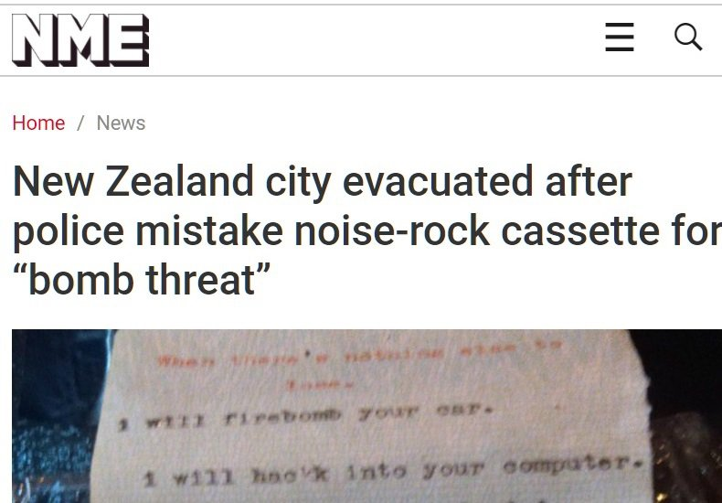
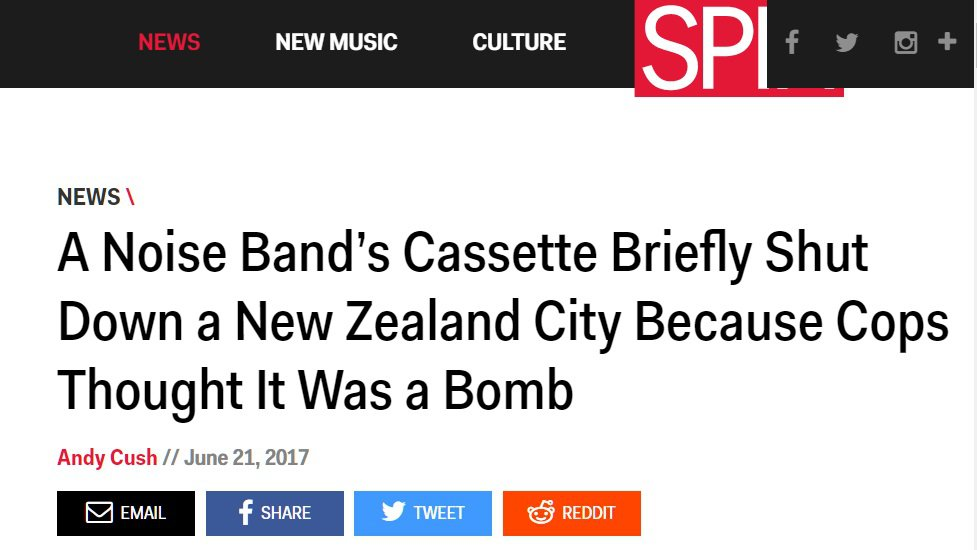

On the 16th of June, late on a Friday afternoon, central Dunedin was cordoned off and closed down for what was described as a bomb scare. The police flew down the Bomb Disposal Squad to blow up what turned out to be an audio cassette containing StreetNOISE the latest album by Dunedin musician L$D Fundraiser. After detonating the cassette and discovering it was not in fact a bomb, local police raided the musician's house, and have since charged him with threatening to destroy property. He'll appear in court this Friday.

This has been a big story internationally, covered in the NME and Spin as well as NZ media, but almost none of the reportage seems to have any awareness of L$D Fundraiser or the nature of his work. There's been a lot of assumptions made, some of them ridiculous, some of them just lazy or wrong-headed.

For those of you, especially in other cities, not aware of his work as a musician and multimedia artist, I wanted to post a good example - shot by me at the Atonal Eclipse of the Charts festival at None Gallery in 2012 - and talk a little bit about how I see it, and about some of the misconceptions I've seen and heard about his work, and what happened.

_<a href='http://www.nme.com/news/new-zealand-city-evacuated-noise-rock-cassette-bomb-threat-2091172'>Source</a>_

_<a href='http://www.spin.com/2017/06/noise-band-bomb-cassette-lsd-fundraiser/'>Source</a>_

The artist known as L$D Fundraiser is one of Dunedin's more coherent, sustained and prolific artists. He's had a developing international audience as a noise musician/sound artist, and an underacknowledged local role as Dunedin's sharpest and most critical street artist. However like other experimental Dunedin artists, this is largely through word of mouth. There is very little overground coverage of Dunedin's underground communities even in Dunedin, let alone in the rest of the country. One exception was the local critical culture magazine Point, which was produced for a couple of years but barely seen out side of Dunedin and Christchurch (and which I contributed to, including writing about L$D Fundraiser). The arts and culture institutions of the city are very limited in funds, scope and local knowledge, so both the scenes L$D Fundraiser operates within and the media that seeks to formalise, acknowledge and discuss it are by necessity non-institutional, artist-run, often short term frameworks that also largely operate outside of the limited funding systems available as well.

As a musician, L$D Fundraiser utilises an extensive array of largely pre-digital sound tools, both designed and accidental, to create bleakly beautiful, heavy - and heavily sustained - sculptural, repetitive/nearly repetitive compositions. He's always somewhere in relation to some element of the history of music, not noise, usually something buried away in some corner of psych music of the last 40 plus years. He looks like he comes from Cleveland in 1974 - having just got kicked out of Rocket from the Tombs maybe - but assembles his compositions in ways that best reflect a very specific set of parallel paths that remind me most of very early industrial culture, just after punk, filtered through both cultural and technical paths assembled from the detritus of a small town at the end of the world. It may be poetically appropriate to consider this as music two doors down from the city's dump, but it's also very nearly concretely true. And much of both the equipment and material of L$D Fundraiser's work has always drawn from the things we discard as a city.

As sound and as music, it's an often buried, introverted sound. The three adjectives I would use to describe the sound of L$D Fundraiser - and I think the music shifts between different clusterings of these three elements through almost all of the work I know - are oppressive, depressive and ecstatic.

_L$D Fundraiser at <a title='Cheeto Sun Blood Fest at The Crown' href='/gigs/cheeto-sun-blood-fest/#lzd_fundraiser'>Cheeto Sun Blood Fest at The Crown</a>_

L$D Fundraiser's parallel career as an street artist based in the immediate local environment has a startlingly coherent and really useful relationship to the music. Simply put, it provides the context for the sources of the oppressive and depressive elements of the sound. Through a series of primarily collage poster works equally influenced by surrealism, 19th century political satire, situationism and underground rock n' roll, and an increasingly fearless approach to placement, these are smart, angry, trenchant, often hilarious commentaries on life under late capitalism. In a town whose council makes the claim to be a centre for street art, L$D Fundraiser is by far the most prolific, rigorous and critical local artist currently operating - and as such is generally completely ignored as a street or a visual artist on any official level, more regarded as a jokester than anything else.

The visual works are immediately distinctive both technically and tonally. Oversaturated, rephotographed, deliberately low resolution colour prints, collaged and cut-up, with typewriter addition, by turns snarky and deliberately obscure, constantly mimicking and inverting the language of contemporary political and commercial discourse. Anyone walking the streets of Dunedin should have come across the work of L$D Fundraiser before, perhaps sniggered at it or puzzled over it, maybe wondered what it was doing there, or what it was trying to sell. But L$D Fundraiser isn't really trying to sell you anything. Indeed what he's been arrested for wasn't so much a promotional stunt as a genuine attempt to find a new way to distribute the music to someone other than the same old folks who've been listening for years. Over the last few weeks, about 10 copies of StreetNOISE have been pasted up on walls known as band postering areas around inner city Dunedin, and most of those tapes have been picked up without the police needing to be called. The release of the StreetNOISE album (not a demo tape, as the Otago Daily Times had it, but perhaps they don't realise that tapes are a valid and appropriate release medium now) was really not a publicity stunt for an album release but rather the actual album release itself as a giveaway.

_L$D Fundraiser at <a title='The BLUES NZ Tour' href='/gigs/the-blues-nz-tour/#lzd_fundraiser'>The BLUES NZ Tour</a>_

It's pretty interesting to see how many people have jumped to attribute selfish motives to the release of StreetNOISE, but for an extreme artist who's been self-releasing music for around a decade, wide, viral publicity isn't necessarily of that much interest. L$D Fundraiser has been postering lively, sometimes even disagreeable content onto the walls of Dunedin for years now. It's often been angry, scabrous political rhetoric that's just sat there - or been unceremoniously pulled down - and this is the first time he's been approached by the police.

I don't have much to say about the role of the police here, and the protocols they have in place to deal with bombs or threats, except to say that it shouldn't have been to hard for them to identify the StreetNOISE tape as being by this guy L$D Fundraiser. I know I wasn't the only one who looked at the photo and recognised it, and this is a really distinctive visual style that's been literally around for many years now. Actually what the photo that's been circulated doesn't show you is not only that the album's supposedly threatening cover poem is in fact signed by L$D Fundraiser - a Google term which brings enough hits to work out its a musical project, to say the least – but the poem was actually hand typed onto sheets pulled out from the artist's expired passport, which traditionally has the number stamped on every page. I'm certainly very sympathetic to the person who discovered it and felt motivated to call the police - it may well have been very upsetting. However I'm not sure the idea of charging L$D Fundraiser with threatening to damage property is reasonable, given that it was the police who made the decision to close down the city and blow up a cassette tape, made by an artist they should have pretty readily identified. I mean I think we all quite often go to a gig or a gallery and see something we don't really understand, but most of us don't have the power to send the artist to jail for it. Maybe it should have had that label, Warning Contains Explicit Content, as wass imposed upon hip hop and metal musicians in the 1980s by the fragile middle classes of America.

Within the arts communities I live in, there's been a really diverse response. The most common responses are a mixture of laughter and extreme bemusement. From two or three scenes across came mockery of edginess and pretentiousness - which is not exactly unreasonable, to be fair - laced with anger. A noted one-time noise musician now located overseas waded in to describe L$D Fundraiser as, "What a F**khead," for what he understood as a, "repulsive, conceptually lame, insensitive and juvenile prank." People who know L$D Fundraiser and appreciate the work have been much more supportive, and there's been offers to organise benefit gigs here and overseas, and concern about whether the artist is adequately legally represented - which he is. One local artist noted, "Love thy... L$D Fundraiser and shame on the lego police for fear mongering a community by lack of knowledge for how to recognize a piece of art. This misunderstanding of counter culture art and underground music which has thrived in Dunedin for decades so stupendously framed as a threat."

The artist who operates as L$D Fundraiser is in court later this week. He was not approached for comment.

<iframe src="https://player.vimeo.com/video/223014965" width="100%" height="480" frameBorder="0" webkitallowFullscreen mozallowFullscreen allowFullscreen></iframe>

<a href="https://vimeo.com/223014965">L$D Fundraiser live at None Gallery</a> from <a href="https://vimeo.com/user4052181">Campbell Walker</a> on <a href="https://vimeo.com">Vimeo</a>.

