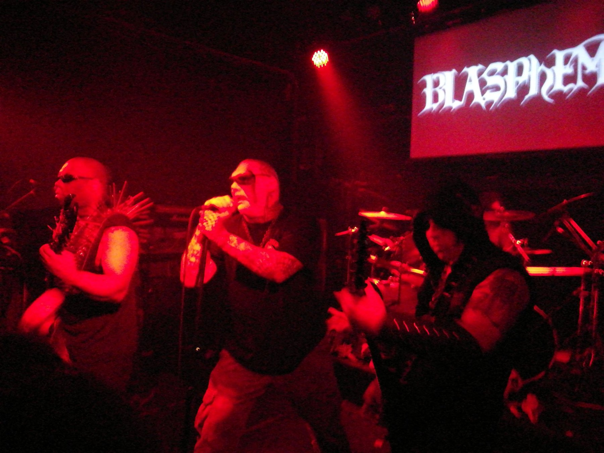

If you’re feeling a little itchy it could be because Methchrist haven’t played a gig here since January, but that all changes tonight. In a vile ritual of hatred at the Crown Hotel, the solar anus will expand and from its foul depths spew forth a torrent of pure evil into the expectant mouths of the cult elite. There will be no escape, and only the true will survive.

I spoke to the virulent trio over some pints to get the skinny on what they've been doing and what they're doing next.

<iframe style={{border: 0, width: "100%", height: "120px"}} src="https://bandcamp.com/EmbeddedPlayer/album=483929922/size=large/bgcol=ffffff/linkcol=0687f5/tracklist=false/artwork=small/transparent=true/" seamless><a href="http://methchrist.bandcamp.com/album/nomadic-war-machine">Nomadic War Machine by METHCHRIST</a></iframe>

**Since the last album what have you been up to?**

Ben: So that was back in September last year… So we’ve played quite a few out of town shows, the highlight would have been playing with Blasphemy in Auckland and Wellington back in June. So basically we got hit up by Phil from Vassafor when Ollie and Dan were seeing Mayhem

Ollie: that was like January, February

Ben: And he sort of earmarked us and passed that info on to the promoter, and yeah. So that was absolutely fucking amazing. We basically flew up there and the Blasphemy dudes are just utterly intimidating, really fucking huge guys. Like Black Winds, the lead singer, I thought he was gesturing for a bottle opener but he was actually after a lighter so we followed him out for a durry and he had these speed demon sunglasses on, lifted them up and he was like “You guys are Methchrist… you got any?”

And we had this really stilted conversation with him aye, we were like uhh so what do you think of New Zealand and he was just like “WHAT?”

Ollie: Couldn’t understand our accent aye.

Ben: Really fucking lovely dudes though, they were on their own mission, didn’t really socialize too much. We kind of respectfully gave them a reasonably wide berth most of the time. Yeah so not only did we get to see two really fucking sick shows that we would have gone to anyway but we got to play at them and sort of extend our audience a wee bit more. Sold out of all the cassettes we took with us so that was cool.

Ollie: Yeah, not only did we get to play and see Blasphemy but we got to play with two of our favorite NZ bands Heresiarch and Vassafor as well which was just… Didn’t think we’d get to play with them at least for a decent while if ever and getting to play with all of them at one show was just amazing.

**Was it a good show?**

Ollie: It was insane man.

Ben: The Auckland one I thought was the better of the two. It had sold out and the mosh pit was just heaving, I don’t think I blinked a single time during that set.

Ollie: Yeah we had to keep reminding Ben to blink after that set.

Ben: Everyone was just very much on the same buzz, just fucking adulation and worship of Blasphemy. They played amazingly, and Vassafor were just next level.

Daniel: they’re always nuggety.

Ben: Yeah it was just like seeing all these really professional bands, like Heresiarch have been around for seven or eight years now, Vassafor have been around for…

Ollie: They’ve been around for fucking ages, like ten plus.

Ben: And then Blasphemy thirty years. Just getting to see how professional they were with getting shit done was pretty bloody inspiring.

Daniel: Fuck yeah.

_Blasphemy in Auckland_

**What about since then?**

Ollie: Last time we played in Dunedin was January, and we haven’t played since them apart from out of town shows just because we were recording.

Ben: Yeah, we recorded four tracks for a split for an aussie band called Self Harm. So cassettes will be manufactured within the next month or so. This time we did all the recording ourselves, it was all down at our practice space, the Beastial Scum Bunker

**Your previous one was recorded Nathan Forbes at Carpet Dungeon Recording right?**

Ollie: Yeah, we got what we wanted completely out of that with him.

Ben: I think we probably spent about a total of 8 hours recording that, it was just over a weekend

Ollie: Yeah we ground that out real fast, and with this we probably spent at least that much time for each instrument part for each song.

Ben: It was an interesting learning experience because we recorded with Audacity and I started to do the mixing side of it and then I discovered that audacity has this flaw called destructive editing…

**So how did you record it?**

Ollie: We’d demo the whole thing live and then go from there and do drums, guitars, vocals, layer it up. I real liked working like that, it was a good way to do it, it keeps that live kind of feel and sound.

Ben: There wasn’t as much urgency to get shit sorted too which I think it helps in terms of getting the right takes.

Ollie: That was the benefit as well of being just like there’s no time limit so let’s just do that again and keep going, there was no compromise, every single little bit was with intent.

Ben: We’d never actually done a recording before so it was a bit an interesting learning experience, especially considering we were only using two microphones. Singstar microphones.

**How does it sound?**

Ben: Fucking feral. It definitely sounds a bit cleaner than the first release, just less digital distortion I guess.

Ollie: Yeah it’s a lot heavier and a lot fuller, which I think is a good way of progressing. I don’t regret anything from that first release but just stepping it up.

Ben: All the nastiness is coming from our playing and our instruments really like Dan drop tuned his drums, like his snare was really fucking low…

Dan: Yeah dropped it right down, before it was quite pingy like almost a grindy thing and now I can’t go back aye. It’s crushing.

Ollie: That and the bass drum just sounds like a corpse's head being smashed on a wall.

Ben: Me and Ollie are using different instruments too, like on with the first recording Ollie was playing Mat Collins’s Epiphone Explorer and I was playing a Fender Jag and now I play a Rickenbacker 4003 and Ollie’s on a BC Rich Warlock yeah.

Ollie: It’s made a massive difference.

Ben: Tonally it’s a bit different yeah. The new songs, they’re a bit longer, a bit more of a…

Dan: Definitely more refined.

**I read your [review in no clean singing…](https://www.nocleansinging.com/2017/09/19/methchrist-nomadic-war-machine/) Pretty good review.**

Ollie: Yeah I liked it, loved that final line at the end aye…

**“It’s like a dog with cancer ate a rat with leprosy and shit it down [your] throat” but he was sort of critical, or he noted that war metal is kind of like a narrow genre. So are you trying to broaden your sound or refine it or what?**

Ben: Well it’s sort of going towards more of an old school feel… Like in that review as well he noted a few influences he could hear. I think we’re kind of going back in time a bit with our sound.

Ollie: But also soldiering forward. We wrote the songs from that first release in sort of no time. And one of the main reasons for the sound of it was that we all came out of playing in a kind of grindcore powerviolence band so after that we were just like we want to do something, we want to make it more heavy, more aggressive, faster and shit like that so we just carried on.

Ben: That was one of the things I took away from the shows up north, still like real feral fucking chords and rhythms and stuff but just that added level of sophistication and I think our latest songs, like the ones you hear on the split, I think they’re considerably more sophisticated than our first.

Ollie: Completely.

Ben: And now we’re composing for another full length and once again, I suppose to the casual listener the songs are longer, they’ve got more time changes and rhythm changes and stuff. I think there’s something for everybody who enjoys the kind of extreme black metal and war metal stuff in these ones.

Ollie: I think the challenge is having the songs longer... I don’t think any broke 2 minutes on the first. On this one on the split they’re all like 2 to 3 minutes and I think that’s probably like the shortest length of our newest ones.

Dan: That’s definitely it because now we’ve kind of progressed from those grind powerviolence roots. We were approaching it kind of like a sprint on our early ones, but now we’re getting the most out of those real nuggety riffs.

Ollie: Give them time just to pummel out. But also have them longer, they’re double to triple the length of the early ones but they’re three times heavier and fucking more brutal.

**Because that’s the concern…**

Ollie: Yeah, you give it more time and give it more time to be boring.

**That happens to so many bands, the early releases are really intense and then they just sort of mellow out.**

Ben: I think there’s just more of what we’d normally offer perhaps, I don’t think the energies let up at all

Dan: And the tempo’s haven’t let up at all, they’ve increased maybe 20 to 30 bpm at least.

**You’re getting asked to play in other cities by international bands which is pretty awesome, so what’s the next step. Do you reckon you’ll be playing overseas?**

Ben: We’ve very much like to do that. We’ve got another gig coming up in September and that’s opening for Heresiarch and Hellfire Deathcult from Chicago, and it’s like we sold quite a few tapes overseas, I think probably about 50 percent of them went over to the US and Europe.

Ollie: Couple to South America.

Ben: But yeah we’d fucking love to go overseas, US or Europe would be great. Just a matter of, I think realistically the next step would be to get on a label, I think that’s the critical part there.

Ollie: It’d help.

Ben: It’s basically just off ourselves and merch and fundraising gigs. I mean this gig we’ve got coming up on Saturday is fundraising to produce our full length.

Ollie: And doing more merch and stuff too. Because we want to give back to the die hards who follow us and support us and everything too, like the people who bought a t-shirt. It sucks having to be like nah man we’re out we don’t have shit.

Ben: I think at the end of the day the next release has to be significantly better than these two.

Ollie: And if the songs so far are saying anything…

Ben: Yeah I mean they’re fucking bonkers, what’s the latest one? Swine March?

Ollie: Yeah.

Ben: That’s a fucking kicker of a song and it goes through all sorts of time changes, tempo changes, and has some of the most excruciating riffs aye.

Ollie: We want it to be as hard to listen to for people as for us to play.

Ben: And if people don’t like it I mean it’s not for them aye.

Ollie: Fuck em. First and foremost we want to make the most insane thing that we can, to our capacity.

Ben: To be as disgusting as possible.

Ollie: We always push ourselves on if there’s like a riff or something and we’re like nah you can make it more hard, or more disgusting or something.

Ben: It’s quite a back and forward really when it comes to writing, like Ollie will come to us with a riff basically, might have just come up with it or been sitting on it for six months or so and then we try putting it together and workshop it essentially.

**What would you say your goal is?**

Dan: First and foremost if it’s not something we want to listen to…

Ollie: Then there’s no fucking point, no compromises on that.

Dan: Keep pushing the will to progress and making it more extreme.

Ollie: No downtime. Every single fucking hit has to be has hateful as the last, like crushing.

Ben: That’s the thing, when we play we try to have no gaps between the songs. Maybe announce the name and then get straight into it.

Ollie: Evil fucking hateful, virulent just real disgusting and pummeling man.

And it seems like there’s definitely a demand for that…

Ollie: It’s kind of a surprise

Ben: Yeah a pleasant surprise, because we just kind of wanted to do our thing because we formed out of the ashes of With Teeth and Machina Rex and stuff and we all just got into the room and learnt three songs in one rehearsal and then decided it was a good idea. I don’t want to sound too soft but it’s terrific fun to play a song, you get such a buzz out of it aye.

Ollie: It’s euphoric man.

Ben: I really enjoy just seeing the audience get into it as well, seeing people with this big fucking scowl on headbanging and stuff. A lot of the buzz I think is just down to the name, like it’s very catchy.

**Yeah and it’s like a big taboo aye, like meth is the worst thing…**

Dan: Such a New Zealand thing aye

**In NZ it’s like the big demon and then you put it next to christ…**

Ollie: Trying to appeal to the meth heads and the christians.

**The two big markets**

Ben: The two major influences on society.

Ollie: To make it one sodomizing ride.
