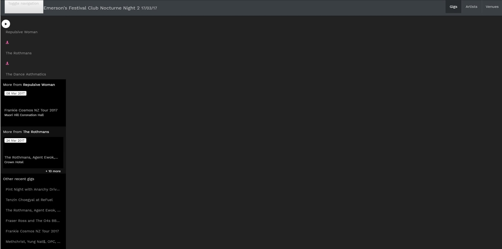
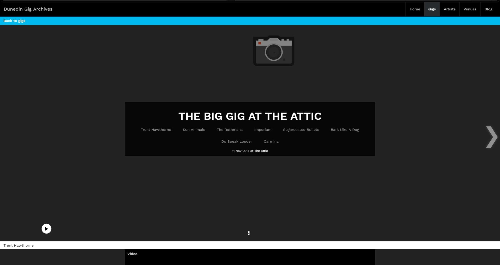
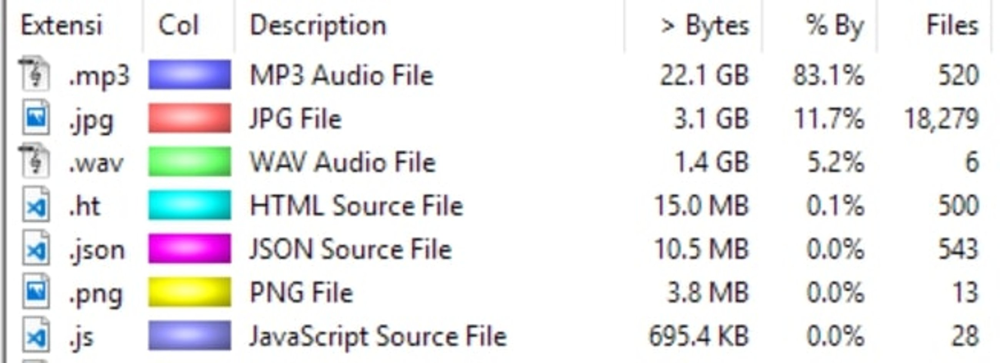
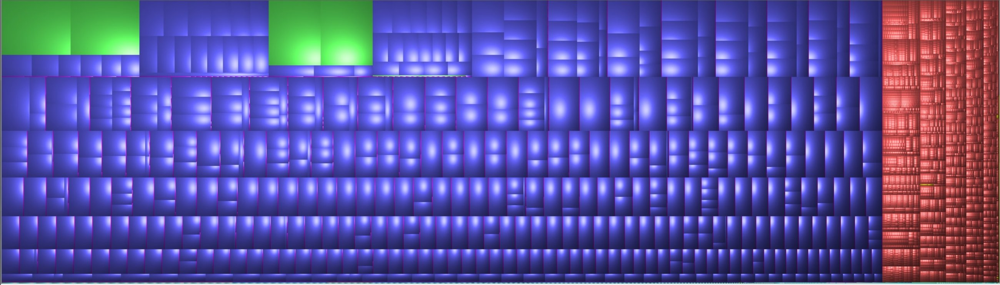

I thought it might be a good time to write a little rundown of the tech behind dunedinsound.com, partially as a way for me to clarify my reasoning to myself, and partially because it might be interesting to someone. I've tried to make it understandable for anyone as well as offering enough detail to satisfy people who are into this kind of thing.

**Initial Design**

When I first started, my goal was to make a simple directory of local gigs and artists. I intended this directory to exist for many years, decades even, because I had this idea that documents recording certain events become more valuable over time.

So when considering the tech to run this thing these were my requirements:

1. It must be cheap to host so I can keep it up for ages without running out of money
2. It must be easy and not painful to use so people want to use it
3. It must be fast (this is more to do with my personal hatred of slow, badly optimized websites)

To me the only option which satisfied these requirements was making a static site.

Typically for this sort of content platform you'd settle on a CMS such as Wordpress, but that would require a server to be running code 24/7 which generates a page every time someone visits. This server would cost money to run and would require ongoing maintenance to ensure it's secure. 

For a website which only changes once a week this seemed unnecessary.

Static sites on the other hand don't require any dynamic processing, so they're cheaper to host, faster for the user, and require less maintenance over time. So I chose to use a static site generator.

A static site generator provides some of the layout and content management functionality of a CMS.The one I chose was Jekyll because it integrated nicely with free GitHub Pages hosting and seemed to be the most popular at the time.

The flipside to this decision was having to spend lots of time wrangling Jekyll to work the way I wanted it to. Also where a CMS like Wordpress would offer a nice interface anyone could use, Jekyll is not really user friendly at all. But that's okay because it's just me who needs to know how to use it (for now).

When I put my first gigs up, the site was basically a simple list of artist and gigs. I'd love to get a screenshot of what it looked like but apparently I switched Git repositories at some point and lost all the history.

My next iteration was making it prettier, trying to make it feel less like an engineers tool and more like a designers multi-sensory audiovisual experience by adding the big image focused "home" page and tile layouts.

And since then the basic design has solidified and it's just been progressive enhancements and new features. The biggest changes have been in the layout for individual gigs which moved from using a sidebar for artist navigation to just letting people scroll. 

*Layout for a gig page on April 20, 2017. Imagine the images are there.*

*Layout for a gig page in November 2017.*

To be honest I'm still not too happy with this so expect more changes in the future.

**Frontend**

I use a handful of third party libraries for simple stuff like lazy loading images and search filtering, but I don't use any frameworks.

For a project I'm not working on fulltime it's important to minimize the time spent being confused after returning to the codebase, and with big complicated frameworks I always find I have to refamiliarise myself each time I look at it, more than I do with my own code.

Most of my own JavaScript is written for the player on the gig page. I basically made "Objects" to represent user interface elements which contain their behavior and state, then I bind them to the DOM elements.

That's the idea anyway. Feel free to check out my code and tell me how much better it could be. Probably I should just use React.

The CSS started as Bootstrap but at this point there's very little Bootstrap left in it, so in my infinite pursuit for optimal performance I've used UnCSS to strip out all of Bootstrap's unused CSS. If I were to refactor I would probably just use a simple grid instead of a CSS framework.

The result of all this is very tiny assets. My CSS file is 19kb gzipped and my main JS bundle is 49kb, with a separate bundle for the gig page which is 18kb. Practically no time is spent transferring these assets to users, most of the time is in transferring all the stuff that matters like images. 

**Hosting**

Currently the total size of the website is about 26gb, which is pretty small really, but obviously it'll grow more and more the longer I do this.

*Breakdown of where that 26gb goes.*

It's all hosted on Amazon S3 because I think that's the most reliable way to store it long term. It's also reasonably cheap, currently data storage costs are around $2 a month and transfer is like $5. 

I use also use CloudFlare's free plan so assets are cached nearby which saves me bandwidth and makes it faster.

*Just a pretty graph of all the files 😍*

**Process (ensuring I don't lose my sanity)**

There's a lot more to dunedinsound.com than just what you see. After every gig I have to:

1. Sort through tens of gigabytes of 4k video and photos from my camera(s), and audio from my portable audio recorder
2. Process RAW photos, resize them and index them (I use DxO Optics Pro 11)
3. Sync the audio with the video manually (I use Vegas)
4. Render videos and put them on YouTube
5. Process and render full set audio files for each artist and generate waveform data
6. Add the gig and artist metadata to markdown files for Jekyll to consume and turn into a webpage
7. Upload it all to the internet

I also try to do this the day after a gig because otherwise it'd become a huge thing in my mind which never gets done and stresses me out.

Obviously it's quite a lot to do, so over the years I've developed automated ways to remove most of the menial labour and make this process as painless as possible. 
 
- I've got a batch script which creates the initial Markdown file for a gig and fills it with metadata. This also makes the directory structure for the artist images and audio files, and artist pages if I haven't got one yet
- I've got a node script which take my processed JPGs and resize them into Large, Medium, and Tiny (which are used for the lazy-loading blur-in effect)
- I've got a node script and a Docker container which takes my audio files, tags them, converts them to MP3 if necessary, and generates a waveform

Previously I spent a lot of time writing all the markdown files and making directory structures manually, so it's nice to automate things. 

I still spend significant amounts of time doing human tasks like editing photos, videos, and mastering audio. Syncing audio and video is always time consuming and would be easier if I had an audio recorder + camera which supported timecodes.

After checking it all looks okay I can deploy the generated site and media to my S3 bucket in AWS.

**What's next**

I kind of want to move away from Jekyll.

Because of the iterative way I grew this I made a bunch of weird decisions in the past which have led to technical debt. Jekyll is fairly inflexible, and I constantly feel like I'm fighting it to make it do what I want. I've had to implement what I consider "hacks" to make it work for me.

I have my eye on GatsbyJS, which is another static site generator. It uses JavaScript and React, which are technologies I'm interested in getting better at, as opposed to Ruby and some random templating language which Jekyll uses and I don't care about learning. 

If I rebuilt the website in GatsbyJS and React I'd be able to make it into more of a "web app" than a website like it is currently. I'm thinking stuff like a universal media player which follows you around ala Soundcloud.

Anyway the whole thing is open source on Github so feel free to check it out and do whatever to it. You could even spin up your own dunedinsound.com if you want. Go wild. I'm a web developer in my day job but I don't feel like I'm an expert on it (or anything really) so I welcome feedback.

[https://github.com/FraserThompson/dunedinsound.com](https://github.com/FraserThompson/dunedinsound.com)
