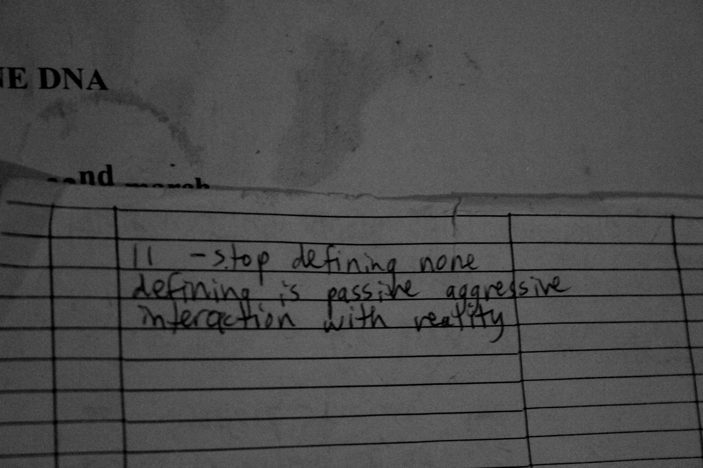
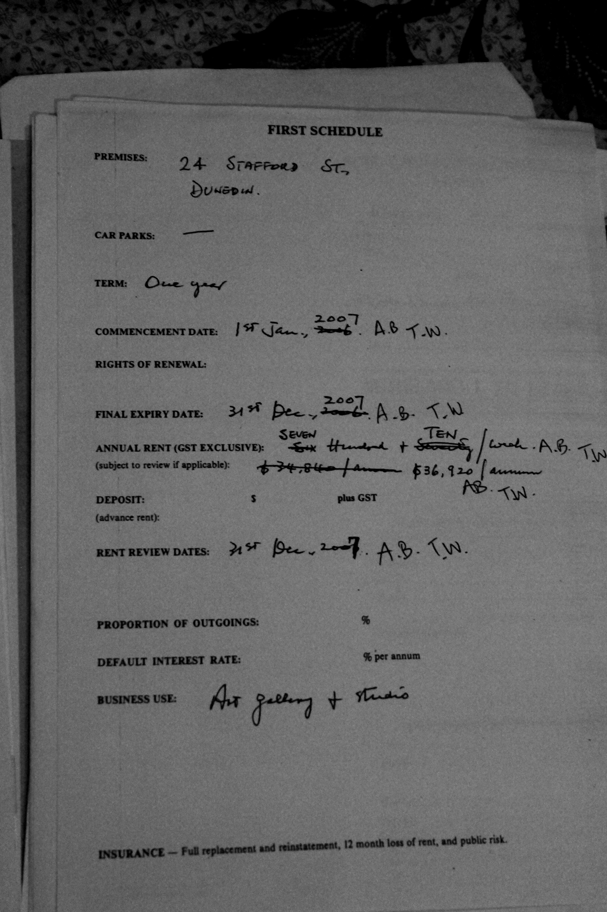
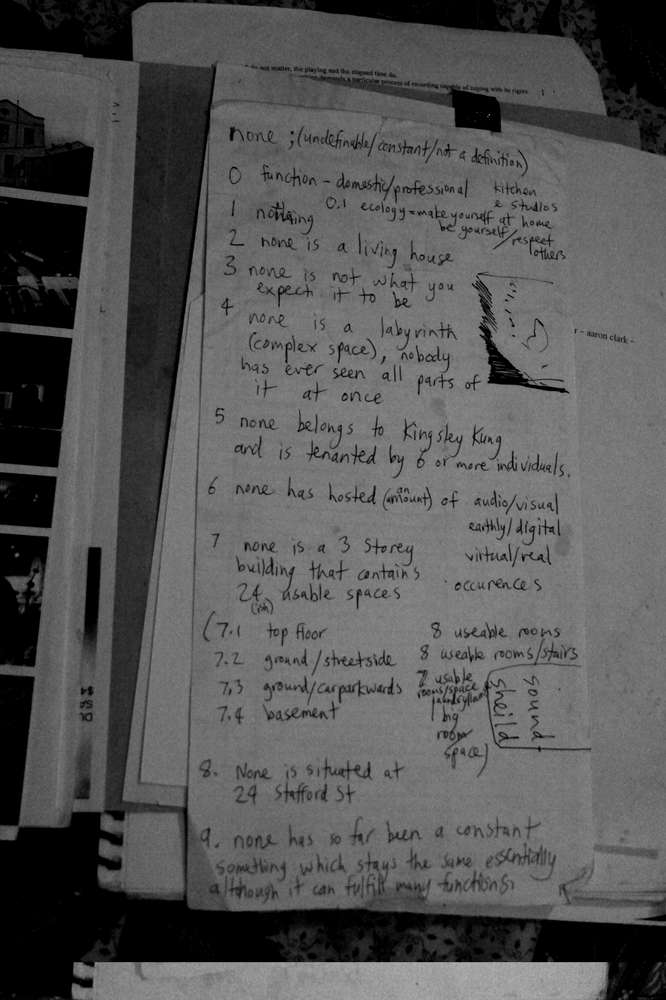
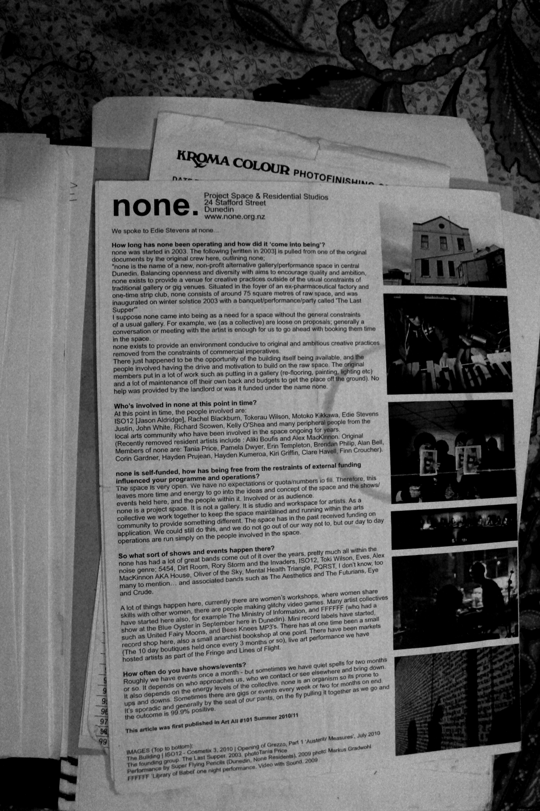

A few weeks ago the art and music community received some sad news: [None Gallery](/venues/none_gallery/) had been sold and, since it’s new owners had purchased a cashflow opportunity not an art gallery, the residents had 30 days to collect 16 years of history and get out.

None Gallery was founded in 2003 as a collaborative art space. The building on Stafford Street included six huge bedrooms, studio spaces, a large basement, and a gallery space. By design it’s purpose was mutable; the “None” was to imply no fixed definition. It served as an incubator, a venue, a workspace, a support network, and a home to the hundreds of artists who came and went over the years. 

It’s near impossible to capture the impact None Gallery had. It was the longest running artist run space in New Zealand. The walls are literally coated in layers of art and life history. Pretty much every local artist or musician has some connection to None Gallery, and many important bands were formed there.

Before it was leased by the original collective in 2003, the building was a strip club. Before this it was the headquarters for a pharmaceuticals and fertiliser company (Kempthorne Prosser). Much work was put into removing peep show booths and general repurposing and remodeling. The basement was originally not part of the building, but the residents expanded and it became a gig space.

Over time the original residents moved out, and a steady stream of artists and musicians came and went, sometimes staying for just a few months and leaving with new artistic perspectives and directions. 16 years later and the building is still fully occupied with incredible artists doing incredible things who are now burdened with the task of somehow packing it all up in under a month.

I myself discovered it comparatively late in its existence, but some of my most memorable gigs have been there. The first time I saw [Ov Pain and Negative Nancies in 2016](/gigs/eye-negative-nancies-ov-pain/), Sewage’s [dual saxophone absurdity in late 2017](/gigs/girls-pissing-on-girls-pissing-with-sewage-and-coyote/), watching Brendan Jon Philip deliver a [screaming barrage of noise as he slowly disappeared behind layers of fog…](/gigs/from-kingdom-to-crown-(storm-channels)/) Even dancier acts like [Disasteradio](/gigs/disasteradio-sweatshop-tour/) felt right at home at None. The space was a blank canvas.

Art flourishes outside of commercial pressures, and while the recent resurgence of venues is great for some, it was nice to go to a venue where the main purpose wasn’t selling alcohol. None Gallery joins The Attic on the list of DIY venues recently snuffed out by external forces.

Unfortunately the cycle of gentrification means as soon as an area becomes known as an art hub, property developers pounce on it and drive out all the artists who made it desirable in the first place. It happened to K road in Auckland and it’s happening to anywhere adjacent to the “warehouse precinct”. Vogel Street used to be cool; now it’s just cafe’s. 

[The Edinburgh Realty listing page for 22-24 Stafford Street](https://www.edinburghrealty.co.nz/listing/DO10120) described the property as: “an exciting opportunity for further development… very close to the heritage precinct area within the central city… not Heritage New Zealand listed” which is basically to say “you can take advantage of being near historic buildings but you don’t have to respect the history of this building.” 

It’s also particularly interesting given that [in 2016 the Dunedin City Council granted $5,000 out of the heritage fund towards drainage and roof repairs](https://www.dunedin.govt.nz/services/dunedin-heritage/how-can-we-help/list-of-applicants) - odd considering it’s apparently not a heritage building. 

The new owners, Bryan Howard Usher and Claudine Maree Usher acting as [NORTHFIELD PROPERTY & INVESTMENT COMPANY LIMITED](https://app.companiesoffice.govt.nz/companies/app/ui/pages/companies/1210486/detail) for tax purposes (probably), spent $625,000 on the property’s four buildings and 14 car parks. Bryan Hower Usher’s previous achievements include closing the BP on George Street because a tank needed replacing and he didn’t want to pay for it.

It’s hard to know what they have planned for it. Probably more car parks.

## Collected thoughts on None Gallery

### Tania Price

**What was your connection to None Gallery?**

We started none gallery as a collective in 2003, though I fell in love with the space in 1997. Some friends of mine occupied the building, at the time known as California Girls (Cartel).  The Ho' Dogs / Crude were part of that scene. 

**How did it come to exist? Ie. Who's idea was it and how did they make it a reality?**

In 2002 we were doing noise / installation / art based performances as The Ministry of Information (Trust).  We were looking for live-in studios around that time, around the Exchange area. 24 Stafford St appeared unoccupied, so we tried to lease the building in late '02  but it fell through - then got a call from the new property managers about 3 months later who offered us the lease. In terms of who's idea, it was a collective of 7 people, with similar ideas to co-habit a space to live, work, do exhibitions and music shows. As a multi-use three story building, none had scope for all of those things. 

**What was the original intent behind it's creation?**

Hayden sums it up well.

**What was the area like back when it started?**

https://en.wikipedia.org/wiki/History_of_the_Dunedin_urban_area

Post-Colonisation era Area pic here >

https://teara.govt.nz/en/photograph/22904/the-exchange-dunedin

The building itself has a colourful history, originally the HQ for Kempthorne Prosser - the leading big pharma / fertiliser company in NZ from 1869 - 1978. https://en.wikipedia.org/wiki/Kempthorne_Prosser

Some artifacts remained in the building from this era, which we uncovered while digging up the dirt room underneath the adjoining building via the basement. Alistair Gailbraith recalled going there as a child, when it housed a dog food / horse meat processing plant.  Then it became California Girls Strip club.

The building required a lot of work to get liveable and workable, so we negotiated the first month rent free in lieu of doing the work ourselves. We sanded and painted the gallery floor, made some modifications to the ceiling etc, removed the peep show booths, prepared and painted the walls and installed spot lights in the gallery. The initial cleaning seemed to take weeks, the patina of time was thick!. We had the building spiritually cleansed, as some residents felt there were more than just us occupying the space. none has remained very much the same as it was back in 2003, but with layers of cultural detritus added year by year.

**Did you expect it to last for this long?**

I don't think any of us expected it to continue in that capacity for 16 years. I guess we figured it wouldn't be long before it fell to inevitable gentrification, as is the case with many of those buildings within Aotearoa.

**How do you feel about the closure?**

As a community of people involved over the years I know it holds a special place. It is just a building however, i’m sure that spirit will continue to evolve in dunedin and re-appear elsewhere.

### Hayden Prujean

**What was your connection to None Gallery?**

One of the 7 founding members. 

**How did it come to exist? Ie. Who's idea was it and how did they make it a reality?**

It was a true joint venture. There was a core collective from the (Trust) Ministry of Information searching for a home along with like minded individuals. We bargined with the previous Landlady in Dec 2002, but it all fell through in a fairly spectacular fashion. Just a couple of months later it was sold to our lord and savior Kingsley Kung, a true patron of the Arts in that kvlt dunedin mental health triangle way. The weight of responsibility for none rests on many shoulders. Worth noting that the space was inhabited by the Ho' Dogs, California Girls Strip Club and a drug factory before it's baptism as none. At first we just had the top two floors, the basement being let to a paint company until we took it over, as well as taking over the adjoining basement by stealth. 

**What was the original intent behind it's creation?**

I can't speak for all but my perspective was to live a true life close to art. To live life as art. A place for Art, Music and experience. To reinvent living. This has all been done before infinite times back to the year nothing. What none meant was a cover to pursue creativity without reference to the soaring id, to not need to be named just to be and create. So completely basically meanigngless, just a bunch of people fucking around making some crap shit.

**What was the area like back when it started?**

Pretty good.

**Did you expect it to last for this long? How do you feel about the closure?**

It's lived and held a million lives since we were there. It's held so many other meanings and explorations. Like so many creation myths everybody wants to weave their scrip into the birthing story. Crazy to see early work still part of it's intergral fabric. But Everything Must Go. Eh?

### Erin Templeton

**What was your connection to None Gallery?**

I was part of the initial 10?! I think.

**How did it come to exist? Ie. Who's idea was it and how did they make it a reality?** 

I wanted to find studio space so asked my friend to approach real estate agents. We found a great building and asked others from Art school and the music scene to get involved. Lots of people put a huge amount of work into eventually securing a lease and preparing the space. 

**What was the original intent behind it's creation?** 

A space to experiment and work on creative projects, that was free for the community/ artists and musicians to access.

**What was the area like back when it started?** 

Perhaps a little less gentrified. Arc cafe and the Blue Oyster were still at the bottom of High Street. Maybe there were more venues back then. I’m not exactly sure how many there are now... but it’s probably gotten harder.

**Did you expect it to last for this long?**

I didn’t expect it to last this long! But it’s testament to a strong community that it has. I guess it’s fairly standard for creative people to live with uncertainty when it comes to real estate. 

**How do you feel about the closure?**

I feel for the current collective, I hope they can find  another space. 

### Edwina Stevens

**What was your connection to none gallery?**

I met some people when I was right out of high school through a friend, actually I might still have been at high school… I don’t remember. I used to go around to none and crash after gigs at other venues, like arc cafe that was on lower Stuart st (where I also used to work with Hayden Prujean but that was later… anyway)… I met these people and I ended up going to noise shows (first saw Matt Middleton I ended up in the aesthetics much later), then I was playing in the noise shows, then I lived there ra ra… essentially I liked those people so I hung about until they let me in, thats what I thought I was doing anyway. It completely transformed my view of what was possible in Dunedin in terms of a creative scene, I had stumbled across this place and these people that were shifting and expanding and verging on crazy and all the rest of it, it was great. It was spontaneous and alive, thats how my imagination took it anyway.

**What was the experience like setting it up and living there?**

I wasn’t part of setting it up, but I was visiting there soon after. I saw those founding tenants really put in so much work, under no funding - they pooled together what they had and put in the hours to turn it into a gallery space and studios to share with the community, it was exciting and hopeful. There were some ups and downs of course, with people moving out after a short time and a new wave moving in - I was part of that wave. We had this amazing setup now and everything was pretty much in place to build on - we didn’t have to do the hard yards! We had our own trials but I’ll be forever grateful to those people who started it and put in all that time and energy and heartbreak and whatever else. Its Dunedin. Its dramatic. Drugs and alcohol and finding weird drugs in the basement (from when it was a drug factory) people sleeping with each other and each others partners and whatever else. It went through some really shit times when there were people living there who weren’t in it for the right reasons, they were in it for some coolness factor and it was obvious but they really overpowered sometimes and almost made life there a bit dangerous, but that passed and has had ebbs and flows ever since I think. Its the nature of a place like that, it attracts all sorts of scenarios, which then in their own way can feed creativity I suppose.

Living upstairs and putting on shows downstairs was great - everything came to you, unless you wanted to sleep then you just didn’t - you made your own fun in a town where venues are popping up and falling over every 6 months. Waking up there was good, I could see out over the harbour and the light was different everyday and sometimes on Stafford st you can smell the ocean, so you feel, I don’t know, like you’re in a dream. It was a dream for me with its ups and downs and weirdnesses but I learnt so much and lived really fully at that time I feel, I broke a few bones and discovered some things about myself, started my current solo project, joined a few bands and that spread out to the scene in general. You know a place like none is where stuff… comes from - that space is imperative to creativity and a sense of freedom outside the norm. Thats why artists are attracted to that kind of space. Now its a developers realm.
There was a really great time when it felt like a family, which is corny but it really did, me and Alex, aliki, Rachel, iso and motoko, Tokerau etc etc, was a really good time that lasted a couple of years or so.

I have about a million stories, and all the characters in my head, everyone is so individualised its quite incredible how Dunedin attracts or makes strong characters, I think its the isolation. Its very intoxicating.

**What do you think it contributed to the Dunedin art and music scene?**

None was… funny cos I remember a kid telling me once at a pub - I didn’t know him and he didn’t know I lived there, that it was an opium den and all these people like lay around on mattresses and stuff… the area had a history of opium dens but anyway - I thought it was more inclusive than that, but you had to sort of make it your own, push your way in there in a way, I don’t know. There were lots of styles of events there, gallery openings, noise shows, guitar wolf (Japan) played in the basement, installations, workshops, community events, lines of flight, residencies, I think a space like that is a resource, and when there isn’t beurocrazy and paperwork and funding whatever in the way its more accessible - I never saw or asked for a proposal ever. No. 

**How do you feel about the closure?**

Fine. Almost joyful. Its ok to watch something fall over and change. Its sad for Dunedin but I don’t think its been too active in a while anyway. Hopefully the developers will slow a bit and people will find the energy to find more loop holes and open other spaces - real diy ones without all the red tape. They are of most value in a place like Dunedin as they bridge the gaps between house parties and galleries, if you know what I mean.
I’ll be at the closing party and will really enjoy the memories that will float through my head. I’ll probably cry - but like I said its ok to let stuff go and bury it. Endings can be beautiful too in their own ways.

### Motoko Kikkawa

**What was your connection to None Gallery?**

Lived three years around 2011

**What was the experience like living there?**

Inside bubble , happy art music environment, surrounded by  PC correct people , able to connect to out side of NZ through particular music style

**How do you feel about the closure?** 

Not particularly feeling anything but I have so many footage of gigs , it’s great chance to make archive

### Justin Taboo’ulu

**What was your connection to None Gallery?**

I lived there for like 2(ish) years (2009-2011
I moved out to Port Chalmers for a couple of months & then moved back.
I'd moved out down from Wellington upon Eddie Stevens's recommendation

**What was the experience like living there?**

I liked it down there. It was always freezing-which I didn't like s much.
I drove some of the other residents bananas with my incessant drumming and jamming with others, I recorded heaps of music & played in a few different bands-some of which lasted longer than others

I liked hanging out in the basement as most of the other residents thought it was sppoky & haunted so I always had down there to myself-one time, shortly after I first started hanging out down there…

a large heavy board that was leaning against a wall fell to the floor seemingly on its own accord. I really couldn't think of a reason why it would fall like that…

I'm not really superstitious & I don't really care about ghosts but I figured if there were ghosts down there they'd have to do more serious shit like make knives float or something, otherwise that was where I was gonna hang out

Nothing else sppoky happened.
That's my basement story.

**How do you feel about the closure?**

mm I guess it's sad. I'm not really surprised when things close down or get sold & bought. To me when you get a cool building with interesting things happening it's oftentimes because of the affordability and ..eventually it's gonna get torn down. That just seems to be the way when things aren't part of a corporate thing or 'the establishment'.

Similar to what happened in Wgtn before they finally made the bypass- prior to that they'd been a few cool little pockets of people doing stuff and living their lives

-always the premise being 'this won't last forever' so the impermanence gives it something special I guess.

### Matthew George Richard Ward

**What was your connection to None Gallery?**

 in 2011 I lived at none gallery for about 7 months. I originally came to have an exhibition - i had no permanent living arrangements anywhere after the earthquake in Chch. After the exhibition was over, I was already collaborating with many artists that were either living at none or affiliated with the space.

**What was the experience like living there?**

It was a really productive time and incubated many incredible experiences of working with other artists as well as finding support as an artist on the "pace" program. I performed with "saved from the sharp teeth of a homophobic death" a few times, and also made many recordings - one which was an album as digital release online. There were a multitude of experiences, since so many people came and went I had the privilege of making new connections not found in other cities in NZ, it was a catalyst for me finding new directions as a multidisciplinary artist and activist. 

**How do you feel about the closure?** 

I feel pretty sad since it's the longest running artist run space / collective in aotearoa. so many memories there, literally physical layers upon layers - some grime, paint - some just living. It is a consistent place of change but also grounding for artists working in that part of NZ. 

**Do you have a most memorable gig?**

I have many, mostly in the basement, but also because a lot of international musicians would come and perform while on tour. One would be the zine fest. All the gigs that followed. Some would be the ones I also participated in. 

### William Henry Meung

**What was your connection to None Gallery?**

My connection to None was first as an audience member, then as an artist wanting to get involved in the cool stuff going down there. Later i had a studio for two years off the gallery space and then lived as a resident artist/crew member for two years. 

**When was the first time you went to none gallery?**

I dont exactly remember how i first found the place but i remember going to a show, i think it was rise of the city cat cult  playing.  had been enuthusatic about noise/ experimental music since high school but hadn’t really seen or herd much of anything live until then. 

**What was the experience like living there?**

I used to feel like the only person paying to see the show, id get there and everyone would disappear up stairs for an hour and then comeback down for the show, something of an outsider. 

I made few approaches to crew members as i was really keen to get involved in playing and organising experimental music shows but the None crew were very tight and very cool and pretty sceptical about an outsider like me. But as pretty much anything cool that happened in Dunedin seemed to happen there so i just kept hanging around. 

I saw so many inspiring shows there, it was kind of the centre of my cultural solar system.

When i started playing in bands around the time i took on a studio at None, we were kind of not really accepted by the other none bands but were invited to play shows with the emerging  wave of younger artists who mostly seemed to ex logan park school people. 

Later living at None was a crazy time, it could be pretty challenging at times but i have some good memories, i recorded a lot of solo work, played a lot with my band The Ladder is Part of the Pit. We had a lot of issues with noise complaints and so spent a fair bit of energy revamping and sound proofing the gallery space. Looking back on it was pretty cool listening to Death and the Maiden writing, practicing and recording  their first album. I felt lucky to spend some time being there and being involved in putting on the gigs and exhibitions we did have. None has meant a lot to a lot of different people over time so i feel privileged to have been a member of that community in various capacities.

**How do you feel about the closure?**

Every thing has its time, and None has been lucky to have had many times, various waves of exciting artists and events going down, the sword has been hanging over the place ready to fall for as long as i have been involved and i guess as an artist you get used to operating in the spaces and opportunities that open up often in unstable, marginal or temporary conditions, None has been kind of exceptional in having such a long life, been a platform for so many talented people and a party to so much history. The future is looking challenging for the dunedin underground scene as developers  pick off the last few remaining out posts of affordable studio space in Dunedin, still artists are resourceful, i have hope that people with energy and ideas will find away. 

**Do you have a most memorable gig?**

I dont know how to answer that one, so so many great gigs=! the legendary Crude vs The Torcheres debacle, Three forks, DirtRoom making the glass in the windows hum, the Aesthetics rocking the crowd ecstatic, Basterdwisher making laptop music dangerous and exciting, Grvddgr playing the most visibly atmospheric show I’ve ever seen, Alex McKinnon was always amazing, The mental health triangle ! the Glean Jewellery exhibition, ! arrrrrg i dont know!, so many , i couldn’t pick one tbh., 

so many highs and lows and things that couldn’t be or shouldn’t be published.

just to add. discovering none was like discovering nz's own NOWAVE scene.
so much underground anti genera diversity and greatness

### Danny Brady

**What was your connection to none gallery?**

I was a resident at none gallery for about 5 years and held on to a studio space there for another 2. This is where i rehearsed and recorded with my bands and worked on numerous other projects. For a period of that time I was helping facilitate and host gigs there, this was after the closure of chick's hotel as a venue and there was a need for a more intimate performance space in dunedin.

**What was the experience like?**

Being there for such a long time there were many different experiences. Having so much space and freedom within that space made for some productive creative times, being surrounded by other creatives was very influential. At times the building would consume you, fill any space with artists and things will at some point get a bit dark, which in turn would affect the art.

**How do you feel about the closure?**

All things must come to an end. Such spaces are occupied by artists because they are cheap, and they are cheap because at any point some developer is gonna kick you out and put up a parking lot. I'm sure the influence people have got from gigs, performances and exhibitions will linger on with or without the building.

**What was your most memorable gig**

Before I was hosting shows which lent more towards live music there were a lot more exhibitions and performance art, the most memorable being a performance piece by Tim Player. Tim erected a wall with a peep hole closing off a corner of the gallery making it seem like an empty white space, through the peep hole you could observe him lying naked on a bed of Centre blocks. It was the middle of winter and freezing. I loved observing people's reactions. And his dedication and endurance.

### Christian McNab

**What was your connection to none gallery?**

Artist/Muscian/ Audience member

**When was the first time you went to none gallery?**

I first went to None gallery when I was a teenager , I think I was around 15 or 16 possibly.

**What was the experience like?**

I was amazed at the space, although I felt very young and a bit out of place. It was very disorientating I remember, back then the basement was used for a lot of shows. We felt overwhelmed (too stoned) and did not stay long.

**How do you feel about the closure?**

I am disappointed the residents are getting kicked out suddenly, and will have to find new homes at a difficult time of year. I feel sad that such an iconic Dunedin site will be gone. None really represents to me what is good about living as a creative person in Dunedin: cheap rent, and space to make things happen. None gallery has been such a huge part of so many lives, the influence is strong. None, as guided by the name, never felt limited in what it offered to the community as a space. It  was open to all, and hosted such a massive range of creative events. I do understand that nothing lasts forever though, but worry such a space might be hard to come by again.

**What was your most memorable gig at none gallery?**

There have been so many memorable events! I enjoyed a lot of the mixed media art exhibitions I remember going to around 2012ish, "Facebook Nuns" etc. There was always a strong connection between visual art and music at None,  through the way shows and events were put together, and the community of people involved. I feel like the last stretch of Nones history was a bit more gig focused. Guitar wolf in the basement would be a highlight, it felt like raw rock n roll, legit basement vibes! As a big fan, Puce Mary was amazing!

*Thank you to everyone who answered my questions and to Oscar Francis for helping me track down information and providing photos*
