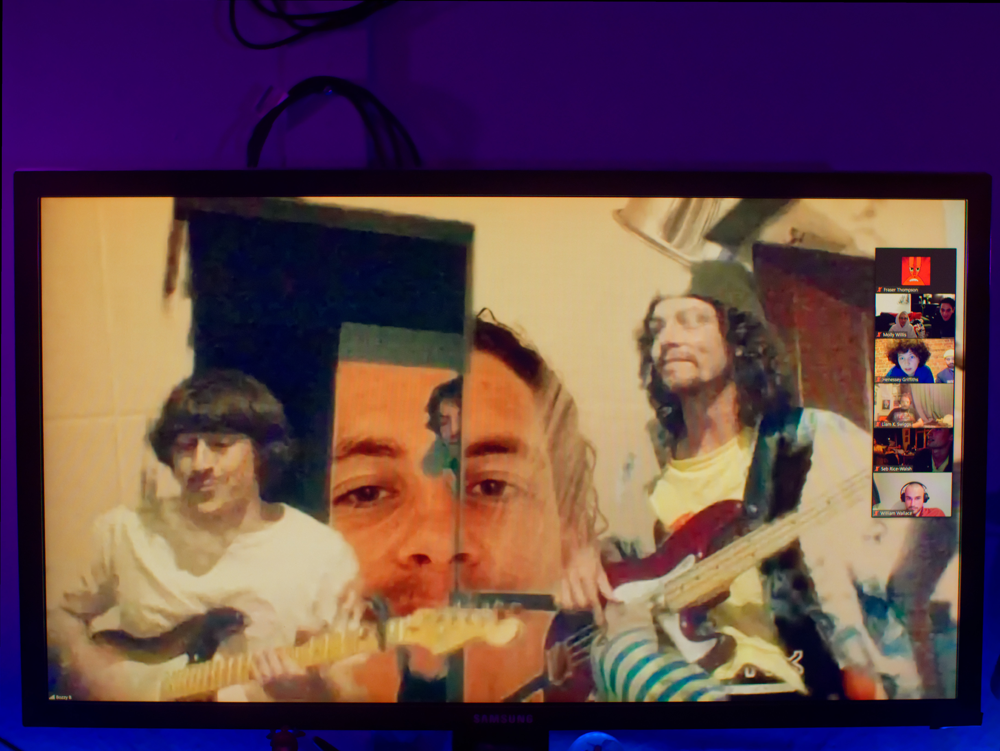
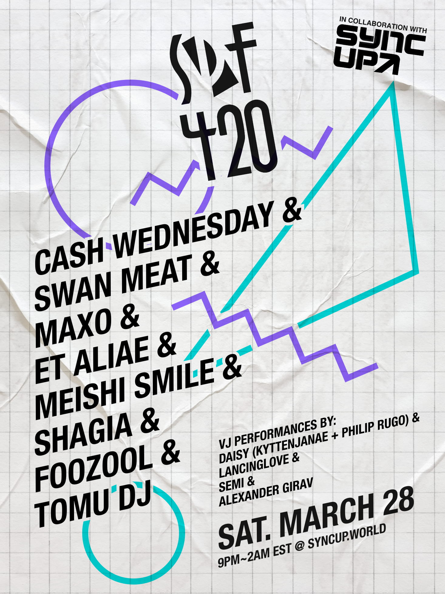
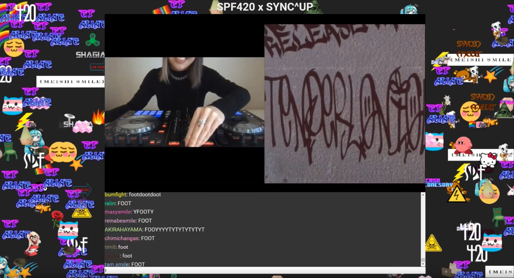

It’s hard to believe just over a week ago I was interviewing a band who were preparing to embark on a national tour, and now we’re living in a world where every step outside our bubbles must be carefully considered. We could all see the storm clouds on the horizon but had no idea how quickly and viciously it would hit.

The local live music scene quickly had to adapt, and we’ve seen a flourish of online livestreamed performances. Experimental artist Mud Death performed a mind-numbing set earlier in the week, Nadia Reid has performed in a few livestreams, and even the infamous U-Bar pint nights have headed online, minus the unique multi-sensory cultural experience of the line outside.

For many joining a virtual “crowd” on Facebook or Zoom seems strange and antithetical, but it’s not a new concept.

In 2012 for example an online music festival called SPF420 grew out of the “internet music” community and over the next few years held numerous events. Attendees would join a room on a video chat site and witness people, in various global bedrooms, performing DJ sets. The audience would engage with each other and the performers by typing text in the chat area.

Making an online event feel as significant as a physical event poses many challenges. Three hundred people in a physical space will fill up a room. In a virtual space you might not even know they exist. The energy you feel at a physical event, where the music is pumping and the crowd is roaring, is hard to replicate.

Last Saturday, in amongst numerous livestreamed performances from the likes of Benjamin Gibbard and Charli XCX, SPF420 returned for the first time since 2015 for a show in the online venue syncup.world. From the moment I joined I understood why the SPF420 events are remembered so fondly.

A big part of what made it feel significant was the mere fact that it wasn’t on Facebook, it was on some unknown site which you rarely have a reason to visit. The site also offered interactive elements: Attendees could click to place stickers in the empty space around the video window, and move them around. This quickly allowed for a micro-culture to develop as attendees learnt the ruleset and engaged with each other.

Whereas on most platforms spamming (repeatedly sending the same message) is discouraged, on other platforms used for live events such as Twitch and the platform used by SPF420 this practice is commonplace. It results in a chat screen which whizzes past. You feel the energy, you feel like you’re in a crowd of people, and the best part is you get to join in.

It’s hard to describe to someone who hasn’t experienced it. One of my favorite moments was when a track played by one of the DJs, Et Aliae, included a vocal sample which sounded like the word “foot” and everyone in the chat started spamming “foot”. Strangely enough I’ll probably never forget that.

What I want people to take away from this is that online music events can fill the hole left by physical events. It could be a long time before it’s safe to return to crowded bars and venues. What I hope to see is the rise of online music venues, hyperspaces specifically designed for hosting gigs.

If you’re wondering what to do this weekend Undertheradar has updated their gig guide to list online events, [check it out](https://www.undertheradar.co.nz/utr/gigRegion/Online).
