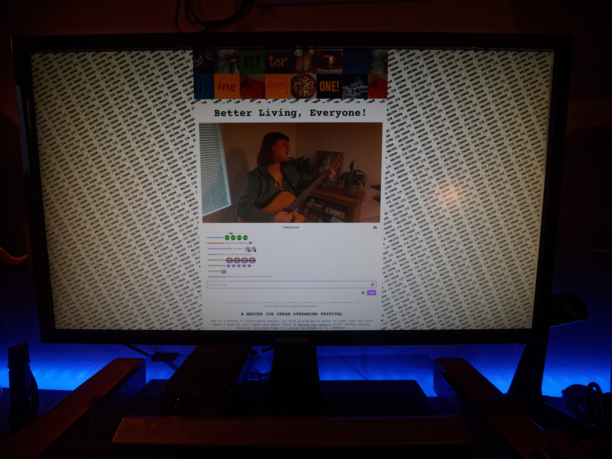
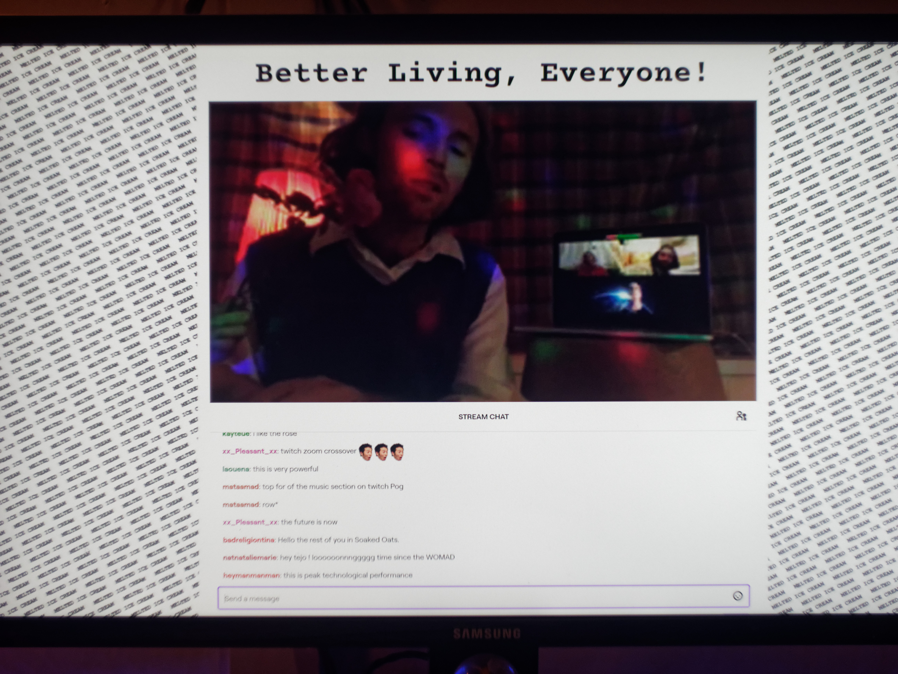
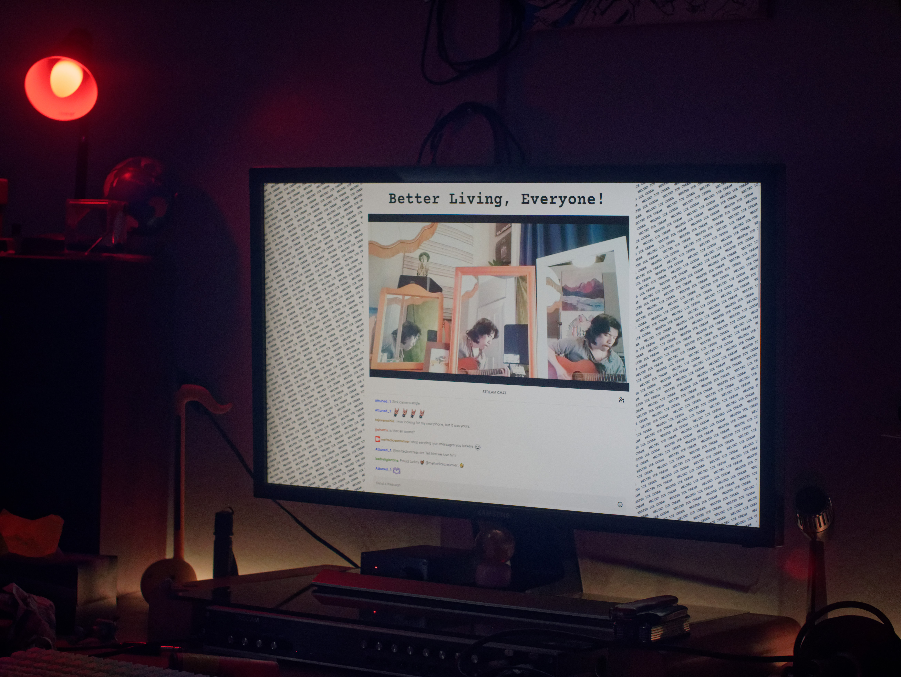
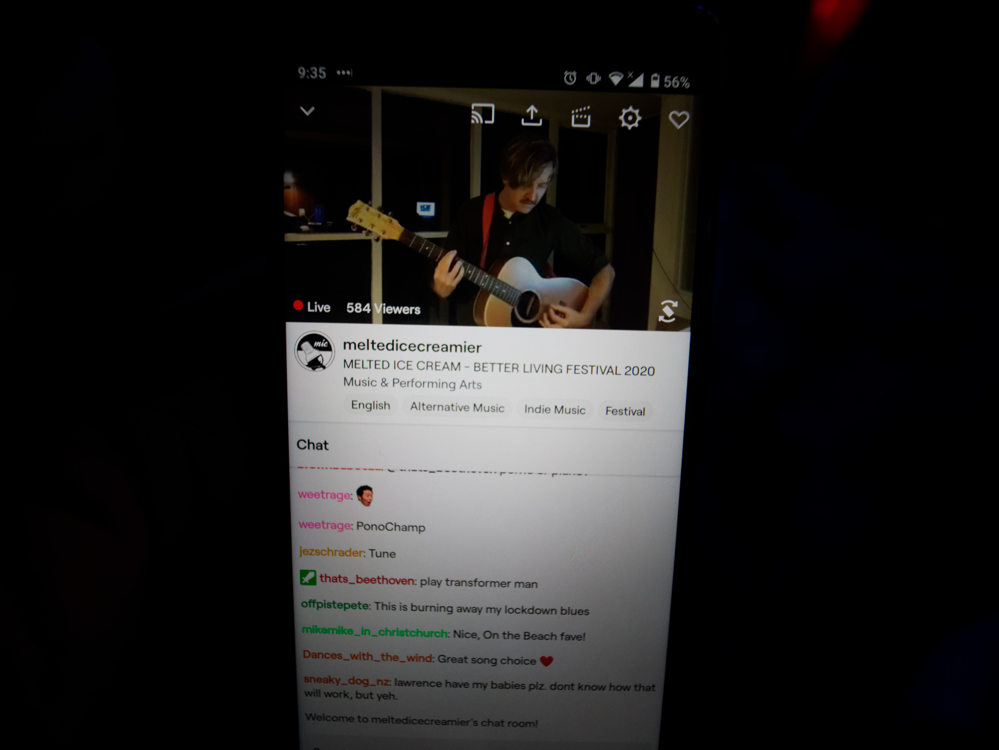
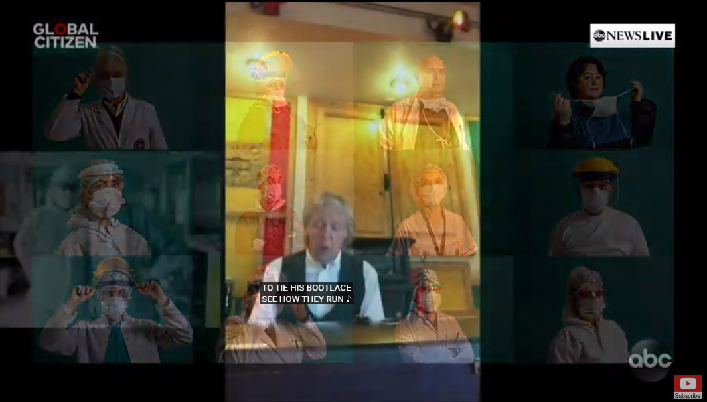
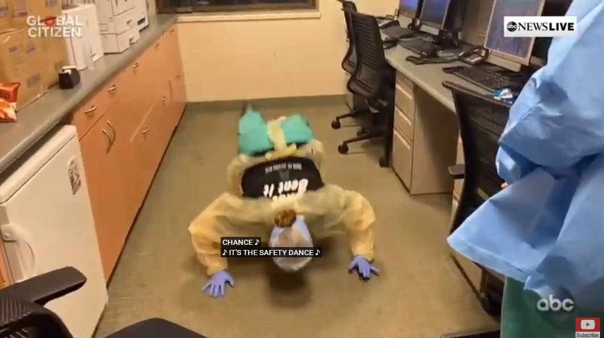
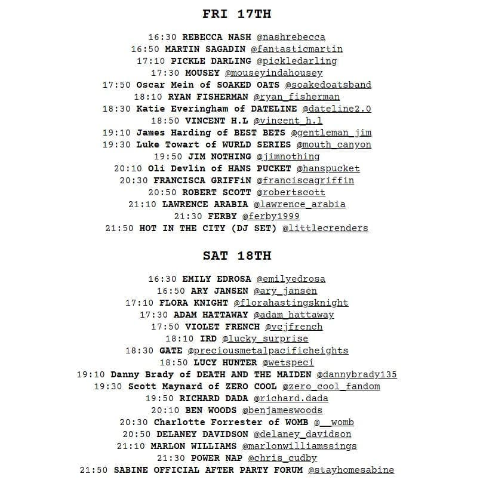

After a few weeks of figuring out the new normal, last weekend demonstrated that the local live music scene is anything but dead. It’s just different now, like pretty much everything else.

When I arrived at “Better Living, Everyone”, Christchurch’s relatively long running music festival put on by local indie label [Melted Icecream](https://meltedicecream.co.nz/), I was sitting in my bedroom in front of my computer screens, RGB room lighting set to Tropical Twilight. I’d arrived fashionably late, Pickle Darling was crossfading into Mousey, but still the night was young; 13 more acts were yet to play.

Oscar Mein of Dunedin’s very own Soaked Oats came next, playing a neat wee solo set on guitar and keys, while his bandmates offered moral support from a Zoom room behind. The video quality was, ironically, porridge, but it didn’t really matter and the audio was fine. In fact at no point in the event was audio an issue, and this is coming from a real audio pedant.

Ryan Fisherman jacked the production values up a notch next, performing in front of a dazzling display of mirrors, each reflecting a different Ryan Fisherman. Which was the real Ryan Fisherman? I doubt even Ryan Fisherman himself could say for sure, but he delivered a stellar country-tinged performance.

He wasn’t the only one to make an effort on the visuals either. Oli Devlin of Hans Pucket performed from a meticulously decorated bathroom with a glowing bathtub, Vincent H.L put up fairylights... It helped drive home that this wasn’t just another livestream, this was Better Friggin’ Living, Everyone. It felt significant and important because everyone involved believed it was.

Around this point I moved to the living room. The beer started flowing, my bubblemate turned up, and the RGB room lights were set to Arctic Aurora. The audience was chatting away happily in the live text chat, little in-jokes and memes were developing. The internet’s trademark toxicity didn’t seem to rear its ugly head either, people seemed genuinely stoked to be there and thankful for the artists performances.

The headliner for Friday was Lawrence Arabia who was unsurprisingly really good, and then things started getting fizzy. We got some refreshing hip-hop from Ferby, which was unfortunately hit by some technical hitches, then Hot in the City capped off the night with a DJ set like no other featuring high-energy shadow-dancers behind a sheet.

And that was just day one. Saturday was another huge lineup of performances. Highlights included Lucy Hunter’s haunting piano pieces, Danny Brady’s infectiously danceable synth set, and of course Marlon Williams. Around 1,300 people turned up for his performance which was, again unsurprisingly, really good.

It made Sunday’s abysmal “One World” livestream viewed by millions all the more embarrassing really… Celebrity egos were stroked. Too many American talk show hosts said too much. Paul Mcartney sang Lady Madonna while stock images of doctors faded in and out around him. And worst of all they disabled the live chat, presumably because it was about them, not us.

I've been spending lockdown getting into Bollywood and other Indian movies (there are heaps on Netflix) so I was pretty stoked to see a segment from favourite actor Shah Rukh Khan, but apart from that it was at best an entertaining disaster and at worst a condescending and inadequate response to the structural inequalities which have left minimum-wage workers on the frontline of a global pandemic.

In contrast, “Better Living, Everyone” felt comfortable, collaborative, and it captured some of that exhilarating feeling you get at a really good gig. The calibre of the performances was top notch, with just enough awkwardness to remind you it’s live. It felt important, and set the bar for future live events over the next few months. Better living everyone.

