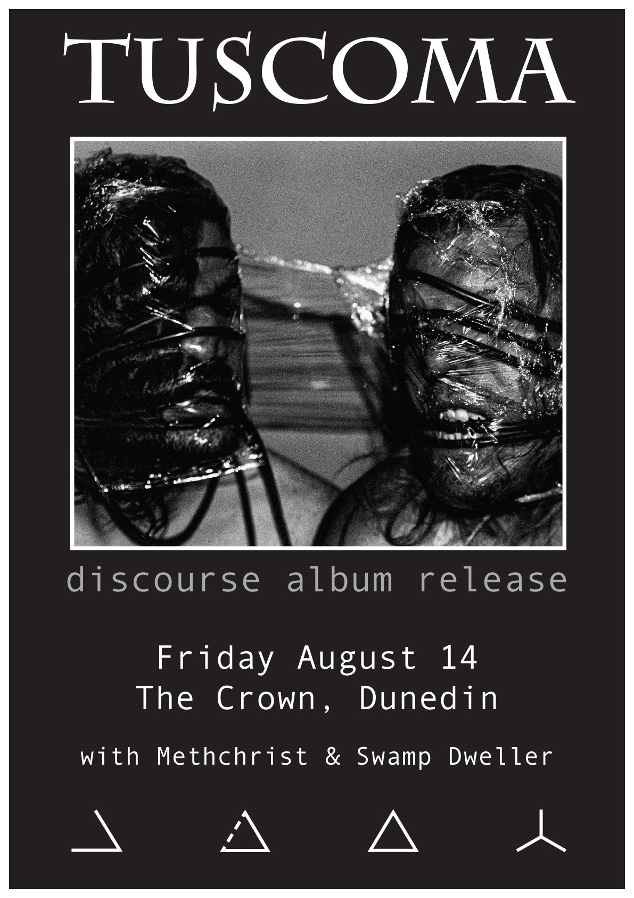

Wellington blackened post-metal-gaze duo Tuscoma released their highly anticipated second album Discourse in April - only to have their national and global tour cancelled due to the ongoing pandemic. I caught up with guitarist and vocalist Kurt Williams to talk about their second attempt at a national tour, but since then COVID has re-emerged and plunged the country into another partial lockdown, forcing them to cancel yet again.

<iframe style={{ border: 0, width: '350px', height: '470px' }} src="https://bandcamp.com/EmbeddedPlayer/album=1436212126/size=large/bgcol=ffffff/linkcol=0687f5/tracklist=false/transparent=true/" seamless><a href="http://tuscoma.bandcamp.com/album/discourse-2">Discourse by Tuscoma</a></iframe>

**Your last album released in April, just before lockdown, so how did lockdown affect that?**

Massively bro, massively. Yeah we had a European tour lined up and the UK, and possibly America and Canada, and then as soon as that hit we decided well that’s basically this album over by the time things go back to normal, you know, you can’t tour an album after a year and a half or so. So yeah, all that time and effort of making that album is kind of like… We’re just calling it a background album I suppose aye.

**So your global tour is obviously not possible unfrotunately, but you’re still doing a national tour, which is cool because we’re like the only country where people can do still do that**

Yeah exactly, our friends in Deafheaven are quite envious of us aye.

**On this record you had the bassist from Deafheaven, how did that happen?**

Well when they came to New Zealand last year we supported them in Wellington and Auckland and just got to know them very well. It’s through Jack Shirley who does all the producing and recording, he produced our first album Arkhitecturenominus, so yeah we got to know them very well on tour. We were meant to go to GodCity to do it, you know GodCity, Kurt Ballou’s [Converge] studio? We were meant to go to Boston to do it and then Chris just was like hey I’ve got an idea, I’ll come out to New Zealand, if you’ve got a good studio out there, and we’ll get to know each other and just peddle to the meddle style, yeah.

**What was that process like?**

We just had a whole album written and when we went into the studio we said to Chris this is how we want to do it, and he was like that’s cool, and he came a week before we started recording, came to practices and had a listen, got an idea of it, he saw us play those two shows with Wolves in the Throne Room. So he had a good understanding by the time we got in the studio, and then he had like two days to learn the bass parts. Having someone of that calibre on our album was pretty crazy bro.

**How would you say you'd describe your music?**

It’s black metal in a sense that we’re blasting and it’s pretty black, but it’s not traditional first fourth or twenty fifth wave, you know how they’ve got all these waves in black metal… Yeah I guess that we approach it pretty differently. Blackgaze is more your Deafheaven or Alcest and stuff like that. We’ve approached it with a bit more, I dunno, not hanging back but keeping it in the mix if you know what I mean? Yeah. Joe’s more of a death metal guy, like you know death metal orientated background, and I’m like not a metalhead at all, I’m into proper shoegaze like Slowdive and My Bloody Valentine and early Blur. And that’s why it’s not like black metal as such, it’s like what the fuck man?

**In general what is your attitude towards genre and labels and that sort of thing?**

Genres? I just reckon like yeah, if you want to fit into a genre go hard man, but we don’t really think of genres much, we’re not like hey let’s write a death metal album or let’s write a black metal album, we’re like you wanna blast? Yep sweet as, I wanna play this, and then we just create, you know what I mean? Like we’re writing new music at the moment because Discourse is just a background album, we’ll take a year to write this and by the time we record and stuff like that the world will be back open again. This new stuff is more, I would say it’s more actually black this time. It’s more straightforward, yeah.

**Especially in the metal community there’s a lot of elitism and like, that’s not true, people like to put things into boxes whereas you have a more kind of interesting “modern” sound. I saw one review which called you hipsters… Does that bother you?**

Nah I don’t care, I’m not saying yeah I’m hipster as but I know I’m not a run of the mill metalhead. Like if someone said name a Megadeth song I’d be like what? I don’t even know what Slayer really sounds like, the traditional metal like I have no idea man. Records I’m blasting right now, you know the band Diiv? That’s more my jam man, and that’s hip shit, that’s very hipster music. We don’t really give a fuck about what people think about us you know what I mean? We just want to make music and if you don’t like it sweet as, it doesn’t bother us aye.

It’s kind of good to have a point of difference, you know what I mean? Wolves in the Throne Room when we played with them, they’re a pretty good band man but it was just like yeah well we’ve heard all of this before, it’s pretty stink. Like that American black metal sound, nothing’s really separating them from like... You know what I mean? It could be like a lot of bands.

**For your previous album did you tour Europe?**

Yeah we did like three months Europe and the UK.

**How was that?**

Yeah bro it went well man, pretty gnarly aye. It was for the debut album, that's why we’re kind of guts about this year because the shows we got this year was only for five weeks but it was more a fine tuned tour and there was more hype behind us you know, these guys have played with deafheaven, this guys on the album, they’ve played with Belphegor and Wolves, you know, we’ve supported a lot of big bands so there’s a bit more hype behind us you know? So the crowds would have been much bigger and you could tell by the guarantees we were offered for the shows, they were bigger than last time. But it’s just like oh well, sweet as, next time.

