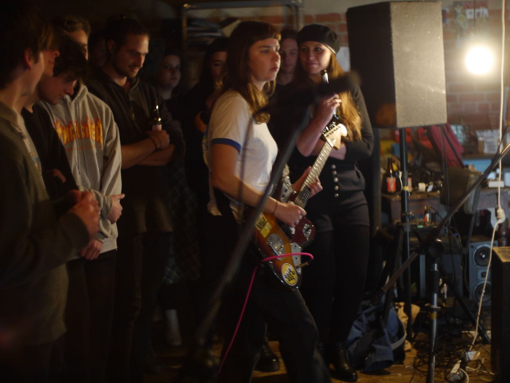
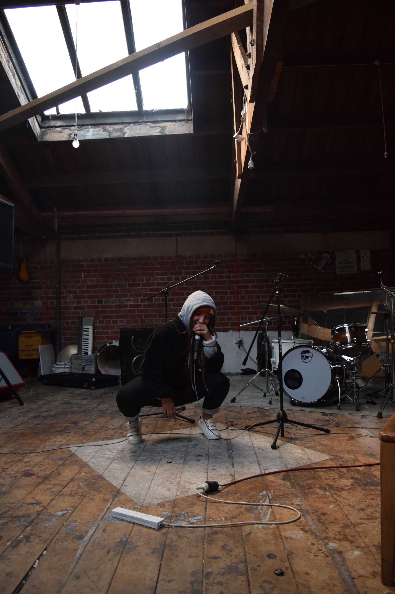
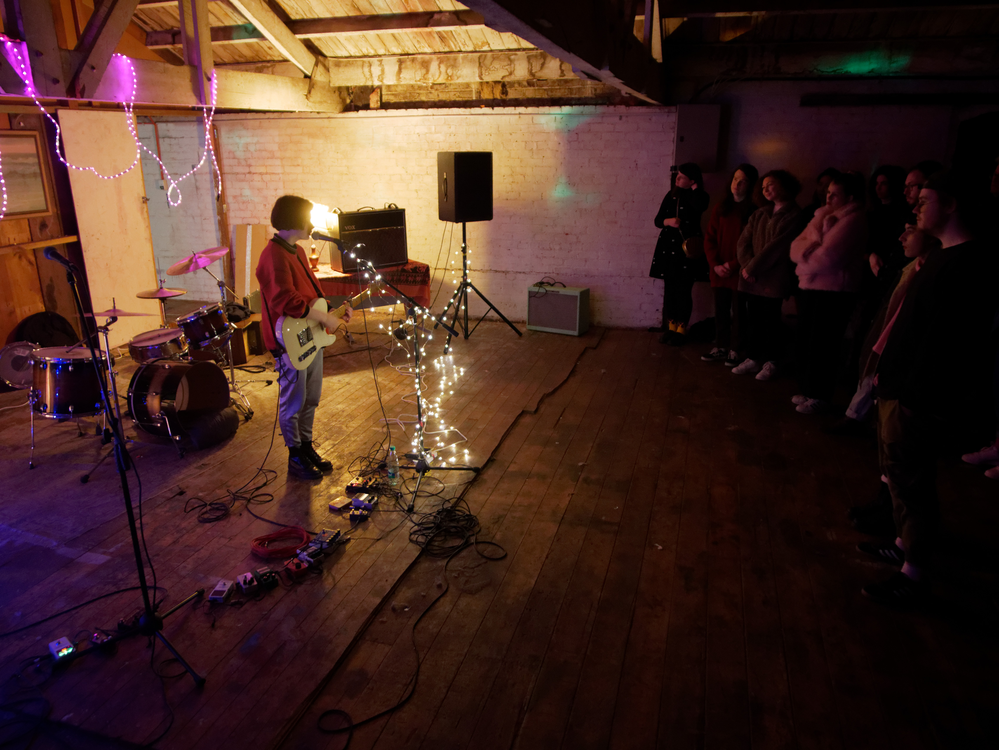

Located at the very top of a three story commercial building on George Street, the venue known as The Attic was the most important place you haven’t heard of.

As well as providing a space for artists to practice and record, it hosted gigs from national and international acts such as The Beths, Miss June, Kane Strang, L.A Suffocated. More importantly, it formed the core part of the local indie scene since 2011, closely associated with Thundercub, Astro Children, Space Bats, Attack!, Alizarin Lizard, and later Koizilla, The Rothmans, and many more.

That era is mostly past. As a venue it’s been officially gone since the main room was closed for earthquake strengthening in 2018, but over the past two years it’s continued to exist as a practice space for a number of artists. That is, until last week.

“At the moment, like today at 7 o'clock, we’re going there to collect our stuff then we will all be moving out.” explained Julie Dunn.

Her association with The Attic started back in 2012, as a self-described “roadie”, but today she co-manages the Trace/Untrace cassette label, publishing many bands associated with The Attic, and is in the band Bathysphere, who shares a practice space.

“Basically we’ve been in The Attic, without a tenancy agreement officially, since September last year, that’s when we got kicked out of the back room, you know the other room where we used to have gigs in the corner.”

“So that’s just happened again with the new room”

Other than Bathspyhere, Night Lunch also held a room in The Attic, along with Koizilla, members of Fazed on a Pony, and a few other visual artists who shared another room. In total, around 14 people shared rooms in The Attic. It’s a lot of artists for two rooms, especially considering they were only able to use it after 8pm to avoid disturbing local eateries.

They had “at least four other bands” who were also keen to use it as a space to practice in, and had emailed the landlord in hope that they could pay to rent the back room which was still unoccupied since being emptied for earthquake strengthening, but that didn’t work out...

“We saw him a few weeks ago in the space and I was like ‘did you get our email?’ and he was like ‘oh yeah, I didn’t reply because we’re going to evict you.’”

The value of practice spaces is not often recognized. As a music fan, you typically don’t hear bands when they’re new, but the fact remains that every band you’ve ever loved will have practiced, and probably more than once, to get to a state where they’re confident enough to share their music with the world. As Julie puts it: “Music really does rest on the ability to have somewhere where you can jam with people. If you don’t have that then you don’t have anything,”

“I just don’t think Koizilla would exist to the same level that it does, or anything like that, people are just able to become so much more proficient as bands because they can just practice when they want to.”

Unfortunately these sorts of spaces are hard to come by. Or, more accurately, landlords willing to lease those spaces to musicians are.

Julie and other artists in The Attic have come close to finding spaces in industrial areas where noise isn’t an issue, only to be rejected by the landlord when they found out musicians would be renting the space.

“It’s incredible how much you just feel like nobody wants you, or like you’re actual scum for being loud, it’s crazy.”

Their plan was, and still is, to form a co-operative of musicians who pay a small weekly fee for access to a practice space, which will ideally host gigs. But to achieve any of that, they’ll need to find both a space and a landlord willing to rent that space to them.

“You’re kind of just crowdfunding it, but people get to use the space because they’re a member which I think is a bit more sustainable as a model.”

“So I think the ideal situation is kind of that you have the practice space which works in that way and then it can become a venue, in a legal way, you know, even if it’s like an alcohol free thing, because it’s on that really stable foundation of being funded by the people who use it rather than having to make money off scarfies buying beer.”

“I just think that people have a certain idea about what musicians are like, and what I’ve struggled with in The Attic is that I find those ideas get reinforced”

The reason given for the eviction, according to Julie, was that the landlord wanted to develop the space. But relations declined when graffiti was discovered by the landlord in a hallway leading up to The Attic, and it seems his feelings towards the tenants may have played into his desire to kick them out.

Julie claims none of the current Attic residents were responsible for the graffiti, but the landlord, who has owned the building for about 12 years, disagrees.

“They were evicted because of being irresponsible, and they, or somebody, graffitied the inside of the building” he explained when contacted for comment.

“Well I didn’t do it, so someone in their group did it, because it’s a secure area, the door has a pin code, so they may say whatever they want to say, the fact remains I can actually show you the graffiti and the rubbish that’s been left lying there, the alcohol tins, bottles, all sorts of trash.”

“They’ve acted irresponsible so they’ve authorised, as we all do, their own misfortune” he reiterated.

Julie doesn’t claim they were perfect tenants, but they always tried to leave things tidy. They banned glass at gigs, and always spent the day after tidying up. She believes a lot of the problems stemmed from the lack of a formal agreement.

“It’s hard in The Attic because I find that those negative stereotypes do kind of get reinforced because people do act out a little bit, and I think it’s because we weren’t being held accountable or responsible for anything because we didn't have our names signed to anything, or have a contract or a bond or anything.”

“That’s one of the reasons why I’m really excited to move away from The Attic because I can’t wait to have a completely clean slate somewhere and, in an ideal world, starting up a DIY venue that separates music from alcohol in terms of getting music out of bars and kind of fostering this idea that musicians can be respectful tenants and it doesn’t have to be all how it’s been”

Regardless it’s still a great loss to the local music scene because The Attic was more than just a space for musicians: It fostered a community.

Once you made the trek up those seemingly infinite flights of stairs and winding corridors you entered a space which felt important, valuable, and you felt part of it. And generally people did treat it with respect. There were definitely far fewer issues than there would be in a typical bar. There was a sense of collective stewardship.

“I’ve seen at The Attic more than anywhere else people calling other people their age out on stuff,” Julie agrees, “People know that there’s no duty manager there, it is just more of a free form space, so people are just way more on to it with managing their friends behavior.”

“I think because it’s not so institutional I guess, it feels like it’s more about the people that you see there, I mean obviously the space is like, quite iconic and we all love like the distressed wood vibe of the attic which I will miss, I really think it’s so beautiful up there.”

“But when I think about The Attic, and I think this is what I’ve seen in people’s responses when they hear about the fact that it’s not going to be a thing anymore, like people are always saying like, so many memories of the people that are up there, and like the bands are part of it but I also really think the audience becomes so much more of a part of a space like that you know?”

“Like you have the same people standing beside you in the crowd and when you go to enough shows there you start to realize that it’s the same people and you start to feel comfortable.”

The long and the short of it is if we want Dunedin to actually be the hub of creativity it purports to be then we need to make space for art to be created. If you want more bands to emerge and create more music you like, you will need to either tolerate them practicing next door, or hope that they can find a space elsewhere, such as The Attic. There’s no third way

“It’s kind of like realizing that music has to go somewhere, like we are forced into that sort of dirtbag position to get to a good place, and that’s just the only channel.”

“You like music, and we are creating that, we just need to be given a space to do that. And we don’t want to annoy you, we want to be nice upstanding citizens, so give us an opportunity to do that.”
