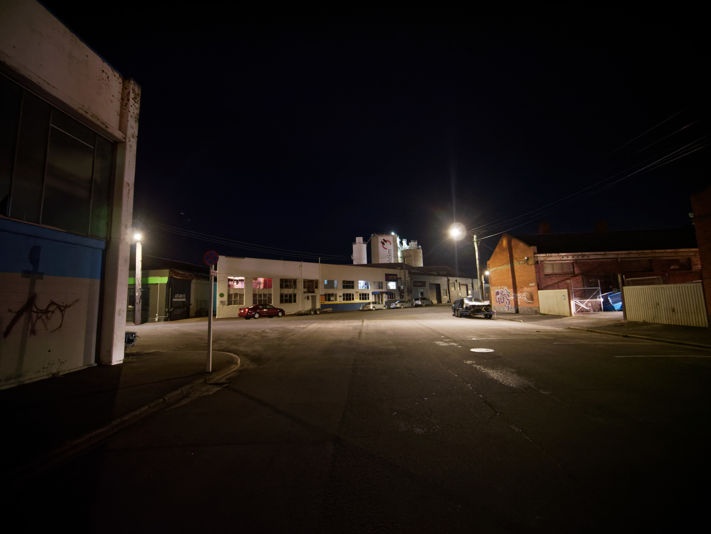
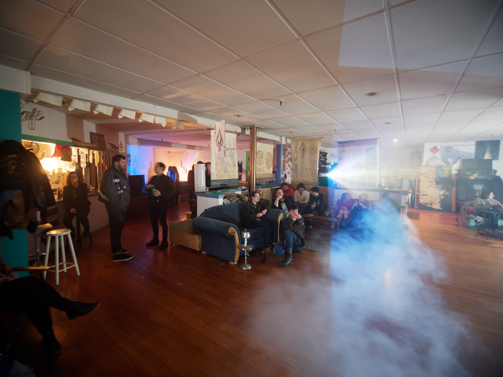
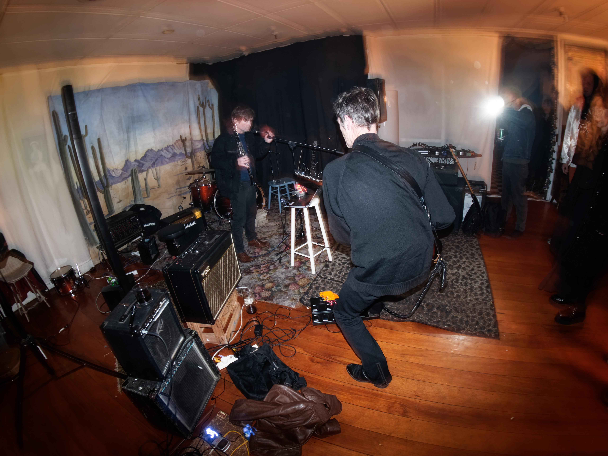
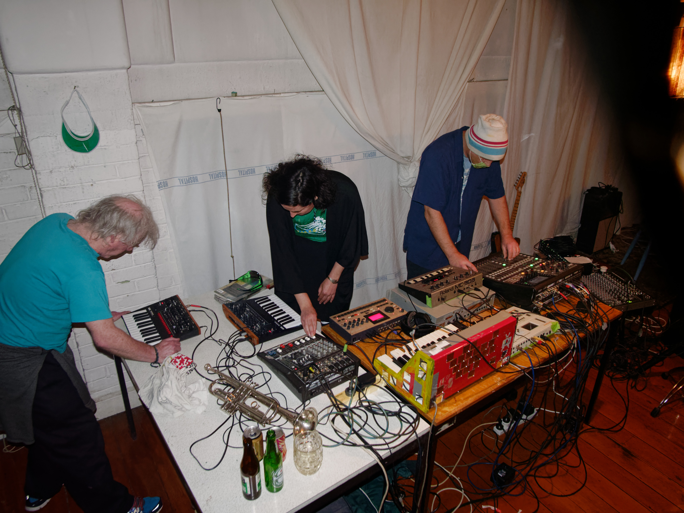
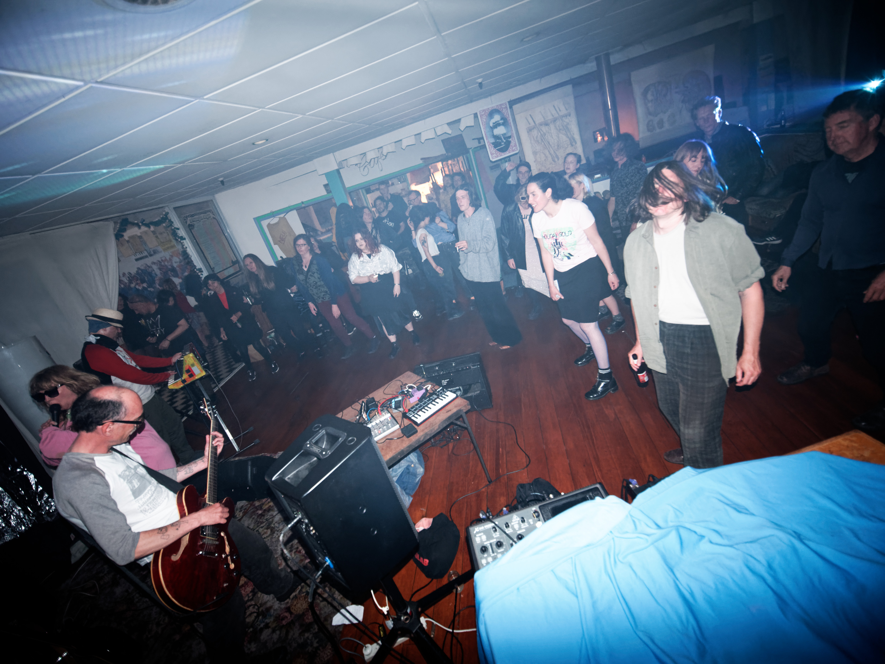

Around a year ago [I wrote about None Gallery](/blog/goodbye_none/). None Gallery was a collaborative art space which hosted art exhibitions and music gigs since 2003. It ended when the building was sold to a property investor. It is now a gym.

A few months ago [I wrote about The Attic](/blog/%E2%80%9Cmusic_has_to_go_somewhere%E2%80%9D_the_attic_and_the_value_of_practice_spaces/). The Attic was a venue and practice space which was a cornerstone of the indie/alternative scene since 2011. It ended when the landlord decided the space was better off being anything else.

Now I am writing about Jutland Street, another doomed space which joins None Gallery, The Attic, and many more in the Dunedin cemetery for dead creative spaces.

Over the past six years [Jutland Street has served as a home for the sorts of music and musicians who are barely tolerated anywhere else](/venues/jutland_street/). And if it were anywhere else it probably wouldn’t have been: Being deep in the warehouse precinct (the real one, not the cafe one), meant no chance of noise complaints.

Entering Jutland Street felt like arriving in another dimension, or maybe a dream. With no neighbors, the surrounding streets were wide, dark, and deserted. It felt like a spiritual home for the sorts of music it hosted rather than just a physical one.

Outside of hosting events it was a flat, and one of its residents is Dene Barnes, who performs as L\$D Fundraiser.

“They started off as parties with bands playing” he explains, “and then it sort of filtered into being gigs as well I guess.”

“It’s just a bit more sort of liberating than being in a venue, know what I mean? You’ve got a bit more free reign to do things, like do visuals, go later…”

This freedom is, I believe, essential to a healthy music scene.

Bars are fine, but they’re commercial spaces, and commercial spaces come with inherent pressures. There are implicit or explicit parameters within which performers and audiences have to operate.

These parameters do not exist at DIY spaces like Jutland Street.

They don’t have to worry about selling enough beer to break even. They don’t have to worry about noise, and are free to start at 10:30pm and finish after 3am, like many Jutland Street gigs did. They can set up larger productions with projectors, backdrops, lights. And they can host music which is trying to make you feel something rather than being necessarily “good”.

Bars are important venues too, but there needs to be a balance.

“It gives people more room to move and do things over a period of days, leave things setup or set things up. It’s not just go in until you’re out sort of situation you know?”

“It’s never been about money for me for what happens here. We do do a door charge and things, but the money all goes to the bands, I’m not really interested in making a buck or anything, it’s more about having a good time.”

Some of the bands who played at Jutland included local staples of the experimental or noise scene like Alistair Galbraith, Eye, Wolfskull, Crude, and The Futurians. More recently it started hosting ticketed international acts through Audio Foundation but this led to some problems with the council and since then it’s been strictly local bands.

“Because we just don’t want the council poking their nose in our business,” Dene explains, “like we want to be just like a house party rather than like a venue you know? And that’s why on the posters it just says Jutland Street [rather than the specific address]”

Apart from that though the space has been trouble free with no police visits or major incidents, and this is a common trend I’ve noticed with these DIY venues and creative spaces.

While the authorities treat them as dens of scum and villainy, the truth is almost always far from that. Compare the Octagon at 2am to Jutland Street at 2am... People are there to experience art, there’s a shared sense of possession of the space and what it represents, so people are generally respectful.

So why does their existence always feel under threat? If it’s not licensing it’s fire regulations… Or something else, The Anteroom in Port Chalmers was also recently put on hold due to the wheelchair access it had not being quite right. Shouldn’t a UNESCO Creative City support spaces like this?

“It seems to me there’s a division of the council who are all for creative space and setting up artistic space,” reckons Dene, “and then there’s another division in the council which is sort of completely counteracting that with bylaws about fire-escapes and you know, noise control, and I guess licensing too.”

“But yeah, it’s getting to the stage now that there’s less and less space for bands or music communities to sort of gather and play, and the council are supposed to be encouraging and fostering creativity, that's one of their identities as a Dunedin council is all about culture and creativity you know?”

In this case though it’s not the council forcing the end for Jutland Street, it’s the other one: capitalism; the landlord wants to develop the space into offices. So I guess that’s the end of that then.

GIG: “Jutland Street Last” 4pm - 7pm and 9pm - Late featuring Wolfskull, Crude/The Aesthetics, Algal Grind, The Fuck Chairs, Stephen Kilroy, Mud Death, L$D Fundraiser, Mother, Francisca Griffin, GRVDGGR, CJA and Corpsehand. $15 at Jutland Street.
