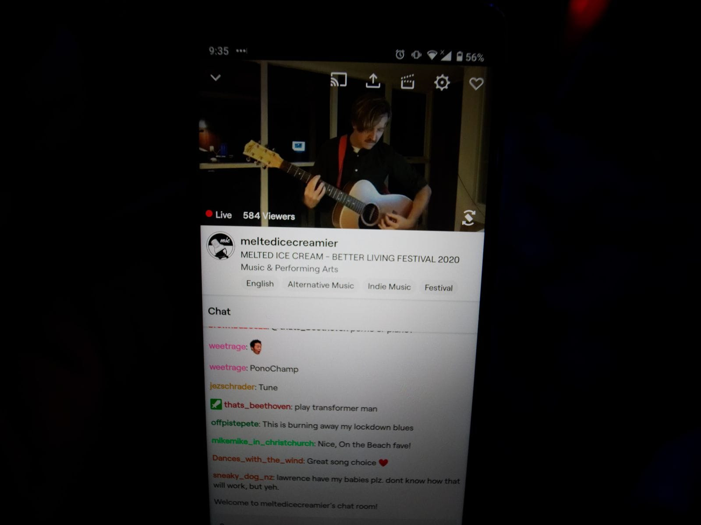
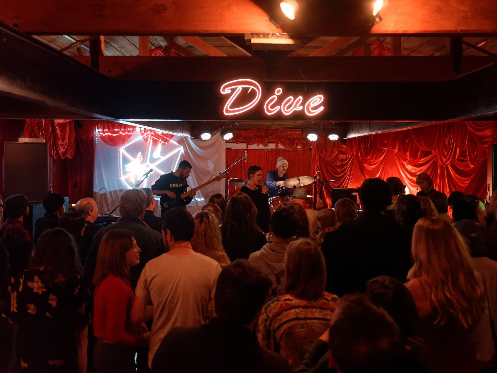

Did that just happen? It felt like one minute we were expulsing bodily fluids all over each other with wanton abandon, and the next we were avoiding the chip aisle until it was clear enough to maintain two metres of social distance.

Yes, as you've probably read a thousand times, 2020 was a strange year, and music was not exempt from the strangeness. As viewed in purely financial terms by some cosmic bean counter, the industry lost a great deal. Without live music, less money flowed from the people to labels and promoters and venues and breweries and distilleries and sound techs and light techs and eventually musicians.

But as an artform, music carried on, as it always will. None of the musicians I've talked to (who were receiving the wage subsidy) seemed particularly bothered by the months spent housebound, and for some it even resulted in an upsurge in creativity. For a certain type of person being forced to stay at home means more room for the things they really want to do but feel like they never have time for. No longer were they suffocated by the external forces and obligations of regular everyday life.

We adapted to livestreamed gigs to keep up the connection between performers and audiences, ranging from simple Facebook live streams to elaborate cybervenues. The first (and only) Radio 1/Critic virtual pint night on Zoom accurately captured the “waiting in the U-Bar line” experience, and the online incarnation of regular local events Waitati Music Festival and Nook and Cranny went way better than you would expect. Local musician Person Will deserves mad props for his work behind the scenes on those last two events.

It was actually genuinely exciting to see the innovation in this space, and I’m almost sad to see it stop. International long-running series of events SPF420 is still the gold standard in this area, and continues to host online gigs, including one featuring New Zealand’s very own Eyeliner. The key is creating a sense of significance, and providing the audience with many ways to be seen and see each other.
Unlike the rest of the world though, we were back in crowded rooms by like July, and while we seemed a little reluctant to get back to the whole tedious “going outside” thing, there were still loads of great gigs this year.

[Same Name Confusion wowed me at Starters Bar](</gigs/same-name-confusion-esp-(telepathy)-tour/>) with their exuberant live show: every member of the band sang into a wireless body mic and took full advantage of the freedom of movement that gave them. [Finally seeing Dick Move](/gigs/dick-move-album-release/) after two failed attempts was cathartic. [Princess Chelsea](/gigs/princess-chelsea-homecoming-nz-tour/), [The Beths](/gigs/jump-rope-gazers-tour/), not to mention [all the hardcore at Dankfest](/gigs/dankfest-2020-day-1/), [all the experimental goodness at Jutland](/venues/jutland_street/)… Same old Otepoti we know and love, despite the global pandemic.

Ironically, [it was DIY venues rather than commercial venues which took a hit this year](/blog/“music_has_to_go_somewhere”_the_attic_and_the_value_of_practice_spaces/), and probably not because of the pandemic. Now we're in a situation where there's pretty much nowhere in the city for music to simmer and grow, nowhere for unsanctioned creative experiments or for underage people. Why? Because while most people enjoy music, they enjoy money more. Bit of a shame, but things can only get better next year.

Speaking of money, America's 614 billionaires got \$931 billion wealthier this year while everyone else got poorer and/or died of COVID. Kinda messed up imo.

It really cannot be emphasized enough how much more of a dumpster fire 2020 could have been for us if it weren’t for our solid leadership. It turns out if you actually follow the guidance of experts and don’t value business over people, pandemics are much easier to manage. Also of course ourselves, who for the most part did a great job of also trusting our leadership, but I think that comes back again to the people-focused nature of the leadership.

Anyway, in summary 2020 was very interesting and kind of bad but also kind of good, and could have been a lot worse. I probably wouldn’t want another one. But at least we’ll always have music.
