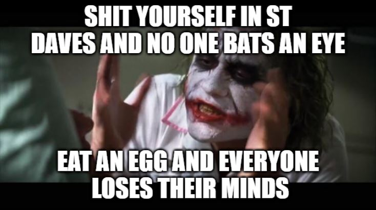

There are two things which get me out of bed in the morning: music and reality TV.

It's the drama, it's the humanity, it's the sheer craft which goes into massaging reality until it becomes hyper-real broadcast mythos. There's really nothing else like it.

So you can imagine my excitement when it was announced that Dave Borrie, local Radio 1 DJ and Musician, was going to be on the new season of [TVNZ's The Bachelorette](https://www.tvnz.co.nz/shows/the-bachelorette-new-zealand). Finally, the crossover we've all been waiting for - student radio and reality television!

Unfortunately it didn't last long. In a twist which shocked the nation he was eliminated on episode three after attempting to win The Bachelorette's heart in a comedy challenge by eating a raw egg, shell and all. A raw egg! Hilarious, obviously, but Lexie The Bachelorette wasn't amused: "I was a little surprised by Dave in that I didn't find it that funny..." she explained in a piece to camera, before sending him home.

And thus Dave became the first member of Radio 1's 37 year fraternity of esteemed DJs (which includes our current mayor Aaron Hawkins) to be eliminated from The Bachelorette. He went into The Bachelorette a Radio 1 DJ, geologist, and musician, and came out the other side with egg on his face.

He's keeping positive though. I caught up with the egg man himself for a beer and to discuss his time on the show, as well as his musical endeavours.

<iframe src="https://open.spotify.com/embed/artist/5JAixRFfpFXSEqBSRHYcAF" width="300" height="380" frameborder="0" allowtransparency="true" allow="encrypted-media"></iframe>

**How does it feel to be the first Radio1 DJ eliminated from The Bachelorette?**

It feels good to be making history _laughs_. It's so funny the different spins you can put on things… It feels good. It feels good to be breaking history, or making history I suppose, not breaking.

**Obviously you were eliminated pretty early, I assume for you it would have been like a few days?**

Yeah I think it was three days or something.

**Was that devastating or what?**

No, in short no. I was like well I've done my best, I've just been myself. So I wasn't devastated. I was like man I wish I could have stuck around for a bit longer because it was so fun like meeting all the guys, and Lexie's a great girl.

The one thing which made me laugh and was kind of like, this is on me… I never talked to her, I should have talked to her but before I went on the show I was like I'm just not going to swoop people. I'm not going to go in and like, take time off other people.

So I'm a little bit gutted because it was so fun while I was there and I couldn't keep having that fun. But at the same time I literally ate an egg and didn't even talk to her, so it's 100% fair. A raw egg too.

**Did you watch it?**

So it was like a ritual in the flat every year since Art Green's season in 2015, it was one of those things that we'd watch as a pisstake, like this show is so stupid, but then the thing with irony is you're eventually going to get invested in it right. So I did watch it quite a lot, for a “joke”. So when I got the opportunity to go on I was like there's no way, my friends will never let me live this down if I said no.

**Obviously you experienced it as you experienced it, then it went through editors and stuff, so was that kind of weird seeing that interpretation of what happened?**

It is, it is weird. The editing is sneaky because like, obviously everything that is said and happens is said and does happen, but they can edit it to make moments look more awkward than they were. Like for example with the egg eating thing there weren't that many pauses in it, so it's very clever with how they edit it but like I wasn't unfairly portrayed. And I think up until… For the first few episodes no one's been unfairly portrayed. I think they definitely pick villains, like people to play the villain role, but no ones like actually been… They did say those things.

**It's exaggerated.**

Yeah it's exaggerated. Like yes it's reality TV, but you are kind of playing a character you know?

**The egg, we need to talk about the egg. I feel like I phased out and then suddenly you were eating an egg and I was like where was the joke?**

It was a bit like that, where was the joke?

So first of all I think it was such a dusty challenge, it's so hard to like, tell a group of guys like “you guys are funny, be funny”. Because humour doesn't work like that I guess. So if you watch back like as soon as I got called you can see me just like cringing because like what the hell do you do? If someone points at you and is like “be funny” what can you do? So I had all these things written down, and I was kind of expecting it to be like a one person says one thing and you kind of bounce off each other?

So that was what my, and I'm using this term comedy very loosely, “comedy routine” was like, and my backup plan, if it was going awful, was to just eat an egg, like go into that Aunty Donna Monty Python absurdist humour. Just eat an egg, what a way to finish a set. But I get up there, I panic because I forgot all my jokes, I say the egg joke: “What type of car does an egg drive?”. And Matt, who I was versing, he knew the answer and he said it, but because it was windy nobody heard it. So everyone else's perspective is I get up there, I mumble something, Matt mumbles something back and then I just eat an egg. So I definitely misread the room.

I still stand by it, I still think it's absolutely hilarious.

**So going on a reality show you're putting yourself out to the world to be scrutinized and that's kind of scary, it was kind of limited for you because you were eliminated so early, but has that been kind of weird or surprising?**

Okay yeah so, the way I was shown on the show is pretty much 100%, that's who I am. Obviously there's like a bit more depth to me, but that's pretty much who I am, I wasn't misportrayed.

There's a bachelorette fans group on Facebook which I'm part of, and I don't know if they know that I'm there, and it is funny reading. I know I shouldn't, but I read the comments. It's like, when all the Bachelorettes got released they were like “where are the men?” “I hate moustaches”. But it's funny because it's these people that I don't know so whatever they say doesn't really phase me because it doesn't land, unless they got really personal. I haven't seen any comments that were like that… They've all kind of made me laugh.

They do, like, posts for the thread where the episodes are on air, so if you read back through the comments it's like a running commentary of the episodes, so they were like, “egg guys gotta go”... It's so funny, so I've never seen anything, like, mean, But there are some horrible comments about Lexie and the other guys which is… I mean it's so easy to talk shit behind a screen you know. I found it alright, and I think all the other guys have thick skin you know. But it is interesting, you are in the spotlight, so you are open to that criticism from everyone.

**You're kind of putting yourself there**

We're putting ourselves there, but that doesn't mean we want to hear people call us like Sideshow Bob or whatever.

**Why did you apply?**

I've got to be careful what I say here… I didn't apply, someone put me up for it, and I didn't know they put me up for it. So I was basically shoulder tapped and they were like “do you want to go on the show”. And at the time I was like, I'd just moved back from Dunedin after living with my parents in Cromwell, I was unemployed, and I was like yeah why not? And then I remember I'd had a conversation with friends going on the show like a few weeks earlier and they were like, Boz, if you ever get the opportunity you have to go on. And I'm sorry it's a bit rude, there's salty pirate language, but they were like “you only get one opportunity to be a fuckwit on national television, you can't let that slip through your fingers”. So I remember that conversation and was like this person probably put me up to it, I have to do it.

**And you achieved that goal!**

Yeah exactly, shoot for the stars.

**It comes up all the time whether people are there for the right reasons. So do you think you were there for the right reasons?**

Okay that is so funny because like at the back of my head, it wasn't really on camera, but whenever I was at the mansion and I heard someone bring up the term “the right reasons” I would just laugh because I think I remember The Spinoff would always take the piss out of that term like “are they there for the right reasons?”. Like Naz, I think it was Jordan's Seasons, she would always bring up the right reasons. I just find that so funny, like you don't know their inner psyche, you don't know like… So every time at the back of mind it would always be like Dave, you probably are having a bit too much fun you should probably go talk to her.

So I was there for the right reasons but going into that show I think you have to take it with a grain of salt. Like there's 7 [billion] people on the planet… The chances of you finding someone you're compatible with are pretty low. So I was like I'm not going to fall in love with whoever is the bachelorette just because I'm there, I'm going to make sure it's compatible right?

So I was there for the right reasons, and I was sort of still in that honeymoon period where I was just getting to know the guys. And like you spend so little time with Lexie that at that point, as a group, we didn't really know much about her. So I was definitely there for the right reasons, and I think it's fair that she cut me when she did.

**It sounds like you, the thing you've gotten the most out of it is the culture with the guys, which makes sense because you spend so much time with them. But from the outside it kind of looks like “they don't even care about her, why are they here?”**

Yeah. Okay the thing that is, like, kind of frustrating being on the inside, because I was definitely one of these people earlier, is you don't actually know what's going on. What they show is the narrative they want to show, but if you're spending time with 18 guys that you've just met and you're all trying to get time with this 1 girl, you're not just going to hang out in your room on your own until you get time to meet that girl, you're going to like hang out with all the guys. So like there's going to be banter, you'll make a joke and they'll cut it in a way that makes it look like there's drama and it's like… That happens.

You see a lot of comments and I just think, like it's a storm in a teacup. At the time no-one thought it was a big deal, we still don't think it's a big deal but like the way it's cut it's like “how could Dave eat the egg?! Why would you do that?!”. But it's like, it was funny, it's still funny. It's still funny.

**You're standing by that.**

I'm standing by that. The thing that I love the most is… And I would love it if you didn't include this, but that same episode I told a story about how I shat myself in St Dave's and it's been overshadowed by eating and egg. Isn't that amazing?

**I totally forgot about that until now**

I think it just goes to show how ridiculous the whole thing is, like how short the media cycle is. Like I told a story about how I shat myself, which I can't believe they put that in there, when I was saying it I was like there's no way they'll share this. Five minutes later I eat an egg, everyone forgot about the story.

**This is sort of a practical question, what did you eat?**

So you cooked for yourself. So we had like a chaperone who was like if you're vegetarian let me know, she would go and get all the food. And then Pauls a chef so he cooked for everyone. I think after I was gone he kind of got sick of being the chef so I think they kind of went back to cooking for themselves. But they just had like a full pantry, say we wanted to cook a curry that night and we needed, you know, Cumin and all the powders, they'd go and get that. So it was like flatting except you didn't have to pay for it and you could get like, chicken thighs instead of the chicken breast and all that.

**The premium mince**

Exactly.

**Someone had a theory that they only got Paul in because he was a chef and he could cook for everyone**

_laughs_ I love that. Paul is so cool, I think they're portraying him as if he's like too cool but he was not too cool, he's just one of those people who's like man you know exactly what you want. I love paul.

**He feels like he could go either way, he could be like douchey or really cool...**

Nah not a douche at all. He's just very quiet, and it would be funny, like someone would do something, and you'd just hear paul… He'd be like sitting in the corner, arms crossed, and he'd just say something and it would be hilarious, just like split the room. He was so funny, and so lovely, not douchey at all.

**Who do you think's going to win?**

I won't answer that just because like... I know who wins.

**So your music. You were in The Shitz?**

Yes! Did you ever see The Shitz?

**Nah I saw posters and was like, that's a funny name… So The Shitz isn't a thing anymore?**

No, so The Shitz was… so my friend Jono and I, we'd gone through uni together, great friends. All through Uni we'd always talked about like, making a band, and just one night throwing a party at the flat and saying like, we've got a band playing, and not letting anyone know but then it's actually us playing. And we'd had that idea for years and then 2018 it was perfect, we started practicing. We lived at Palace on Alice, it's in the Dunedin flatting book they made, and we thought it was just a great idea for your friends, get a bunch of covers of songs you love, throw it together, it doesn't have to be perfect, and by god it was not perfect.

So the whole thing was kind of a piss take, because you've got like The Strokes you know, it was just like to me it was so funny. Because like if you don't know whose playing and you see the bands called The Shitz, like the bar is so low already. And I don't want to, well I do want to because I'm going to do it, blow our own trumpets, but we weren't awful, we were pretty good. We practiced a lot, made sure we were putting on a show that was alright.

But I remember the first time we played our friends were like not expecting anything good and we started playing and they were just like oh my god… I mean again, we were nothing special, but the bar was so low they were so so surprised.

It was so much fun, and then like as it went on 2018-2019 we started playing at like Dive, Starters Bar, U-Bar, it was so, so much fun. And for us the whole time it was one big joke.

**What are you doing now?**

[The Shitz] kind of came to its natural end, it wasn't like we all hated each other or you know, it just came to its end. But the drummer Fred and the guitarist Jono and myself, Jono had a few originals he wanted to play with. So I lived with Jono during lockdown so we sort of played with them, and then halfway through last year, because we'd been talking about it for a while and then lockdown got in the way, but we thought let's lay the foundation, get some stoff recorded, so we recorded our first single and then late last year we recorded two singles to release. So it was kind of like a natural progression from The Shitz, like I still want to have fun but still serious. We're not looking to be a cover band to play every weekend, we want to play gigs where we're playing originals.

**It's such a common thing in Dunedin, like it's how Six60 started playing...**

And it's fun, like you still have so much artistic freedom to do what you want. It's so cool, like whenever I'm learning a song I never sit down and learn it note for note, I just get like the basics and it's actually so fun to play with… And when you get a group of people. Like I feel sorry for anyone who never learnt an instrument in school because when you get that, it's like magic.

**What do you play?**

I play bass so it's easy mode _laughs_. Oh sorry I never even said, L.Hotel is the name of our new band/project, I don't know what people call it these days. But I play bass, and we've got Fred Richardson on the drums, and we've got Jono Everetts and he's the guitarist and singer. And he grew up in Nelson, but I met him first year of uni and we've been great friends since.

**What sort of music?**

I don't know. It's the Dunedin Sound _laughs_. I guess probably like surf-something, it's not punk, it's not pop, but it's whatever the middle point of that is. It's funny because every band got people they listen to and inspiration but it's such a melting pot, but Jono Fred and I, our venn diagram of what we listen to, there's a little bit of crossover but what we listen to collectively is quite broad. So yeah I dunno, I would say surf rock.

**I find these days everything sounds like Mac Demarco. Like all the “new Dunedin sound” stuff has those seventh chords and chorus…**

Yeah, major sevenths and minor sevenths. Can I ask, your instagram is Dunedinsound, is that like tongue in cheek?

**Kind of... I'm trying to like redefine it, like there's still good music coming out of Dunedin**

Yeah because Dunedin is such a hotspot for music, but we've moved on so much from the 80s where it's all like, gloomy like, you know, I've got black mould in my flat, you know like…

**Although we do still have black mold in our flats**

We do. But it's so diverse now. Like when people say “The Dunedin Sound” to me it's like a term which doesn't really mean anything because you've got Juno Is and you've got Marlins Dreaming, they're different you know? They've got similar aspects but they're different, so the term Dunedin Sound is a tricky one.

**Well yeah, it's like a thing which was a thing in the 80s but it's sort of like an anchor holding down everyone else now…**

It's more of a concept now, like there's a lot of music coming out of Dunedin and it's so diverse, and we're all tethered together from like poor housing… I dunno, it's a funny term.

**And you're on Radio 1 as well?**

Yeah I've been there five years. I love Radio 1, it's so great. Student radio is fantastic because you've got your mainstream radio stations that play Mitch James and Six60, almost exclusively it seems, which I get, it's popular music, you need to make money. But like there's such a broad range of alternative music, and student radio you have that opportunity to just, you know, if you want to be the Samoan punk rock show on Thursday nights you can, you know? I love Radio 1, I've had so many great opportunities here.

I don't listen to the radio that much, but when I do Radio 1 is so refreshing.

**Wow, you've been there five years?**

Yeah, I started 2016. I've done I think like 250 shows or something close to that.

**You have any new music you want to recommend?**

This probably won't be new for everyone, so I host the Cosmic Thursday Drive on Radio 1, and they do the Student Radio Network Top 10 and that is where I find most of my new music these days. I think Aotearoa music is like so, so good. Not every band is for everyone and what I love about that Top 10 is it's so diverse, you'll have a house track followed by a really punky track. So when I do that I never look at the list beforehand I just listen to it as a go, and I've got a playlist on Spotify where I just add stuff.

This probably isn't going to shock anyone but [Three Quarter Marathon](/artists/three_quarter_marathon/) and [Avant Glass](https://www.facebook.com/Avant-Glass-101079088129070). I know Three Quarter Marathon is on Garbage Records, I don't know if Avant Glass is. I love the both of them, they're that indie rock vibe. [Mia Jay](/artists/mia_jay_and_the_keepers/), like incredible, every now and then I show music that I listen to knowing that she'd hate it but I showed her Mia Jay just to get her vibe on it and she loves it. And [Ragaire](https://www.facebook.com/ragaireofficial), absolutely incredible.

It's so exciting to, I dunno, to be in a world where you can actually listen to anything, it's so available.

**More so than ever.**

Yeah, and you're getting people who are having these crazy influences from every area. Sorry that beer's like, hit like a truck, I'm losing my train of thought. I don't really know what I'm trying to say but we're so fortunate to live in a time where you can just listen to anything. We're so, so fortunate.
