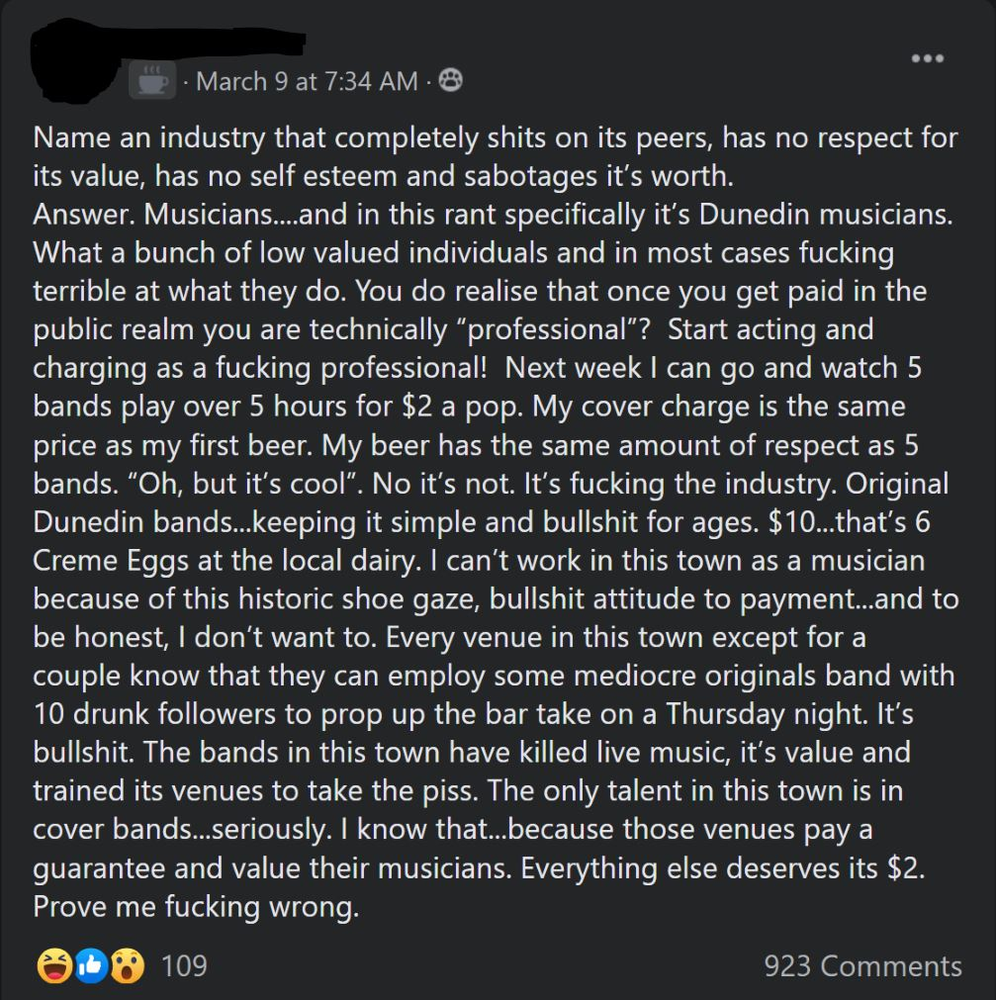
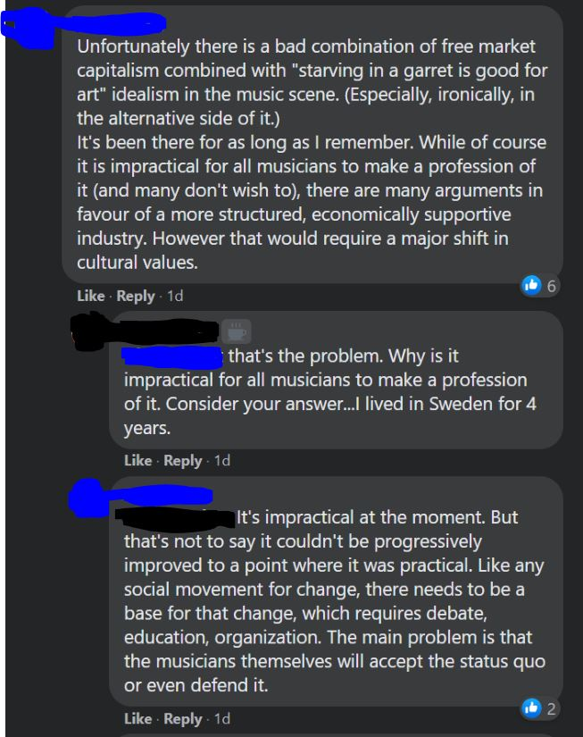
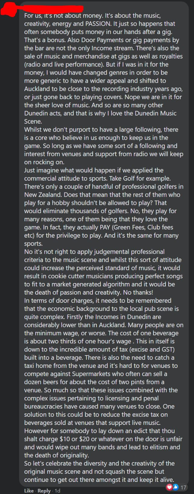
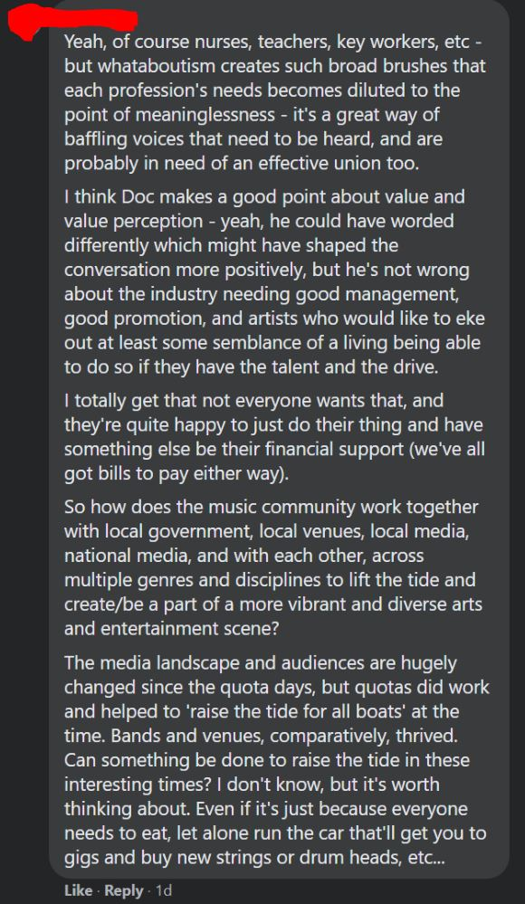
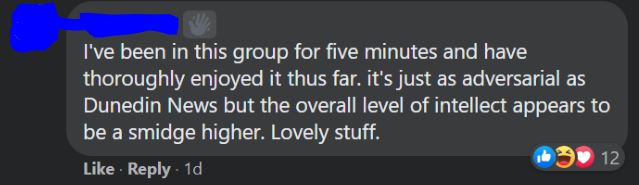
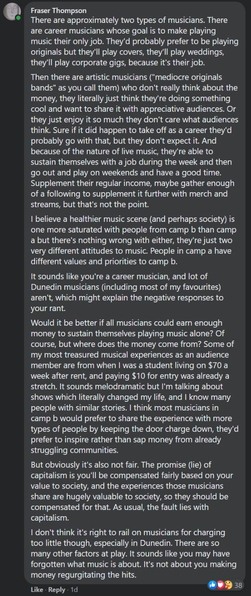
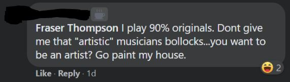
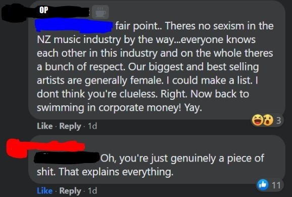
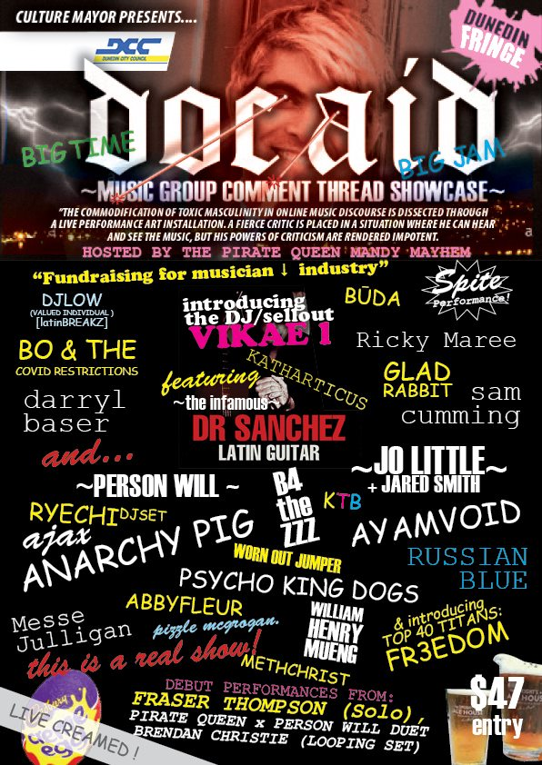
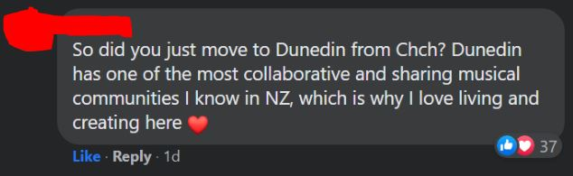

On the 9th of March 2021 a local musician woke up in a rage.

"Why don't I get paid more?" he roared, "Why does the public value creme eggs more than me?"

The answer, he decided, must be because:

- Musicians, specifically Dunedin musicians, are terrible at what they do
- Also, these terrible musicians charge the public too little for the privilege of seeing them
- And venues choose these terrible musicians because they know they've got at least ten friends who will buy beer, which means the struggling covers bands (which, by the way, is where the _real_ talent is) are unable to get work.

So he hopped onto Facebook at 7:35am and elucidated these concepts into this post:

For context, the post was made in [Dunedin Music](https://www.facebook.com/groups/116402411773825), a Facebook group with 2,300 members. Most of the posts in the group usually run along lines of "starting a new band, looking for a guitarist, drummer, bassist and vocalist" or "come see my gig", and typically engagement is pretty low.

But when the aforementioned enraged muso posted his rant all hell broke loose. People were whipped into a frenzy.

At the time of writing there are 923 comments, 1400% more than any other post in the groups history. 165 unique individuals participated in the discussion and wrote 47,128 words. If the raw text from all comments was extracted and printed out the resulting novella would be 129 pages.

It's nuts, but there's a wholesome truth amongst the madness.

People just want to talk. People want to talk with other people who share their passions and interests. Musicians, who are often instrospective and often spend a lot of time thinking, jumped at the opportunity to share their thoughts with others.

And so what started as a huffy rant against basically anyone who plays music blossomed into a beautiful collaborative exchange of ideas.

Much of the motivation behind the comments was probably to take the OP down a couple of pegs, but the fact remains that people eventually engaged in a (mostly) fruitful and stimulating discussion. People were clearly more than happy to bang out a couple of pragraphs and return, multiple times, to engage in the ensuing debate.

I even jumped into the fray to try and help with a sort of higher-level summary of the problem:

To which OP responded:

In fact, throughout the symposium the Original Poster made sure to weigh in at key moments with insults and dismissals, continuing to add fuel to the fire.

I do wonder whether people would have been this conversational if the original post wasn't deliberately inflammatory. Do the ends justify the means? Should everyone conduct themselves as dickishly as possible in order to help stimulate discussion? No. Not at all. But in this case the OP may have inadvertantly created something very positive out of his negativity.

Another local musician, inspired by the event, is attempting to harness its high vibrational energy with a mammoth mega gig, which he claims **will** happen. Currently there are over 30 musicians on the bill, with more added seemingly every day. Watch this space.

It was kind of a shitshow, and a bit of a circlejerk, but best of all it was an opportunity for the community to come together and learn from each other. Haters only make the Dunedin music community stronger.

If you're keen to experience a realistic simulation of the March 9 2021 Dunedin Music comment thread experience you can [download this 148mb PDF of the entire comment thread](./dunedinmusic-comments-simulation.pdf) or [read the comments as a 129 page text document](https://docs.google.com/document/d/1y5i5qPC60rN-y069r6IQSE9NWWxHca9AzRN0NeiuHbw/).
