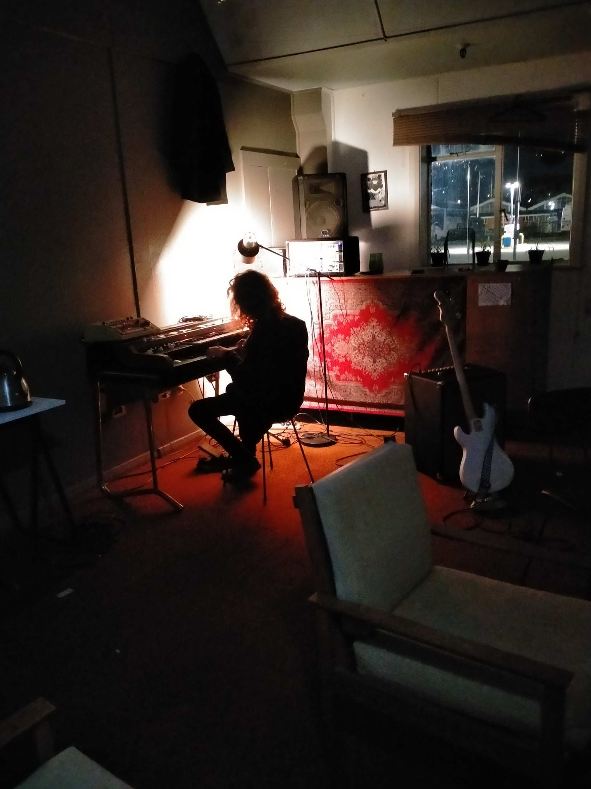
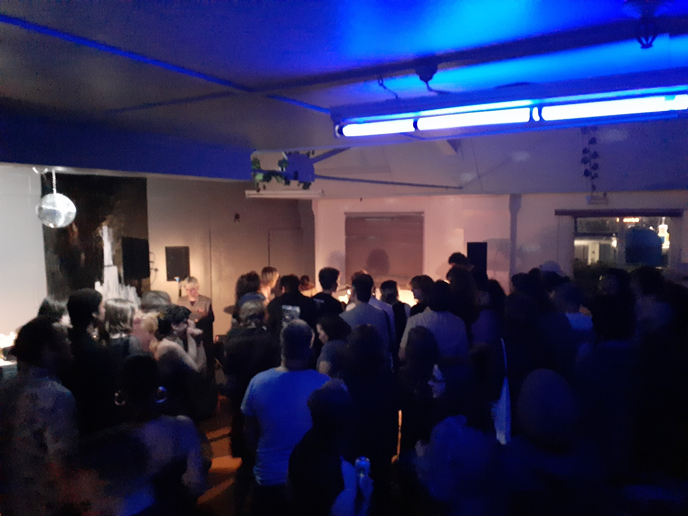
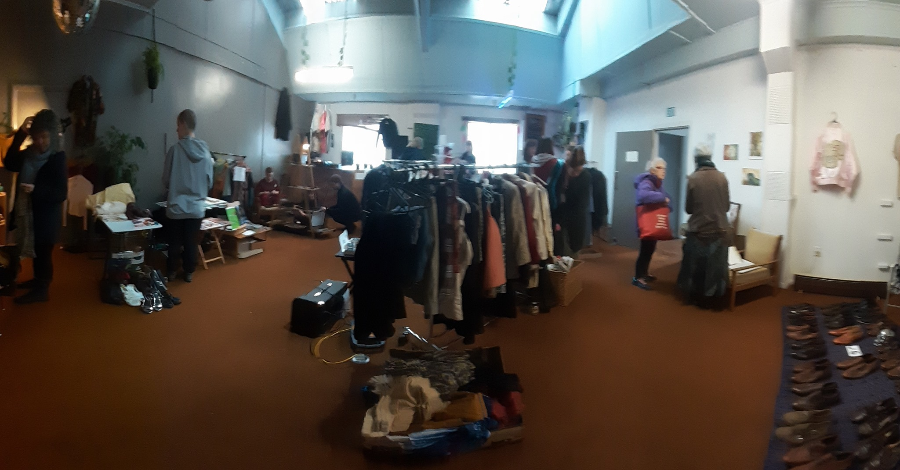

It’s been a winter of discontent for the local music community here in Otepoti. Old grievances which have tormented the scene for decades are bubbling to the surface and erupting.

[A petition aiming to “Save Dunedin’s live music” through noise control reform accumulated over 1,700 signatures](https://www.change.org/p/save-dunedin-s-live-music-band-together-to-have-protections-built-into-the-district-plan), spurred by clashes between residential inner-city dwellers and musicians/audiences who just want to play/hear music at 10pm on a Friday.

Meanwhile, the council is promising a new medium-sized theatre as part of their 10 year plan, which is nice for medium-sized acts who have the capacity to provide their own equipment and attract medium-sized audiences. But it’s a small consolation for the underground, under threat on all sides by both noise control and capitalism.

Over the last three years we have lost [Jutland Street](/venues/jutland_street), [None Gallery](/venues/none_gallery), [The Attic](/venues/the_attic), and most recently [Dee’s](venues/dees_cafe_and_venue). Not all of these losses were due to the council (mostly it was property developers’ eternal quest for maximum profit) but, crucially, we have also gained few new venues in this time.

While the council may not be directly responsible for ending these venues, could they do more to support the creation of new ones?

At the very least, one thing we finally have is a practice space, thanks to the efforts of some local musicians. But it could have been so much more.

Spaceland is located in the industrial precinct and offers rentable practice rooms for musicians, as well as a communal area intended to be a place for gigs.

Things were going well. They hosted a small opening gig with no issues. Any hopes of a second gig however, were dashed by a visit from a council enforcement officer.

“He basically said if we went ahead without [being compliant] we would be fined or have to go to court.” explains one of the musicians behind Spaceland.

“We are not able to afford the ‘4 toilets’ he quoted to make our building compliant, we won't try to become compliant for fear of thousands wasted.”

Thankfully Spaceland can still exist as a practice space, but its future as a venue seems to be out the window. Which is a real shame, since it’s location is ideal for the sorts of noisy rackets musicians like to make. The DCCs own guidance on noise control even states quite plainly: [“For regular band practices choose a location where the noise will not disturb others, such as an industrial area.”](https://www.dunedin.govt.nz/services/noise-control/what-we-do)

“In my opinion we are basically funding what the council should do or hasn't done,” says Spaceland's spokesperson, “which is provide a space for musicians to develop or easily exist.”

“Councils need to help venues meet their costly requirements or maybe do their own version of a venue, or offer sound proofing grants”

According to an email response from the council, the DCC are “not seeking to close venues” but they do have “a regular role which requires venues to comply with regulation such as the Building Act”. They “encourage organisers to plan for such requirements, and discuss options for safe spaces with the DCC as early as possible in their planning process.”

However this spirit of encouragement offered by their spokespeople doesn't seem to extend to the people on the ground tasked with enforcing regulations. It doesn’t sound like the Spaceland musicians felt encouraged to plan and discuss options with the DCC.

Instead of an officer threatening them with fines, they might have appreciated being provided with resources on how to meet regulations, or how to apply for funding.

That’s putting aside the question of whether the regulations are even fit for purpose… Do a few dozen people and an indie band really need four toilets? I’ve lined up outside enough bathrooms at flat parties to know that a single toilet can serve hundreds of people easily.

The underground is where all music originates. The acts which attract tens of thousands at the stadium, or thousands at the town hall, all cut their teeth in sticky pubs and back rooms.

But music isn’t just about providing an incubator for the next Six60, there’s value in music for music's sake, music which might only appeal to a few people, but the positive impact it provides for that audience is far greater than the size of their presence. This sort of music saves people.

So it’s crucially important that this small community is able to exist. And right now it’s struggling. Musicians are on the wrong end of a power structure which benefits anyone with more money than them.

Residents with lock and leave inner-city apartments can use noise control to suppress any hopes of a scene flourishing around them. Landlords can lease their unsafe and unlivable spaces to artists and kick them out on a whim.

And a truly arts focused council would do a better job at shielding the most vulnerable parts of their arts scene from those forces.
