For the past five years all of the images and videos taken for dunedinsound.com were taken on this camera.

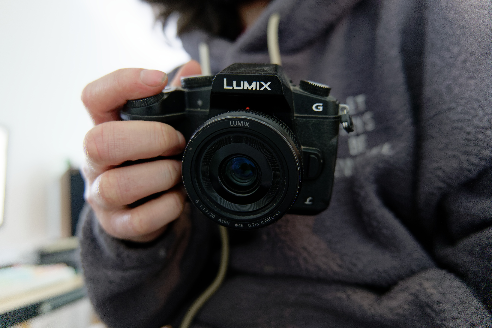

I've driven it hard (77,918 shutter count) and it's served me well, but there are a few areas where I've never really been satisfied. The high ISO performance is my biggest complaint; the image collapses into a smudgy mess above ISO 3200.

This is a problem because, as you probably know, a lot of live music takes place in dimly lit rooms.

To work around this limitation I've had to find ways to pull as much light as possible onto that sensor. This meant obtaining lenses with really low F stops, and this combined with budget constraints led me to discover vintage lenses.

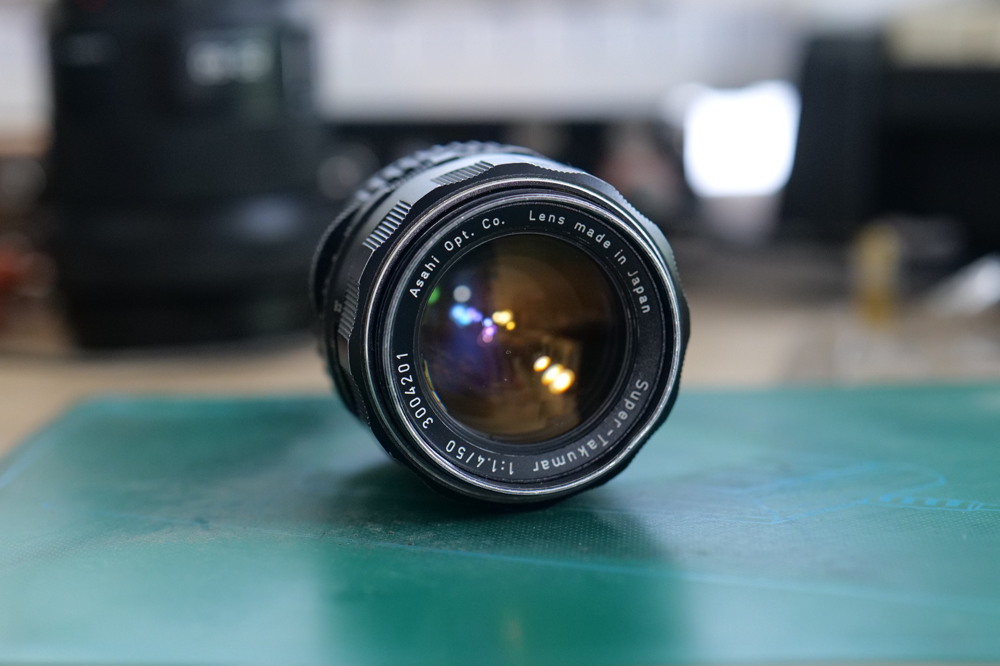

Accounting for crop-factor and a speed booster (which smushes all the light from a Full Frame lens onto a Micro Four Thirds sensor), I end up with a roughly 80mm F0.9 lens full frame equivalent. A modern version would cost thousands, but I bought this lens plus the speed booster for about $150.

To be fair though vintage lenses don't really perform like modern ones. Sharpness often drops off towards the corners, and their anti-flare coatings are often inferior, meaning if you point them anywhere near a light source they flare like mad.

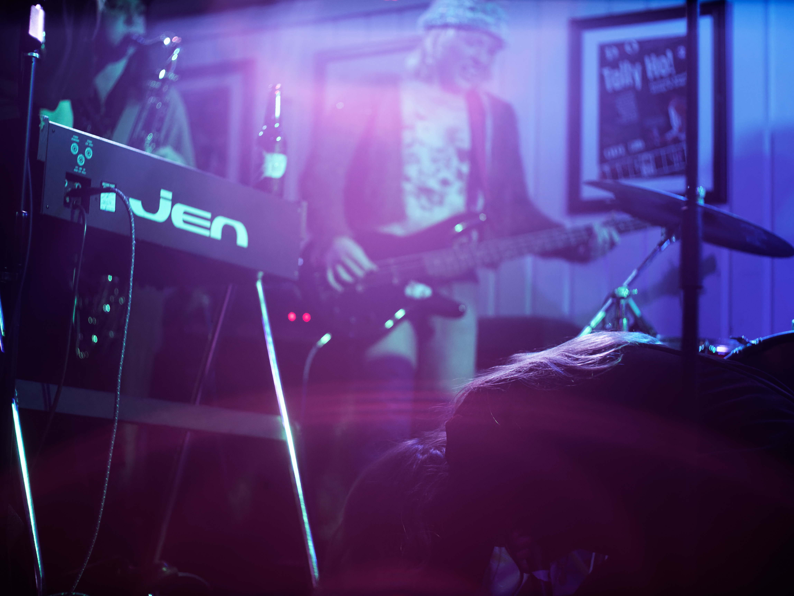

These characteristics are considered a flaw, but I've come to love them. It's an interesting look. It sets my photos apart. I value optical interestingness over optical flawlessness.

It's a bit like the resurgence of cassettes, or the VHS aesthetic: As soon as we can achieve perfect representations we seek out imperfect ones. We achieved perfect digital recordings on CD and people moved back to vinyl and cassettes.

As usual Brian Eno sums it up: “Whatever you now find weird, ugly, uncomfortable and nasty about a new medium will surely become its signature."

What I'm trying to get at with this preamble is that camera reviews often try to be objective, but they can't. The reviewers experience and perspective and even their income all impact how they might interpret a camera.

For example, I can only afford to value fun over optical flawlessness because I'm not doing it as a job. So if I take a weird photo where nothing is in focus but the flare then nobody can justifiably grumble at me. But if I took a weird photo of your wedding day where nothing was in focus but the flare and you were paying me for it... That'd be different.

(You could argue I'm still failing at my self-appointed role as a documentarian, but also I need to enjoy it in order to continue doing it, so sacrificing my enjoyment would be counterproductive. I take it seriously but this is still a hobby for me.)

So I'm not going to be objective, I'm just going to share my subjective experience moving from a Micro Four Thirds to a Full Frame camera. Your experience would probably be different from mine.

I'm also not going to bury the price down at the end as if it doesn't matter because it absolutely does. I see this a lot in camera reviews, and perhaps it's a desire to divorce the tools we use to make art from the realities of capitalism? But unfortunately we _do_ exist in a capitalist hellscape :(

## The camera

My new camera is the Panasonic S5.

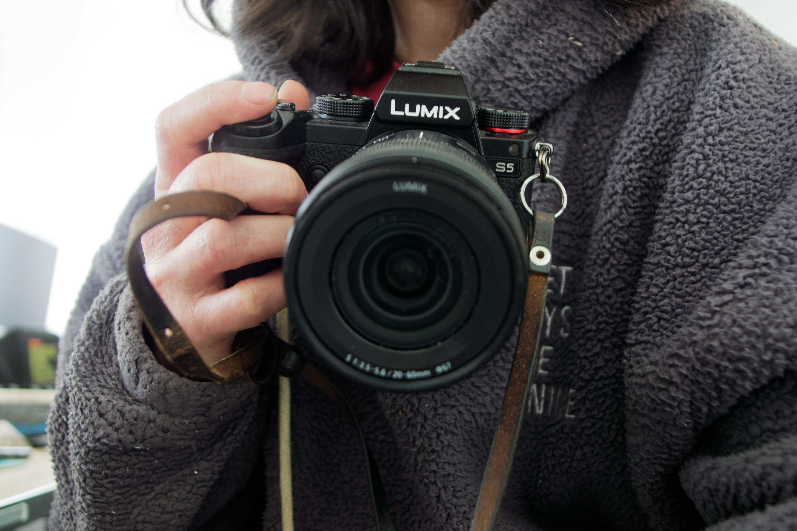

It has a Full Frame sensor, and my old camera had a smaller Micro Four Thirds sensor. A bigger sensor means (theoretically) it can collect a lot more light, which has implications for both ISO performance and depth of field (which I'll get to later).

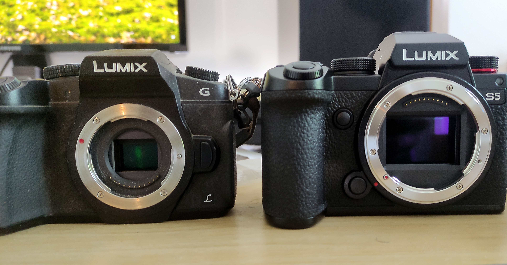

The bigger sensor also means it's a lot more expensive, which is why I waited this long.

My old camera was $1100NZD with a kit lens. My new was $2699NZD on sale with a kit lens and a bonus Panasonic 50mm F1.8. Usually it's $3500 without a bonus lens, so you can see why I took the opportunity to buy it now.

This is obviously a lot of money. As I mentioned, it's a hobby not a job. But I don't mind spending money on stuff as long as it's good stuff. And that's basically what I'm trying to work out.

Comparing two cameras at vastly different price points might seem unfair, but I'm really comparing Panasonic's Micro Four Thirds to their Full Frame system. Panasonic makes more expensive "pro" oriented Micro Four Thirds cameras like the [$2800 G9](https://www.photowarehouse.co.nz/shop/shop-by-product/digital-cameras/mirrorless-system-cameras-2/panasonic-lumix-dc-g9-12-60mm-leica-kit/) and the [$3400 GH5 II](https://www.photowarehouse.co.nz/shop/shop-by-product/digital-cameras/mirrorless-system-cameras-2/panasonic-lumix-dc-gh5-mkii-12-60mm-lumix-lens/) which are priced similarly to the S5, but have roughly the same high ISO performance as the G85.

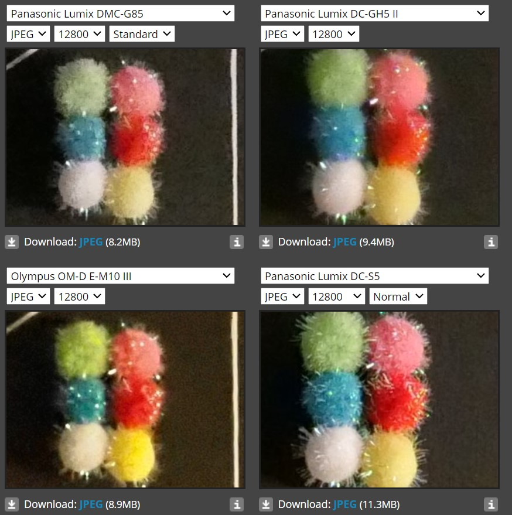

So for me, even moving to their top tier Micro Four Thirds body wouldn't be much of an upgrade. Although they differ in terms of handling and features, all of their Micro Four Thirds cameras above a certain point are basically the same to me.

## Experience in the field

So far I've taken the S5 to three events.

The most immediate difference is the size of the body. In pictures it looks similar but in my (small) hands it feels noticeably chunkier. It's still a fairly compact camera, but I could comfortably hold the G85 by the grip with one hand, and I can't do that confidently with the S5.

Size isn't really an issue though, just something I'll need to get used to. Handling in general is great. Lots of buttons in smart places.

The screens are a noticeable improvement in resolution, colors and contrast. This is a thing which seems small but actually makes a huge difference when you're using it.

As for the experience of taking photos, the most jarring change is depth of field.

Full frame depth of field is noticeably shallower at the same focal length. Even the kit lens at F3.5 produces a much more shallow depth of field than I'm used to at that aperture value.

Aso manually focusing my Super-Takumar 50mm F1.4 is near impossible wide open due to the shallow depth of field. This was a problem for me at events, so I found myself stopping down to more like F2.8. More on this later.

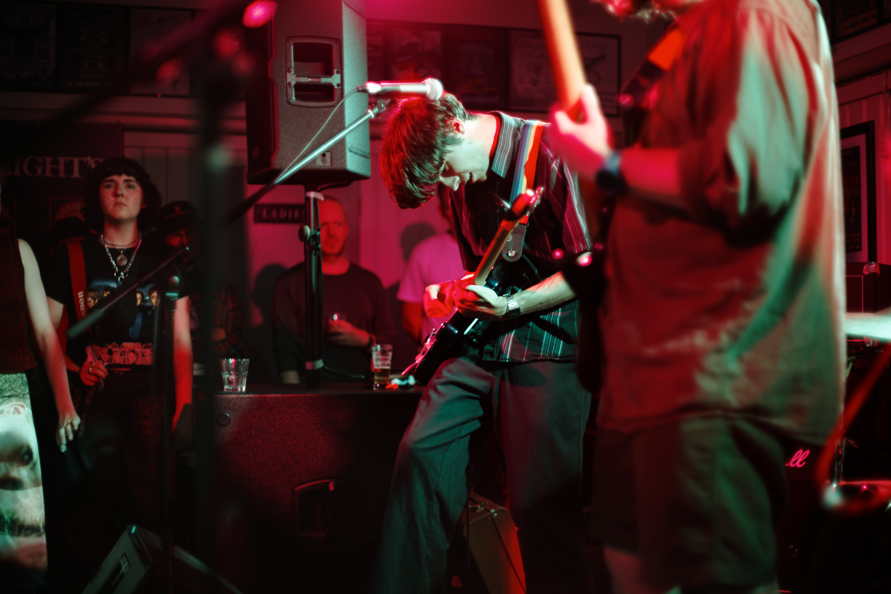

The colours are also subtly improved since the G85. I used to use a lot of film emulation in post, but I found myself not needing to do this as much on the S5.

Video is naturally great as expected of a Panasonic camera. Dynamic range is noticeably improved over the G85.

The S5 can also shoot 10-bit video, but for me this isn't worth the file size increase. A quick and easy workflow is important so I can get everything up the following day and move on with my life. But I am shooting in V-LOG and valuing the latitude that gives me.

The stabilization is amazing, better than the G85, especially impressive because the sensor is a lot larger. This is essential for me since I'll never be using a tripod, and might be shooting in an environment where I can't pay too much attention to how steadily I'm holding the camera.

Something I didn't really expect was the lack of a built-in flash. I guess pro photographers don't like convenience?

## High ISO

The one area where there's no competition is ISO performance.

This is a comparison between two images, one taken on the G85 and one on the S5, both processed with the same noise reduction settings. Can you guess which is which?

Here are some 100% crops:

Top is the S5, bottom is the G85. You can see a pretty stark difference in noise levels and detail retention.

But here's the surprise twist: In the above images the G85 was at ISO 6400 and the S5 was at... **ISO 25,600.**

This is what the G85 looks like at ISO 25,600.

The situation in video is equally as impressive. When shooting in V-LOG the sensor operates with dual ISO's at 640 and 4000, meaning ISO 4000 is cleaner than ISO 3200. The G85 at ISO 6400 is unusably smudgy, but it looks fine on the S5. There is noise but details are retained.

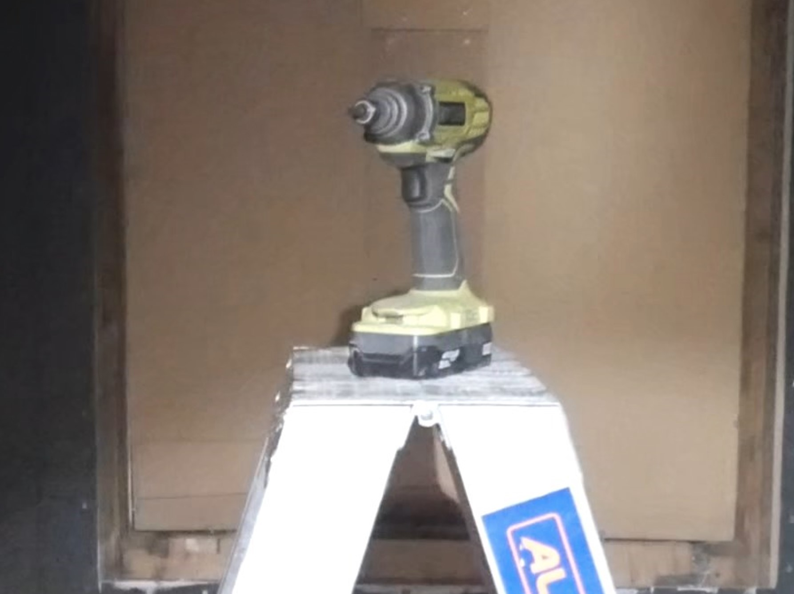
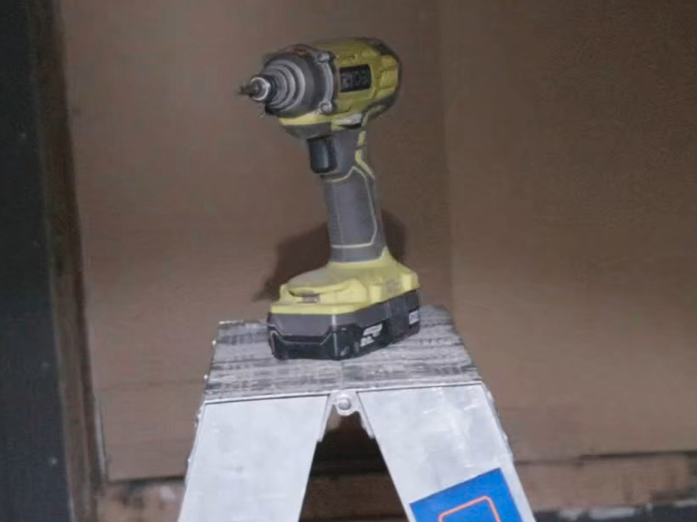

I expected better performance, but this is kind of mindblowing: **The S5 is cleaner at ISO 25,600 than the G85 is at ISO 6400.**

On the G85 I'd hesitate to go above 3200, on the S5 I'm able to go up to the maximum 51,200 if I _really_ need to and have a usable image after denoising.

This is a game changer for the way I work.

I never used variable focal length lenses because, unless I went for something massive, none of them let in enough light. Now I'm able to use a variable focal length lens at higher F stops and just bump the ISO. This means more dynamic videos rather than fixed perspective ones.

But it also raises an interesting point about Full Frame sensors.

## Depth of field

Just as focal length is affected by a crop factor when going between sensor sizes, so is depth of field.

On a Micro Four Thirds sensor, a 20mm lens is equivalent to a 40mm lens on a Full Frame sensor, and an F1.4 lens has the equivalent depth of field to an F2.8 lens. F2 is equivalent to F4, F2.8 is F5.6, and so on and so forth. This equation only affects depth of field though, not the light gathered.

So the same F stop on Full Frame has significantly shallower depth of field than it does on Micro Four Thirds. If you wanted to match the depth of field characteristics between systems you'd need to double the F stop, but in doing so you'd also reduce the amount of light coming in.

What this meant when using the S5 was that I found myself stopping up more because otherwise the depth of field was too shallow. At F1.4 for example it was very hard to nail a photo with what I wanted to be in focus actually in focus. So even though I could boost the ISO much higher than I could on Micro Four Thirds, I was also using narrower apertures which let in less light to begin with.

So you end up with a weird situation where even though you're at ISO 12,800, you're still in the same boat in terms of light gathering.

Let me show you what I mean.

The above images are exposed roughly the same, have (roughly) the same depth of field because they're at equivalent F stops, and yet the G85 photo was shot at ISO 3200 and the S5 photo was shot at ISO 12,800.

These were also shot at equivalent F stops in terms of depth of field (F4.0 is equivalent to F2.0), and yet the G85 was at ISO 6400 and the S5 was at ISO 12,800.

Here's the rub though. Even though I was able to set the ISO lower on the G85, the G85 was still noisier than the S5. The S5's ISO 12,800 image looks better than the G85's ISO 6400 image.

So basically what this means is I don't need to seek ultra fast < F2.0 lenses for Full Frame. F2.8 or even F4.0 is fine, I can just boost the ISO and still get better images with the same depth of field characteristics.

## Autofocus

The autofocus was not great on the G85, and while it's improved, it's also not great on the S5.

To be fair it's still fine. I can point the camera at something and it will _probably_ focus on it, but I still can't rely on it to hit focus every time. This doesn't really surprise me though since I didn't expect the autofocus to be good. I hedge my bets with multiple shots and it's not really a problem.

The face/body detection magic works surprisingly well in average to good light, but it also introduces new problems in some situations.

A shot which includes both the audience and the band might decide to focus on all the bodies in the audience rather than the band. I'd love to have face detection without body detection but it seems this isn't an option.

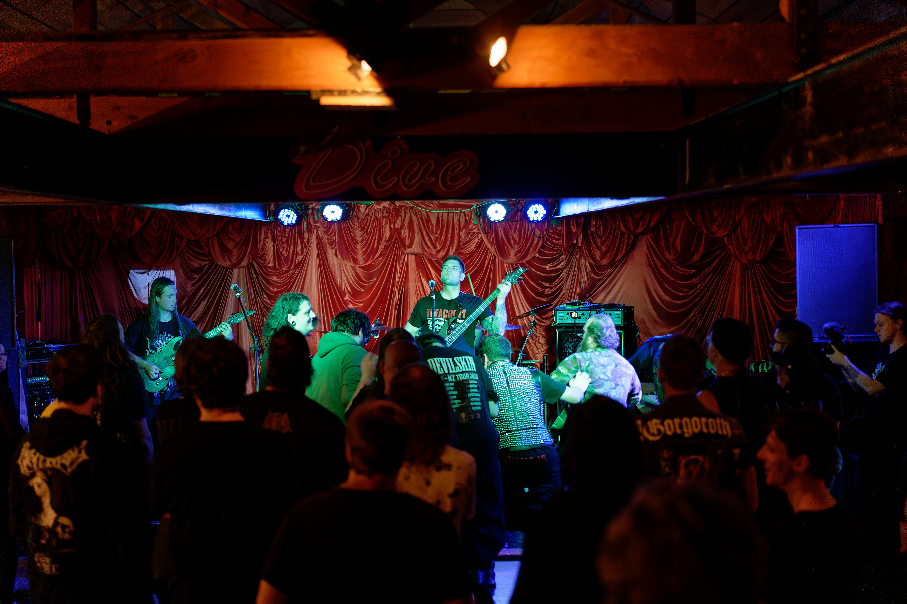

It probably doesn't help that I refuse to use the AF light because I don't want annoying red lights distracting everyone.

One thing which is appreciated is the ability to switch all AF lenses to linear focusing. I don't know why anyone would want nonlinear focusing, or why it was the default, so it's good to have the option.

## Lens ecosystem

Because the mount and sensor size are different, none of my Micro Four Thirds lenses are compatible with the S5, so I need to buy new ones.

I'm quickly realising that L mount lenses are **big**. Big and expensive.

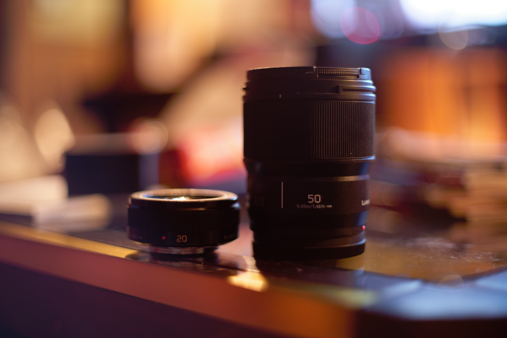

I think this is probably a deliberate strategy from Panasonic. Pro photographers tend to want larger lenses which are higher quality, and from what I've read these lenses are exceptionally high quality. Even the 20-60 kit lens is supposedly great.

(I think the photographer ego is probably also involved... Big cumbersome gear to make sure people know that you're very serious and important.)

However in the real world nobody actually cares if photos contain a few pixels of purple fringing or slightly fuzzier corners, so even though they're great lenses, the tradeoff isn't worth it for me and the size is a problem... Or is it?

The way I worked in the past was to go to events with pockets full of primes. Micro Four Thirds lenses are small and light enough that I could comfortably have a prime in each jacket pocket, one on the camera body, and then just swap them out mid-gig as required (I expect this is also how my sensor got so dusty).

My go to kit was the Laowa 7.5mm F2, the Super-Takumar 50mm F1.4, and the Panasonic 20mm F1.7. All fast lenses with wide apertures to let in lots of light. Also very compact.

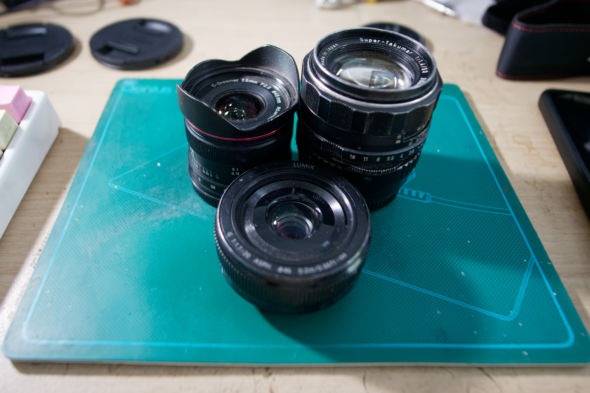

The current lineup of L mount lenses are technically pocketable (depending on the pocket), but not comfortably.

With the S5 I've run with the 20-60mm on the body, the 50mm F1.8 in one pocket, and the adapted 50mm 1.4 in the other. It's a bit much in terms of bulk. Swapping lenses one handed is also kind of precarious.

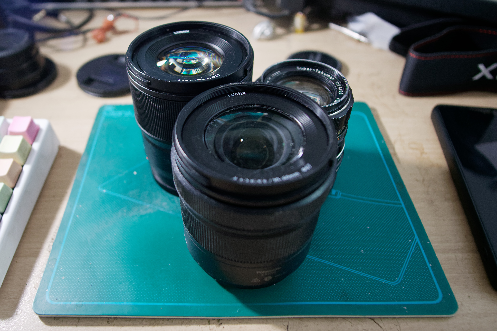

Part of why the lenses are bigger is because the sensor is bigger and requires more glass to cover it, but full frame lenses don't have to be huge. Other mounts offer big ones for the pro's, and little cheap pancakes for the hobbyists. I'd love something like this for the L mount.

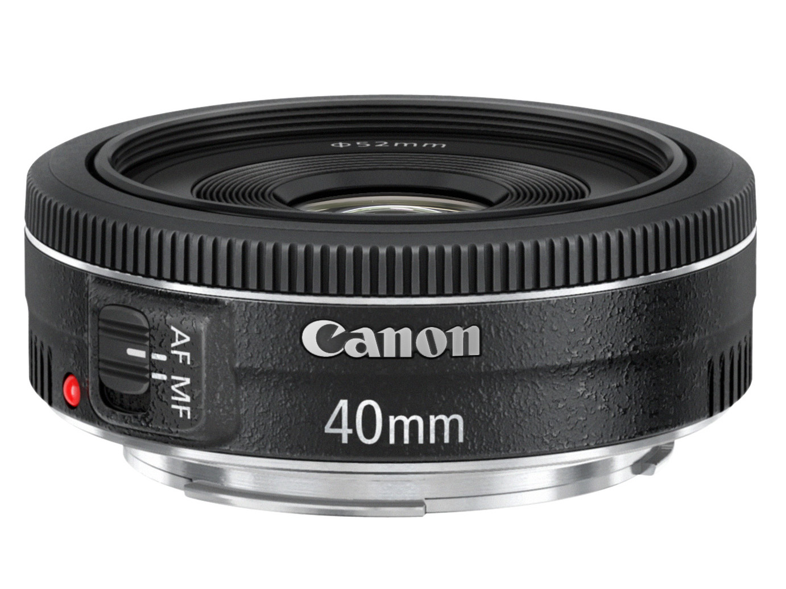

I'm also not going to spend thousands on lenses. My most expensive lens for micro-four thirds was the fantastic Laowa 7.5mm F2 for around $500. Most of my others were just a few hundred. I can't justify spending much more on lenses.

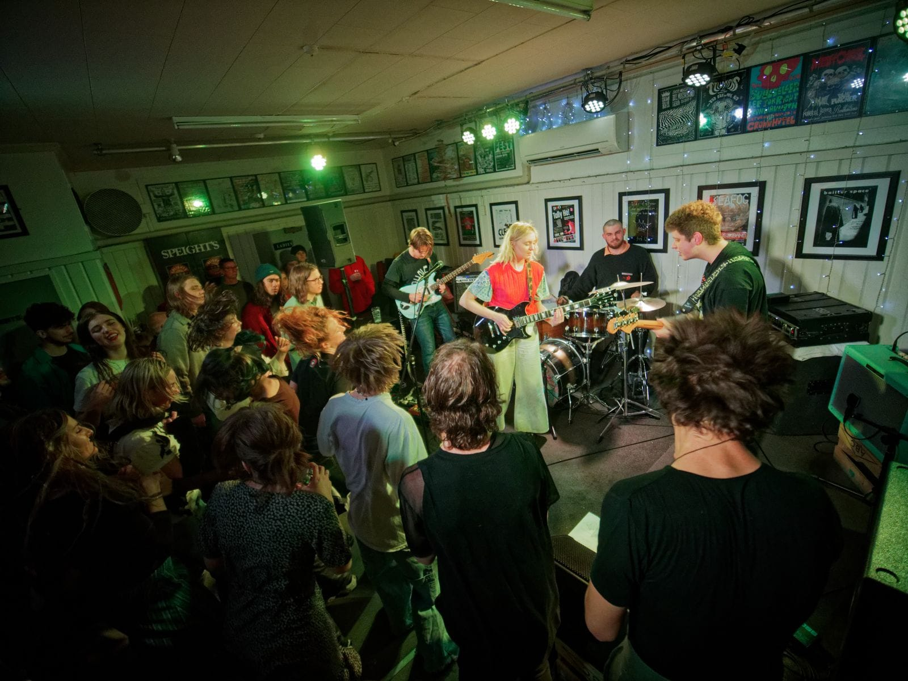

If I wanted something equivalent for Full Frame I'd be looking at the Laowa 15mm F2 Zero-D for more like $1,500. This is pretty significant: **A single lens for L mount costs the same amount as an entire Micro Four Thirds camera with an equivalent lens.**

If you're after telephoto lenses the situation is even worse. A 300mm telephoto on Micro Four Thirds is easily pocketable, an equivalent on L mount is definitely not pocketable.

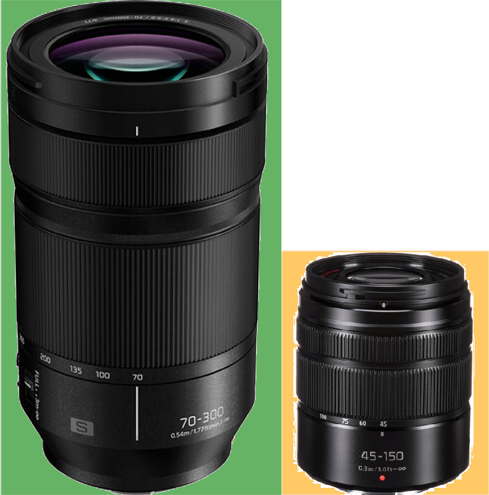

Also because of the smaller sensor, you can adapt a far wider range of lenses to Micro Four Thirds cameras. For example, I've used C mount CCTV lenses quite successfully, and I have a range of comically small Pentax Auto 110 lenses which perform surprisingly well.

So I'm in a situation where I can either fork out truckloads of cash for native lenses, or buy smaller lenses for other mounts and adapt them, which will also add to the size of the lens.

But the other side of the coin is that maybe I don't need to carry around loads of primes anymore? The only reason why I favoured primes was for their lower F stops to let in more light. Maybe I can make do with fewer, larger, slower lenses instead?

The lens I found myself using the most on the S5 was the kit 20-60mm. On the 20mm end it's not quite as wide as I'd like, but still wide enough, and on the 60mm end it's not quite as telephoto as I'd like either (80mm is the sweet spot for what I do). But it still _almost_ covers two of the primes I'd carry with my old system. And with more megapixels (24 vs 16) I found I could crop in to get more length if needed.

I thought F5.6 wouldn't let in enough light, but it turns out I can literally just boost up to ISO 25,600 and get a perfectly fine image. I could probably make do with just this lens and one ultrawide, or one telephoto.

...But I actually quite like having multiple lenses and swapping between them. It's fun, I like collecting gear and using it. Having just one perfect lens which covers all focal lengths would make what I do easier, but also boring.

## Closing thoughts

**Pro**

- Far superior high ISO performance
- Better image quality in general
- Better autofocus
- Better stabilization
- Better handling

**Con**

- Bulkier body
- Significantly bulkier lenses
- More expensive lenses
- Less lens flexibility

If I was a professional I'd clearly prefer the S5. The image quality is superior, the handling is superior, it offers more "pro" features like 10-bit, LOG, dual card slots... But since I'm not, things are complicated.

When I'm doing this for fun, and churning out media every week, I don't want to deal with bulky, expensive gear. I want to be able to drink a beer with one hand and hold a camera in the other.

Of course quality is important too since the only thing seperating what I do from what everyone does with their phone is the quality of the media. And the media is definitely higher quality on the S5. The high ISO performance specifically is remarkable, which is most of the reason why I wanted to upgrade to Full Frame.

But here's the thing: Because of the depth of field, the difference in low light performance isn't as pronounced as it seems. And the G85 still takes excellent photos and video.

When you have a problem you can either embrace limitations and solve it through creativity or you can just throw money at it. The S5 (and Full Frame in general) feels like throwing money at it, brute forcing a solution.

Micro Four Thirds feels more fun and interesting: Limited, but also in some ways more flexible as a consequence, for example the smaller sensor opening up more lens options.

## So what am I going to do?

Was buying the S5 a mistake? No. I've always lusted after Full Frame cameras so it's good to finally try one.

I'm going to run with the S5 for a while longer. I might buy one of the cheaper ultrawides (a fisheye unfortunately) since those wide shots are what I'm really missing. If I'm still not feeling it in a few months I'll probably sell it and go back to the G85. I could probably resell it for near what I paid so it's not much of a loss.

I guess another option would be keeping both and using them for different types of events... But owning two cameras seems a little too extravagant to me.

And another option would be keeping it around in the hopes that more L mount lenses come out. I mean it's a very new mount so it's not too surprising that it doesn't have the range of something like the EF mount. If I could just get a few reasonably priced, compact, interesting lenses I wouldn't look back.

OR if the high ISO performance of Micro Four Thirds (which has basically been stagnant for the past decade or so) could be improved I'd love to upgrade to a better Micro Four Thirds camera. But that doesn't look likely.

If you haven't got a camera but you want to get into photography/videography, don't feel discouraged if you can only afford mid or low-range options, because they might not be as inferior as their price suggests. Don't envy the big guys with the big expensive cameras, pity them for (probably) spending more than they needed to.
