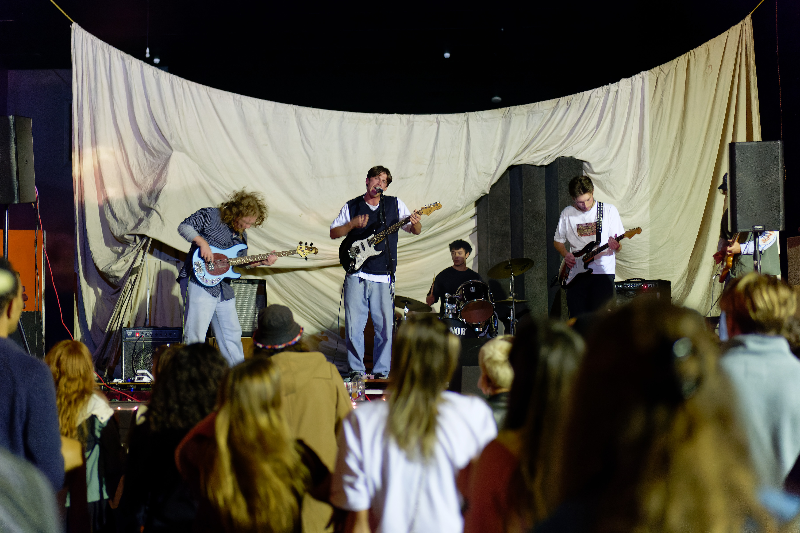
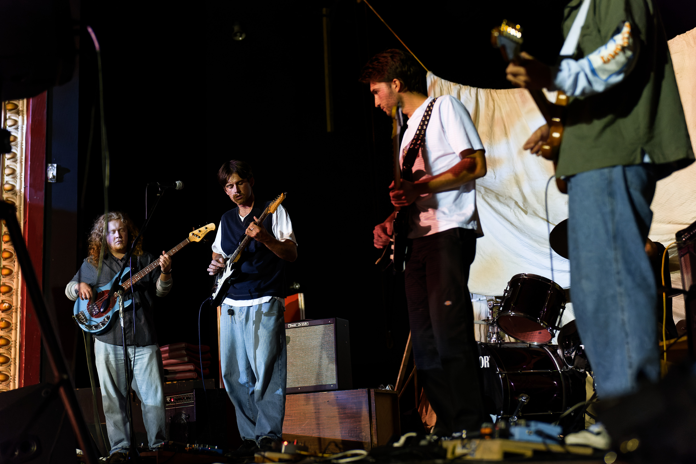
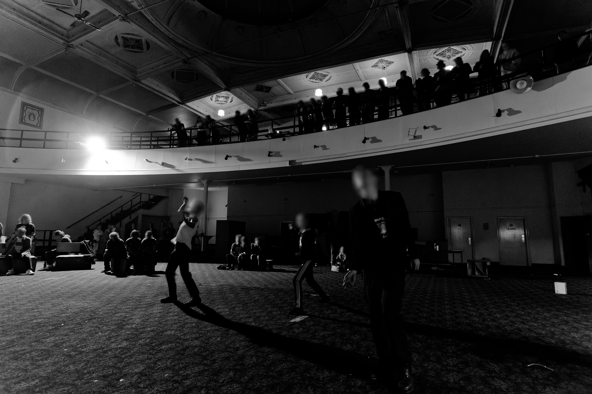
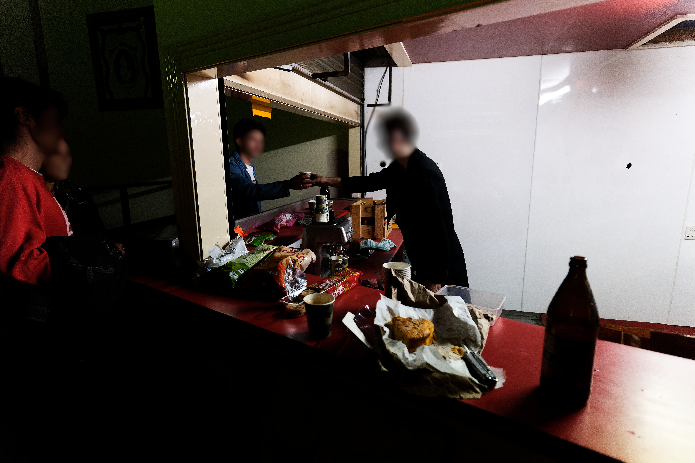
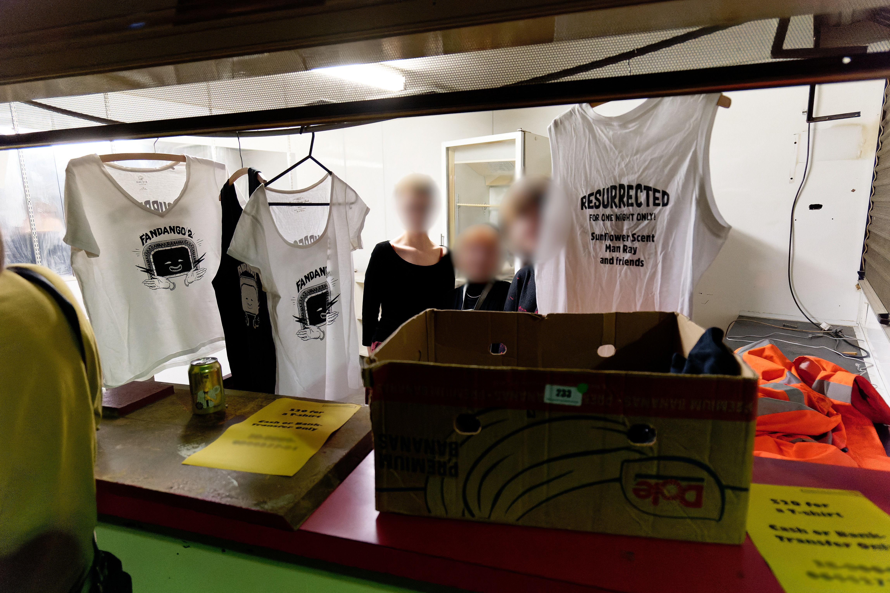
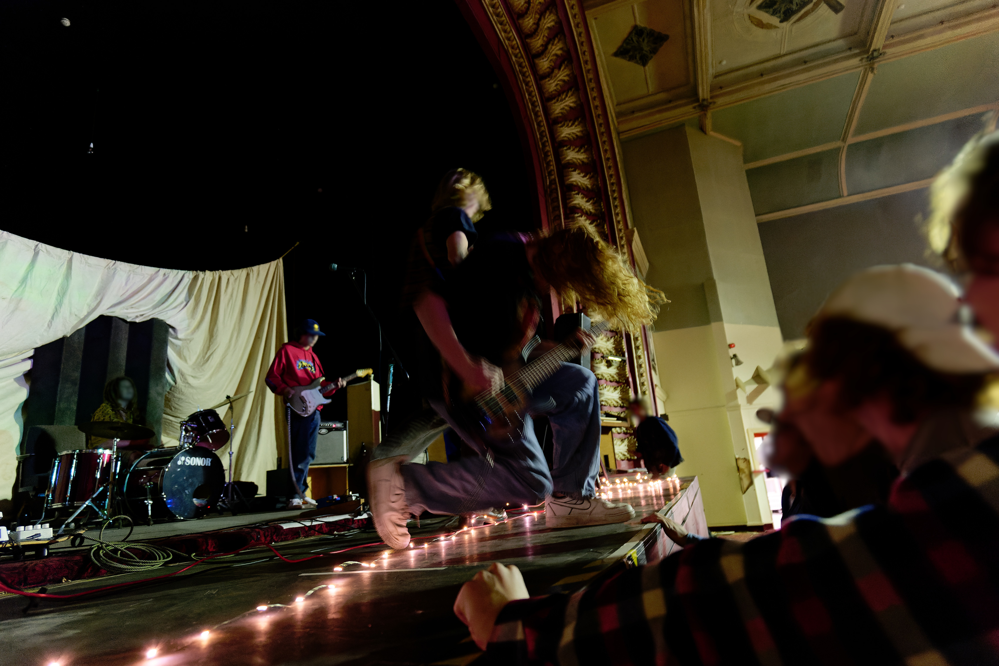
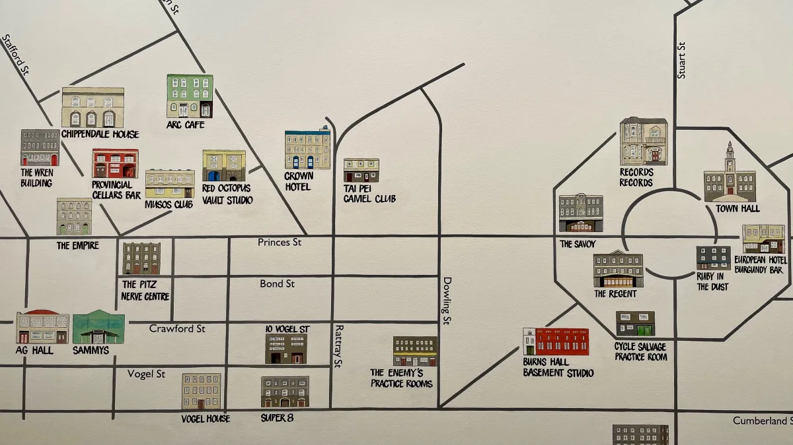
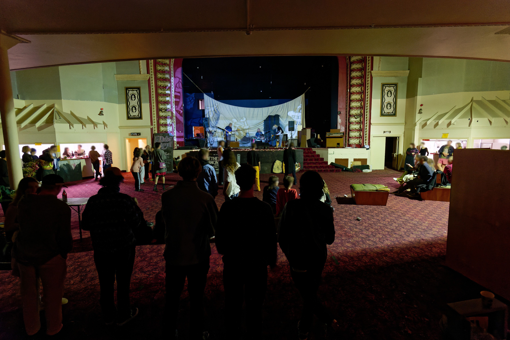

On an average Sunday in April of 2022, an iconic Dunedin venue is resurrected.

The venue? Sammy's, built in the 1800s, previously served as a theatre, cinema, and storage facility. It's contemporary musical history began in 1983 when it was purchased by Sam Chin, and became one of many locations fostering a thriving scene later known as the "Dunedin Sound".

Back in the present, a relaxed crowd mingle, drink, and dance to a mix of originals and covers from the three bands on the lineup. There's a merch stand, a small bar serving espresso and snacks, a full PA, and stage lighting.

On the surface it's like any other indie gig. But Sammy's has been left derelict for five years, and this gig is taking place without permission, right under the nose of the building's owner, the Dunedin City Council.

How this remarkable event occurred is still shrouded in mystery. We do know it was organised by at least one intrepid urbexer who discovered an entrance, realised the unprecedented opportunity sitting in front of them, and invited bands.

These organiser(s) remain elusive (wise given the [threats of prosecution](https://www.odt.co.nz/news/dunedin/sammy%E2%80%99s-brought-back-life) voiced by the council) but thanks to an [interview in student magazine Critic](https://www.critic.co.nz/features/article/10131/your-inalienable-right-to-dance), and another in micro-zine Errant, we know a little of their motivations. And basically they just wanted to dance.

> “In my mind, the amount of work you do as an artist, regardless of how much you’re paid, requires so much passion and work, it’s nice just to get together and forget about any sort of economic input. We just really wanted to dance.” <a href="https://www.critic.co.nz/features/article/10131/your-inalienable-right-to-dance" target="_blank"><small> - 'Your Inalienable Right to Dance' - Critic Magazine</small></a>

The promise of a unique and unsanctioned opportunity to cut shapes drew around 100 people, purely through word of mouth, and Sammy's could handle crowds of 500 back in its day, so there was plenty of room to spread out.

Small groups relaxed in the booths in the upper mezzanine level, and on the provided seating lining the dancefloor, while others danced. Far from the media spectre of rowdy students, the vibe was positive and respectful.

In an internal newsletter sent shortly after the event, the Dunedin City Council's CEO stated they "are taking this very seriously because of the risks that the folks exposed themselves and others too [sic] by their actions". But aside from the ever-present risk of earthquakes, I'm not sure what this supposed risk was.

Organisers used walkie talkies to communicate and ran a hose from an outside tap for fresh water. Since the building's electricity supply was in-tact, fire exits were clearly marked with illuminated signs.

It felt safer than the average flat party.

> “We went in on four occasions prior to the gig to check the power, tested anything that could’ve been an issue, and kept it closed.” <a href="https://www.critic.co.nz/features/article/10131/your-inalienable-right-to-dance" target="_blank"><small> - 'Your Inalienable Right to Dance' - Critic Magazine</small></a>

When you think "illegal gig in an abandoned building" probably the last thing you expect is an espresso machine. The organisers clearly held respect for the space, and the participants.

And despite running into the wee hours of Monday morning, there were no noise complaints because all the surrounding buildings are vacant outside of work hours. Regular police patrols rolled past throughout the night but were none the wiser. Almost like it's an ideal location for a venue.

The list of venues regularly holding gigs in Dunedin right now is roughly:

- Crown Hotel
- ~~Dog with Two Tails~~
- ~~Dive~~
- U-Bar

(2023 update: Dog with Two Tails and Dive are no more.)

[(Check out the live venue map)](/venues)

And as many students know, throwing a gig at your flat is a gamble based on the temperaments of your neighbors. Plus it can be nice to have stuff like lighting and a stage.

So the fact that an ideal medium-sized venue sits rotting is frustrating.

The organisers have stated they don't necessarily want Sammy's to be resurrected permanently (these are students who have no connection to the place other than awareness of it's history) just that they want _something_.

> “I would really like it if the people in power recognised this city needs more cultural life. It would be great if we could get more music venues, there’s a lot of abandoned buildings that are ignored” <a href="https://www.critic.co.nz/features/article/10131/your-inalienable-right-to-dance" target="_blank"><small> - 'Your Inalienable Right to Dance' - Critic Magazine</small></a>

Just look at the number of historic venues mapped out by The Clean/Bats guitarist Robert Scott [as part of a Flying Nun exhibition at the Hocken Library](https://www.odt.co.nz/news/dunedin/mapping-dunedin-sound-history):

To anyone who has moved to Dunedin in the last decade or so, the idea that there could be not just four or five venues, but dozens, seems impossible. But it happened once. I wasn't there, but I think the diversity of venues could be a large part of why that period was so vibrant and fostered such a legendary scene.

Back in 2017 when the DCC bought Sammy's, Mayor Hawkins had this to say: "Sammy's has played a huge role in Dunedin's social and cultural history, so it's exciting for our community to be able to start thinking about its future."

And now, thanks to the community, Sammy's has once again played a role in Dunedin's musical history. This act stemmed from a desire to create something special in a time when diversity of spaces for music is at an all time low. And that's exactly what they achieved.

_In an unnecessarily punitive move, the DCC attempted to trespass the participating bands from all DCC owned buildings. The police chose to just trespass them from Sammy's._
