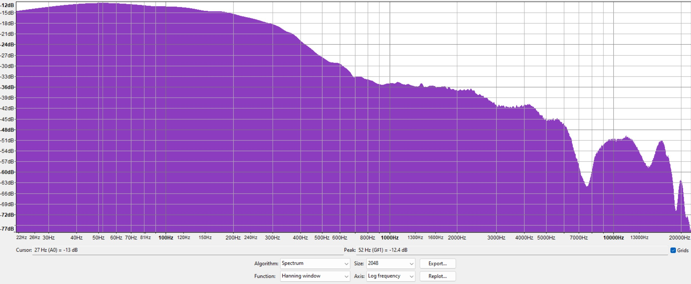

import Player from '../../../components/Player'

Binaural recording essentially involves using microphones which emulate the human ear as closely as possible.

Where a traditional recording will capture sound from an "artificial" perspective, usually via multiple mono sources which are positioned in a virtual "space" with techniques such as panning, binaural recording aims to precisely capture a human's aural perspective.

The result is incredibly convincing. In terms of accurately capturing the feeling of being in an aural space nothing else comes close. It's like you can feel the temperature of the recorded air, as you can hear in this classic demo which introduced a lot of people (including me) to the technique back in 2007 (wear headphones).

<iframe
  width="100%"
  height="400"
  src="https://www.youtube-nocookie.com/embed/IUDTlvagjJA"
  title="YouTube video player"
  frameBorder="0"
  allow="accelerometer; autoplay; clipboard-write; encrypted-media; gyroscope; picture-in-picture"
  allowFullscreen
></iframe>

It has limitations. Because it records exactly what your ears hear, it means you can't hide anything, so the most important thing becomes the placement of your recording rig in relation to what you're recording, and the space you're recording in. This is probably why it isn't really used in studio recordings (these days it's mostly used by ASMR Twitch streamers).

But for the purpose of bootlegging live music it's perfect.

(Well, to be fair it's not going to beat a _good_ desk recording, but often in smaller venues the desk recording might be missing bits because not everything is running through the desk, and of course you'd need to get the sound person on your side… So this is a lot more practical.)

## How?

If you've looked into doing your own Binaural recordings you've likely found there aren't many off the shelf options which don't cost an arm and a leg.

A “proper” binaural setup would be one of [these guys](https://reverb.com/item/23274939-akg-d-99-c-binaural-harry-dummy-head-stereo-microphone-36387).

Obviously this would sound really good, but it also costs overy $1,000, and might look a bit funny at your local venue.

The cheaper and more practical option is to forgo the foam dummy head and just use your own dumb head. Why buy an expensive set of foam ears when you already have real ones?

To make this work you'll need:

- A pair of microphones small enough to go in your ears
- A housing for these microphones to make them safe and comfortable

The first requirement is easy: Electret condenser microphone capsules are tiny, readily available, typically have an omni-directional pickup pattern, and generally do a good job of recording accurately. So they suit our purposes.

Many electret condenser capsules are available, but I use the [JLI 61A](https://www.jlielectronics.com/microphone-capsules/jli-61a/), which is an equivalent to the discontinued Panasonic WM-61A you'll read about a lot in [tape enthusiast forums from the 00s](https://taperssection.com/index.php?topic=101099.0) (which means it's moddable in the same way, more on that later). They cost around $3 each, but you might have to buy them in bulk if you're getting them from the manufacturer.

There are also AliExpress sellers selling "genuine" WM-61A for a lot cheaper, but I can't vouch for them (they might be fine).

Then you've just got to figure out how to get them in your ears. For this, I bought musicians earplugs with replaceable filters, so I can remove the filters and glue the capsules in instead. It's a pretty good system.

This is the setup I've used for most dunedinsound.com recordings up until now: JLI 61A capsules glued inside musicians earplugs.

They sound fine by themselves, but if you're using WM-61A capsules or equivalent there's one thing you can do to make them more suitable for live music.

Live music is often **very** loud, and most electret capsules aren't designed to handle that and tend to distort. To combat this you can do the [“Linkwitz mod”](https://www.linkwitzlab.com/sys_test.htm#Mic) to bypass the internal FET. I don't know what this means either, but the result is capsules which can handle far higher volumes without distorting, but require an external circuit to feed them power.

I put my circuit in a little project box that fits in my pocket. It uses a tiny L1022 battery to keep the overall size down while also providing the 9 volts it needs.

The result is a set of microphones you can stick in your ears which will never distort, but might be a bit hissy for quiet stuff. They'll sound pretty good though, the real limiting factor will be the sound of the venue, and your capacity to place yourself in it (channel imbalance can be an issue since you often can't situate yourself directly in the middle of the PA).

This is a clip from the time [Night Lunch played DIVE and it was so hectic someone fainted](/gigs/nightzilla-vinyl-release-party/).

import night_lunch_sample_diy_mp3 from './night-lunch-sample-diy.mp3'
import night_lunch_sample_diy_json from './night-lunch-sample-diy.mp3.json'

<Player
  artistAudio={[
    {
      title: 'DIY microphone sample - Night Lunch',
      audio: [
        {
          '.mp3': {
            publicURL: night_lunch_sample_diy_mp3,
          },
          '.json': {
            data: night_lunch_sample_diy_json,
          },
        },
      ],
    },
  ]}
/>

Despite the sheer volume, the entire frequency spectrum was recorded reasonably accurately and without distortion. Cool.

The downside to this, however, is the same as the upside: You made it.

Unless you're very skilled, the thing you made won't be very durable. I'm not, and I've gone through numerous capsules because pushing and pulling them in and out of my ears degrades the connections, or wears off the protective felt. I've also had issues with bad connections in my battery box.

Each point in the chain is a potential point of failure, and when the rig is worn with relative abandon there's a lot that can go wrong.

This has caused me to lose a few recordings, which is not good.

Also, I don't know if its the capsules or the battery box or what, but they sound very warm. Too warm maybe. I'd like a bit more brightness.

So this is why I started looking for a commercial equivalent. Does such a thing exist? How does it measure up? Can it handle the filthiest, loudest gigs?

I found there is pretty much only one option.

## The Roland CS-10EM

They cost around $100 and you'll probably have to import them (I bought mine from a Japanese eBay seller).

What you get is pretty similar to what you can make: A pair of electret condenser capsules inside headphones you can put in your ears. Roland also put some headphones in the headphones as an added bonus (and they even sound ok).

The package comes with three sets of silicone tips in various sizes, and two foam wind-barrier covers to reduce wind noise if you're recording outside.

They fit comfortably in the ear, but they stick out more than the DIY headphones, which theoretically might decrease the realism of the Binaural effect since the distance between the microphones is wider than the distance between your eardrums.

Overall the build quality feels okay, but the cable is garbage - it tangles very easily.

### Synthetic comparison

This is a graph comparing a recording of pink noise on both sets of ear microphones. I did these tests by putting the microphones in my ears, then putting headphones over them and playing pink noise (not entirely scientific, but good enough for comparison)

As you can see they have slightly brighter high end than the DIY capsules, but otherwise look fairly similar.

The DIY have a weird notch between 6khz and 8khz which probably shouldn't be there (and I think explains why they sound a bit muddy and I usually end up EQing the top end).

Here's an audio recording comparing the post-lounge classic [Wii Fitness Results OST](https://www.youtube.com/watch?v=HALxd3SA1g4) on each set of earmicrophones.

import diy_wii_mp3 from './diy-wii2.mp3'
import diy_wii_json from './diy-wii2.mp3.json'
import cs10_wii_mp3 from './cs10-wii2.mp3'
import cs10_wii_json from './cs10-wii2.mp3.json'

<Player
  artistAudio={[
    {
      title: 'DIY',
      audio: [
        {
          '.mp3': {
            publicURL: diy_wii_mp3,
          },
          '.json': {
            data: diy_wii_json,
          },
        },
      ],
    },
    {
      title: 'Roland',
      audio: [
        {
          '.mp3': {
            publicURL: cs10_wii_mp3,
          },
          '.json': {
            data: cs10_wii_json,
          },
        },
      ],
    },
  ]}
/>

To me they sound significantly brighter than the DIY variant, less "veiled" and more "clear". But also somewhat thinner: The low end feels less full.

### Real world experience

Synthetic tests are one thing, but how do they hold up in meatspace? To determine this I took them to a few different types of gigs.

This is from [Ben Woods at DIVE](/gigs/ben-woods-dispeller-tour/).

import ben_woods_mp3 from './ben-woods-sample-unpowered.mp3'
import ben_woods_json from './ben-woods-sample-unpowered.mp3.json'

<Player
  artistAudio={[
    {
      title: 'Ben Woods CS-10EM Sample',
      audio: [
        {
          '.mp3': {
            publicURL: ben_woods_mp3,
          },
          '.json': {
            data: ben_woods_json,
          },
        },
      ],
    },
  ]}
/>

As you can hear it sounds pretty good. The binaural effect is convincing, and the entire frequency range is reproduced accurately.

But that's a relatively quiet gig, how does it handle something louder, like [Dale Kerrigan doing their album release at DIVE](/gigs/dale-kerrigan-the-water-album-release-tour/)?

import dale_mp3 from './dale-kerrigan-roland-unpowered.mp3'
import dale_json from './dale-kerrigan-roland-unpowered.mp3.json'

<Player
  artistAudio={[
    {
      title: 'Dale Kerrigan CS-10EM Sample',
      audio: [
        {
          '.mp3': {
            publicURL: dale_mp3,
          },
          '.json': {
            data: dale_json,
          },
        },
      ],
    },
  ]}
/>

It's a distorted mess, and the distortion is from the capsules themselves, not the recorder which had plenty of head room.

However this isn't the end of the story.

Electret condenser capsules usually contain a little preamp which needs power to operate. To accommodate this, microphone jacks on recording units like mine usually supply a small amount of “plug in power” voltage. My trusty Roland R-05 recorder sends about 2.3v.

Maybe if the capsules had more power they'd handle higher volumes? I don't know enough about how electret condenser capsules work to say for sure, but it sounds plausible (and [this Stackexchange answer seems to agree](https://sound.stackexchange.com/questions/14934/how-does-the-voltage-affect-the-operation-of-an-electret-capsule)).

So I built this simple circuit based on [this design](https://www.megalithia.com/elect/battbox.html). It's powered with three CR2023 3V button cells, for a total of 9v. I could have used a regular 9V battery, but this is what I could easily fit in the enclosure I bought for this test.

And here's a recording from [an exceptionally loud DARTZ gig](/gigs/srn-awards-after-party/) powered by the 9V circuit.

import dartz_mp3 from './dartz-sample-powered.mp3'
import dartz_json from './dartz-sample-powered.mp3.json'

<Player
  artistAudio={[
    {
      title: 'DARTZ CS-10EM Sample Powered',
      audio: [
        {
          '.mp3': {
            publicURL: dartz_mp3,
          },
          '.json': {
            data: dartz_json,
          },
        },
      ],
    },
  ]}
/>

It sounds marginally better but still doesn't seem to handle the volume very well. I wouldn't really call this a particularly accurate recording.

Here's another snippet from [Blood Cauldron at the Crown](/gigs/all-hallows-eve/).

import blood_mp3 from './blood-cauldron-sample-powered.mp3'
import blood_json from './blood-cauldron-sample-powered.mp3.json'

<Player
  artistAudio={[
    {
      title: 'Blood Cauldron CS-10EM Sample Powered',
      audio: [
        {
          '.mp3': {
            publicURL: blood_mp3,
          },
          '.json': {
            data: blood_json,
          },
        },
      ],
    },
  ]}
/>

This one sounds cleaner, still a bit crunchy but usable at least.

I think the reason for the disparity between these two results is low frequencies. These capsules tend to get overpowered by low frequencies easily, so they'll work fine in some scenarios but not others.

The battery box does help a bit, but adding a battery box kind of defeats the point, which is to reduce points of failure. I've already had issues with the socket on the battery box introducing noise as it rattles around in my pocket.

## The upshot and next steps

If you want to bootleg live music with a discreet and wearable recording rig, you can make a DIY binaural headset which will do a pretty good job, and in most situations (ie. loud situations) will be better than an off-the-shelf equivalent for a fraction of the cost.

The Roland CS-10EM are good too, and it's nice to have something reliable to fall back to, but the inability to handle ultra-high volumes rules them out for most of the live music I attend. If you're not interested in DIYing, have some money, and are mostly interested in acoustic stuff then they're a good solution.

I'm still not 100% happy with the WM-61A headset though... Especially after seeing the frequency spectrum, which explains why they've always sounded a little bit "off". I usually apply EQ to counter this,but it would be nice if this wasn't required. I'm going to look into this further, but if anyone has suggestions let me know.
