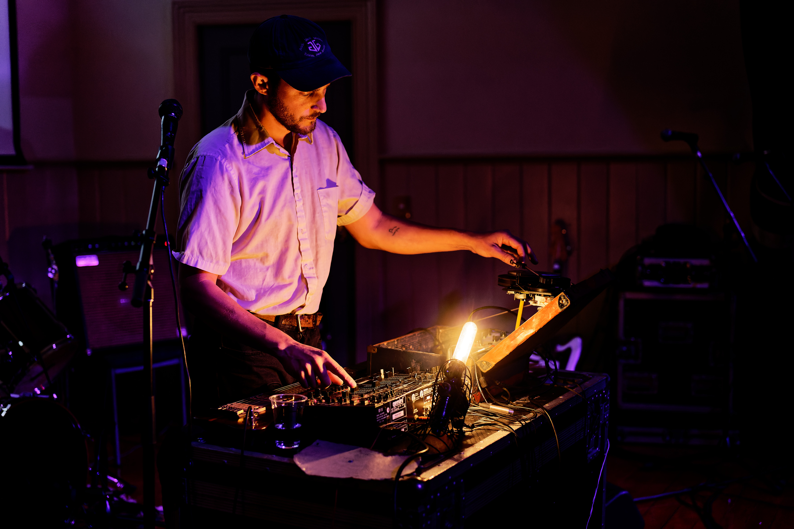

**Note: This was largely written the day after the festival ended while it was fresh in my mind, as such it's a bit rough and full of wild tangents and run on sentences but I'm posting it here since I think it's an interesting retrospective.**

A lot of the time the really cool stuff is largely ignored. Society only values the winners in the current mode of production and the current mode production is capitalism, which means venues like [None Gallery](/blog/goodbye_none) and festivals like Lines of Flight are seen as a curious footnote, because they're not businesses, they don't exist to steal surplus for shareholders, they don't promise eternal growth. Basically entities which don't profit don't matter.

How many Lines of Flight festivals have there been? [Enough to cement a legacy](https://www.pyramidclub.org.nz/lines-flight-personal-history). I'm late to this whole thing, I've only been to the 2019 iteration before this, but that weekend left an impact on me. I remember riding the bus, the beach boys blaring over the speaker apparently off a cassette which warped and dropped out as we hit bumps, hearing conversation behind me centering bands who until then had been pantheon for me. Bands like The Dead C and Dadamah, who my friend Oscar had introduced me to not long before. It's funny how "scenes" can feel inaccessible and "gatekept" but all you need is someone to introduce you.

Like 2019, the [first night of Lines of Flight 2023](/gigs/lines-of-flight-2023-show-1) took place in the conference room behind the Dunedin Public Art Gallery.

Despite having strong corporate energy I enjoyed this space because it was acoustically dead, being carpeted with soft fabrics lining the walls, which worked particularly well for grokking complex busy work like Sewage. We saw Peter Wright, Ov Pain, Sewage, Gabie Strong and the Aotearoa Snuff Jazz Ensemble.

Aotearoa Snuff Jazz Ensemble closing the night was a good move because it turned out to be somewhat impenetrable to the more casual members of the crowd (the ones who left), but I think that was the point. Matt Middleton wielded his soprano sax like a weapon (literally).

The rest of the festival (two night shows and one day show) took place in Port Chalmers Town Hall, which is not only the acoustic opposite, but also the moodistic opposite. It's a grand old building with over 100 years of history imbued in its walls. This is fine, except that halls don't suit busy music. "The acoustics are great!" people will crow, until something amplified and complex comes along and it turns into a blurry mess. No matter, it was the space we had and it mostly worked thanks to the expertise of Danny and Jade on sound.

[Friday night](/gigs/lines-of-flight-2023-show-2) we got Hōhā, Children's Letters to God, Sunset Temples, A Dream is like a Magic Cloak, People Skills and Surface of the Earth. Hōhā opening was great, I've seen them numerous times and they're always great so I wasn't particularly surprised by how great they were. But it's definitely worth noting that they were great.

Another highlight from this evening was People Skills. I think he's from America? It was some really weird experimental folk music which is kind of hard to explain but involved an incandescent lightbulb and a very old looking record player. I'm not actually sure what he was doing but it was cool.

And then I guess the "headliner" was Surface of the Earth, who spent about three years setting up and then delivered a fairly acceptable noise set. I dunno, it was ok, I was a bit bored.

On the bus now. Took a while to turn up, but a very nice woman had leftover seaweed snacks and shared them with the gang. I very much appreciated a delicious salty treat both on the bus and when I got home to dump media and then collapse into bed.

The next morning I almost felt like giving up, but I'd be kicking myself for years if I archived an event incompletely. So instead I prepared a sandwich and some iced tea, got on my bike, and enjoyed a pleasant journey on the new bike path to Port Chalmers. Biking is so nice when you don't have to fight cars constantly trying to kill you.

I arrived [just in time for Rose James's set](/gigs/lines-of-flight-2023-show-3), which involved a crescent of sheet metal surrounding the crowd, and agitated by transducers to simulate thunder. It was really cool, and worked especially well for the daytime show which seemed to attract a smaller but more focused audience who weren't interested in chatting over the music. A refreshing change.

Nothing could prepare me for the Charles Ives Singers though. They're from Australia, and it was the sort of chaotic absurdism which your average New Zealander is too cowardly to perform. Mfers were running round the venue slamming doors, blasting brass, spinning things that made noise, shouting epithets. It felt slightly unsafe, which is a mode I cherish greatly, and was concluded by an improvised speech which went on forever. And that somehow felt suitable.

Roy Montgomery was another highlight. He spent a long time setting up amps and working on his tone, which paid off to be honest - it sounded delicious. In some ways it reminded me of Connan Mockasin or Mac DeMarco, but he pre-dates both.

And then for some reason I decided to bike back in preparation for the evening show. In retrospect probably a bad idea because by the time I got back I had barely enough time to eat dinner and take the bus back out (I missed the 6:30 bus and had to take the 7:30 and missed Archangel Archangelica…). There was a freezing headwind, rain, and I got home dead (I'm also new to biking, this was my first time biking more than the couple of k's to the supermarket, and actually my first time taking any form of autonomous transport more than a couple of k's which is pretty pathetic for a 30 year old. But hey, I can make websites).

One interesting thing I noticed was that the festival attracted a different audience from the typical sloppy experimental shows I frequent. There's a whole demographic who only surface for shows that feel sufficiently sanctioned and organised. So because this might be one of the few shows they go to in a year it's a special event for them, which makes things feel more significant overall. The usual regulars still show up, but it's a much bigger and more varied audience.

[The Saturday night show](/gigs/lines-of-flight-2023-show-4) saw Grvdggr, Little Deaths, Abigail Aroha Jensen and Tash Van Schaardenburg, Seymour Glass and The Dead C play, but I arrived for GRVDGGR, who insisted on performing in pitch darkness. Honestly it was a refreshing change since it felt like lighting had been an afterthought until now.

Abigail Aroha Jensen and Tash Van Schaardenburg deftly combined electronic beats with delicate use of taonga puoro, which unfortunately conflicted a little with an echoey venue and excited audience members who wouldn't pause their chat for anything, even the music they paid to come see.

Seymour Glass was something else. He invoked the subconscious, voices and fears, cold and clinical medical notes and visceral textures. It was an autopsy. Somehow it made me think of Synecdoche New York which I saw recently and still can't decide if I liked. This was one which really stuck with me.

One interesting thread throughout the event: People wanted to sit. In 2019 I don't recall people sitting for the evening shows, at least not for later ones. Maybe it reflects a general tiredness, a communal sigh. It's 2023, we're still in the midst of deadly pandemic (although we like to pretend we're not), we're fighting multiple wars, our species is doomed due to our collective failures. People don't want to stand anymore, they want to sit.

And this incites an aging rocker, who has become offended at people daring to SIT during THE DEAD C and decides to stand obnoxiously in the middle of them, his partner pretending not to know him while he beckons her to join, before eventually giving up his one man protest and returning to the crowd, probably to the relief of the people sitting behind him who had to peer around his legs.

While this was happening another guy ate an entire bag of shrooms.

And then The Dead C delivered an intense blast of noise rock gone wrong, there was friction and conflict, and juxtaposition and moments of beauty. The performance was just as much about improvised musical dynamics as it was about social dynamics.

To try and conclude this thing which is already too long, this festival is so valuable, and strongly affirms the community and artist and this place and its humanity. It was art as humans have been doing for thousands of years. It's importance is even greater now that we're faced with the rise of "art" which removes the human component entirely.

Critics of the more experimental and abstract side of the artistic spectrum will parrot "I could do that" as if it's some sort of gotcha. But art isn't about packaging up a product which appeals to a market, it is quite literally about expression. This was a festival which centered people expressing themselves, as we have done for thousands of years before we started sitting at desks and writing CVs.

