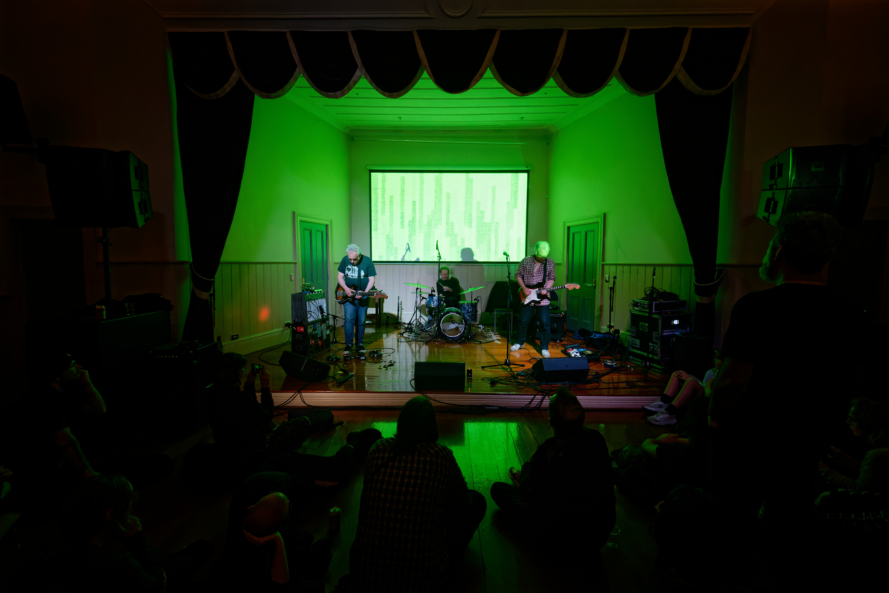
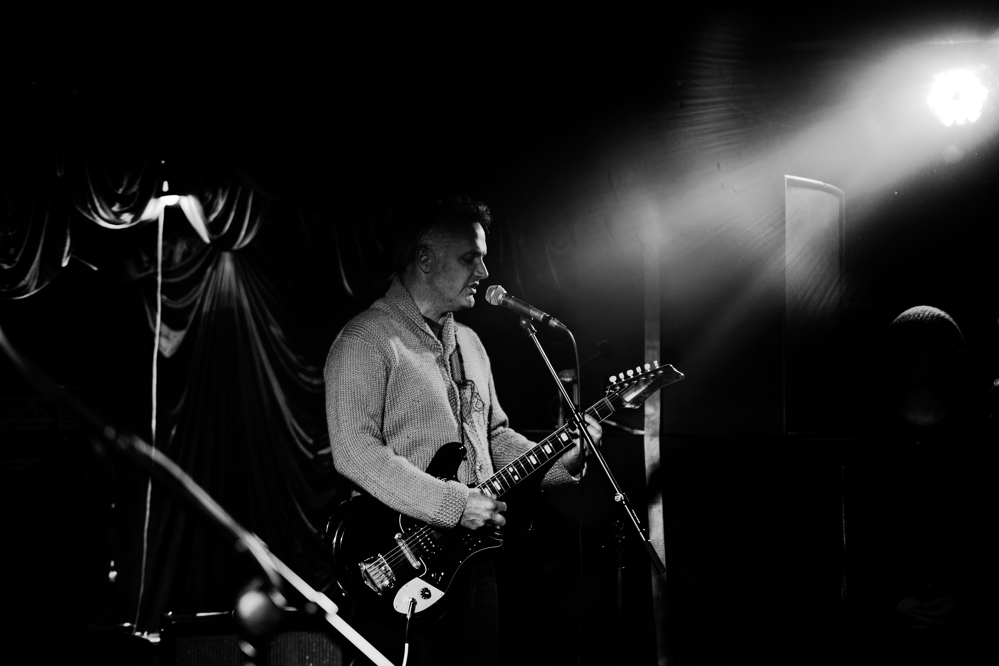
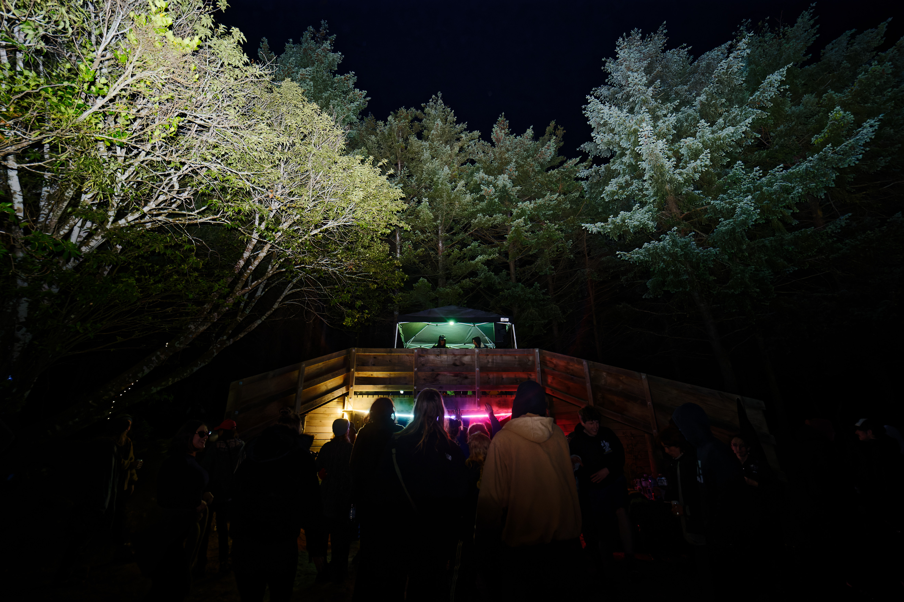
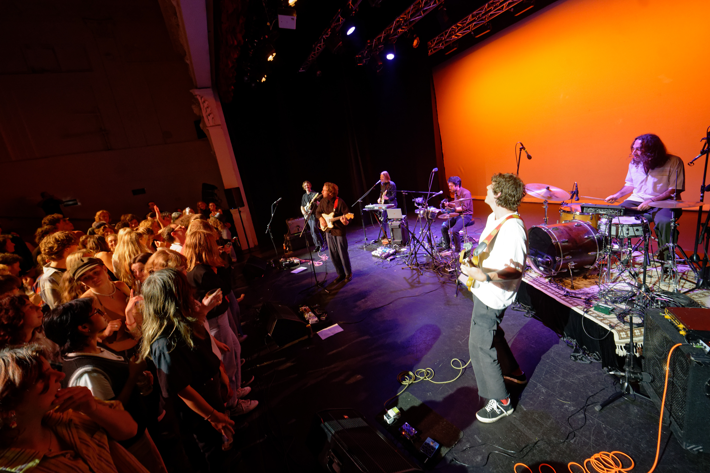
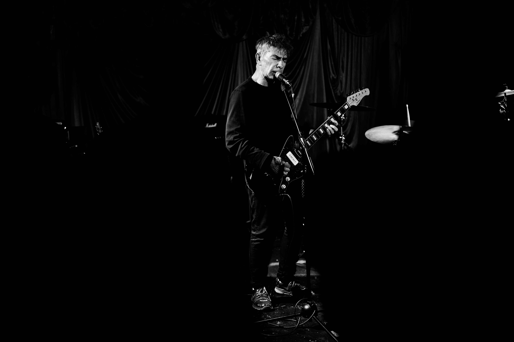
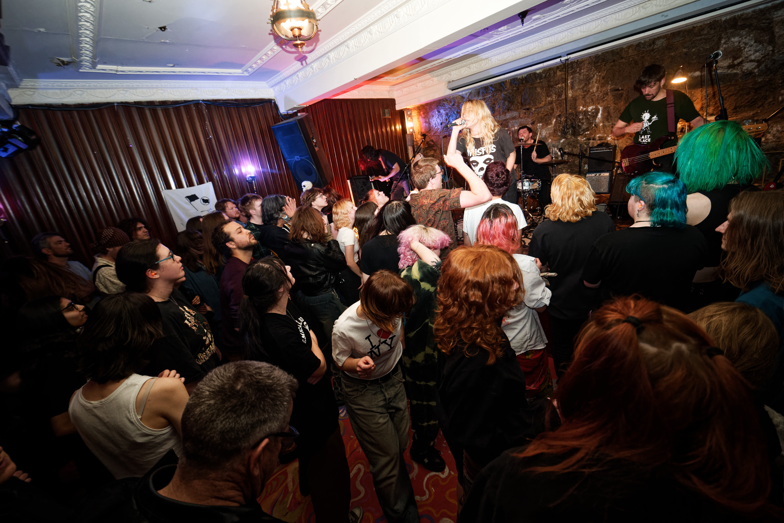
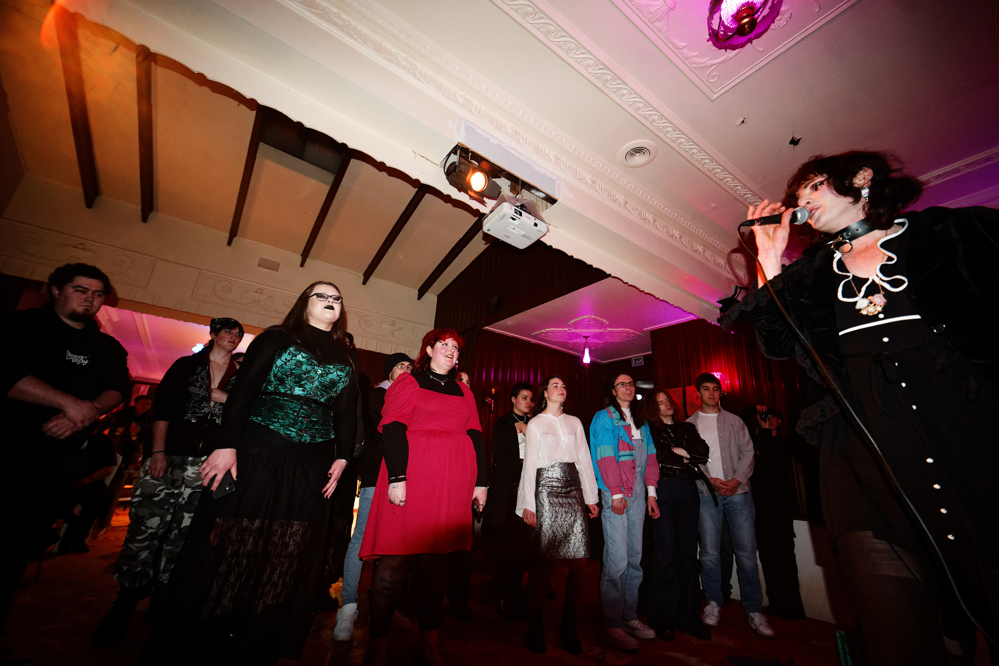
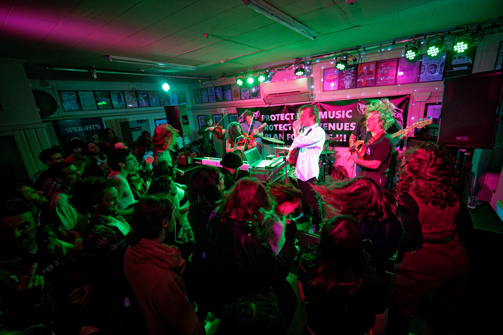
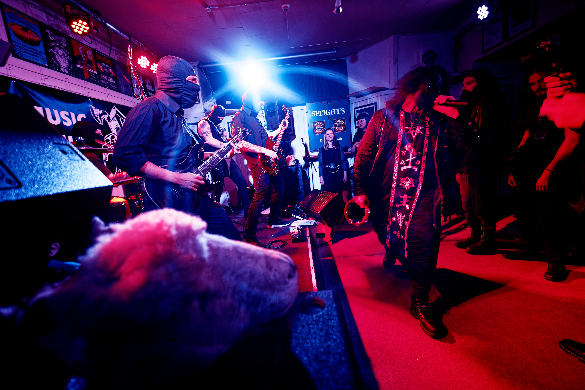

At the end of 2023 I was feeling pensive and had some spare time thanks to the union movements of the 1900s, so I wrote a bunch of notes for an article summarizing the year. Things like which gigs were especially memorable, venues we'd lost, etc. Then I just didn't write it.

But now I'm like actually it's kind of interesting to think back on the year. So here we go.

## Memorable Gigs

There were SO many good gigs in 2023, so this isn't an exhaustive list of every S tier gig, it's just a handful which stood out to me.

### [Lines of Flight](/gigs/lines-of-flight-2023-show-1/)

What can be said about lines of flight? Probably nothing that I haven't already said [here](/blog/lines_of_flight_2023_belated_retrospective/). It's simply an essential event for the local (and global) experimental music community, and the work put in by Peter Porteous and co will pay creative dividends for years. I'm still pondering some of the stuff I witnessed.

### [Mount Eerie at DIVE](/gigs/mount-eerie-new-zealand-tour/)

I still can't believe Phil Elverum, the man behind Mount Eerie and The Microphones, was just casually mingling with the crowd at DIVE. Someone whose art has had a huge impact on so many people, just chilling. I never really feel starstruck because musicians are just people, but this got me a little bit, and it was a great show - really cool to hear him with a band. A shame about the sound issues.

### [The Rave Rides](/gigs/rave-ride/)

Looking back I was surprised both rave rides were in 2023. Time is crazy. The first Rave Ride got me on a bike for the first time since childhood, fixed with the help of Crooked Spoke... But it was promptly borrowed and lost to the streets. So I decided to go all in and get a second hand e-bike which I rode on the second Rave Ride whose destination was a bush. Absolutely impeccable vibes, massive props to Negative
Space, nothing beats cycling in a gang.

### [Soaked Oats at the Mayfair](/gigs/soaked-oats-working-title-tour/)

I really didn't know what to expect from Soaked Oats. In the early days I always got the sense they had higher artistic ambitions than their frothy fanbase might imply, and over the past few years they've gone from a student band to an RNZ Jesse Mulligan band. Their [latest album Working Title](https://soakedoats.bandcamp.com/album/working-title) really impressed me, so I was curious how the live show would work. It was an unusual situation, a seated gig where half the audience were the RNZ-listening patricians and half were the younger crowd who wanted to dance. And nobody was left disappointed, the band deftly handled the opposing vibes, providing dancey songs for the dancers, and seated songs for the sitters. An incredible display of showmanship and respect for the audience.

### [Vorsen at DIVE](/gigs/vorsen-a-world-on-fire-tour-2023/)

Gotta be the most underattended show of the year (there were maybe like 30 people there). But he didn't let that impact the intensity (or volume) of his performance. It almost felt apocalyptic somehow, with the small crowd and lyrical themes it was like the world had ended and the only survivors were in an attic listening to extremely loud post-rock. As someone who prefers small crowds it was ideal, but I do feel bad for the musicians involved. It's tough out there.

### [Miss June at YOURS](/gigs/miss-june-mle-single-release-tour/)

Miss June was the [first gig I saw in The Attic way back in 2016](/gigs/miss-june-x-astro-children-tour-dunedin-with-tongueflower-and-lucy-hunter/), and this was the first time I'd seen them since, so it was kind of nostalgic for me. The rapport with the audience was excellent, they encouraged everyone to vote (which might have helped?), and at one point identified the stage stairs being an impediment for the front row and got it crowd surfed out of the way. Now that's what I call direct action.

### [Paradox Princess + Beet Wix at YOURS](/gigs/matariki-gig/)

This was one of those classic gigs where the crowd isn't massive, the pressure isn't particularly high, but the vibes are impeccable and the performances on point. Not every gig has to be a huge event, in fact some of my favorites are the casual ones where the artists are more free to try new things and the crowd are there to support them rather than just get wasted. We later lost Paradox Princess to Tāmaki Makaurau and Beet Wix to Te Whanganui-a-Tara :(

### [Sleeping Village at The Crown Hotel](/gigs/eyegum-scenic-tours-3/)

One of Eyegum's scenic tours, which are sort of like a cultural exchange between Wellington and Dunedin. Was this the most people ever on stage at the Crown Hotel? Somehow they managed to fit, and put on a hell of a show. I was not expecting the streaks of heavy stoner doom which somehow crept in. Bit hard to summarize but I hope to see them back soon.

### [Blood Cauldron at The Crown Hotel](/gigs/winters-requiem/)

Blood Cauldron marching their guitarist out of the Crown Hotel in a literal casket before performing a ceremony to swear in the new one gotta be a Top 10 Crown Hotel moments moment. This is showmanship on a level rarely seen in Dunedin, but also the musical chops to back it up. Who are these mysterious individuals and where did they get the audacity? Not sure how I feel about the animal head thing. Honorable mention to their [pint night gig](/gigs/heavy-pint-night/) which traumatized *at least* one unsuspecting student.

## Regrets

In 2023 I went to 43 gigs. As usual I regret not going to more, but I always remember the wise words of Matua Julie of Trace Untrace circa 2018 when I expressed my regret at missing one of her gigs: “You can't go to every gig”. It's true, I can't, and lately I've also been conscious of burnout and stress and have been trying to dial things back a bit and have more weekends to myself.

But I still regret missing Beastwars at the Crown, Fazerdaze at YOURS, in general not going to more stuff at YOURS, and not trying harder to get into the FIFA fan festival thing to see Bic Runga (they wouldn't let me in with a "professional camera" which turned out to be an extremely arbitrary definition, so I came back the next day for Ladyhawke with a less "professional" concealable camera and got in, but was told off by a staff member for using it, but by then it was too late for FIFA, [I'd pulled off the media heist successfully](/gigs/fifa-fan-festival/) and FIFA will likely never recover).

## Pour one out for lost venues

In 2023 we lost [Dog with Two Tails](/venues/dog_with_two_tails/) and [DIVE](/venues/dive/). Bummer. At least Dog With Two Tails [went out with a bang.](/gigs/dogfest---the-final-goodbye/)

## Fill one up for gained venues

In 2023 we gained [YOURS](/venues/yours/), [Erricks](/venues/erricks/) (replacing New New New), ReWind (replacing Dog with Two Tails), and Moon. Yes!

Erricks fills in the mid-size "professional" venue niche (complete with stadium priced $13 half pints in plastic cups), and I still haven't been to ReWind or MOON but they seem to be humming along. In 2024 I'm hoping [Pearl Diver](/venues/pearl_diver/) will fill the hole left by DIVEs absence.
